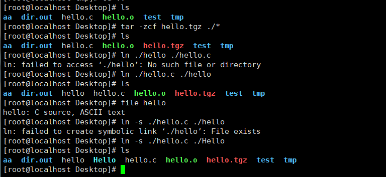
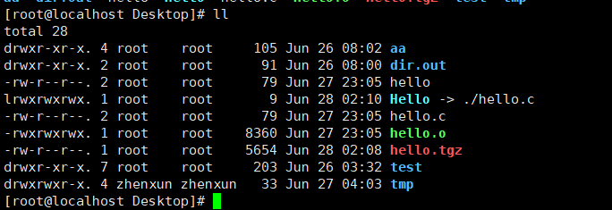
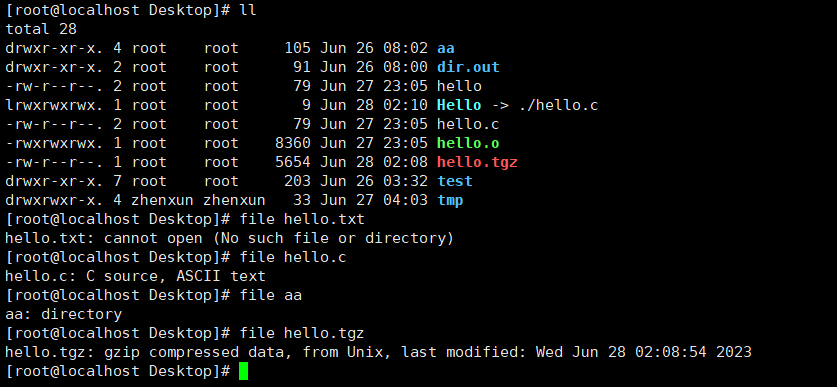
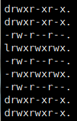
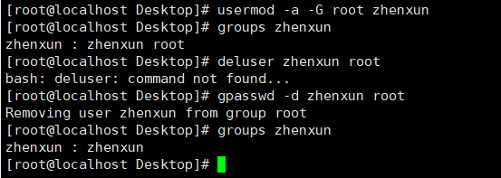

# Linux 权限相关（基于CentOS7)

## 1.文件类型

识别文件类型的三种方式：

### 1.通过文件名的颜色识别；

- 白色	普通文件
- 蓝色	目录（文件夹）
- 绿色	可执行文件（命令，程序，exe）
- 浅蓝色	链接文件（快捷方式）
- 红色	压缩文件

#### *了解：

- 黄色	装置与设备文件
- 紫色	图形文件

### 2.通过ls -l查看到的文件详细信息的首字符

ls -l  或者直接用 ll

-rw-------

- 普通文件（一般文件）
- d	目录
- l	链接文件

### 3. 使用命令file查看文件类型

file 文件名或者目录名	查看文件名的具体文件类型

## 2.文件权限管理

- — 文件类型 包括 - 文件和 d 目录

-  rw-r--r--	文件权限

### 1.**文件的权限**

​	一共9个字符，每3个字符为一组，分别代表：

​		文件所有者，文件所属组，其他人的权限

### 2.rw-	r--	r--

- rw-	文件所有者的权限
- r--	 文件所属组的权限
- r--	  其他人的权限

### 3.具体的权限字符r、w、x、—  

- r	可读     2 ^ 2 = 4
- w	可写     2 ^ 1 = 2
- x	可执行   2 ^ 0 =1
- —   无          0

## 3.修改文件读写权限

### 数字权限修改：

#### 1.权限对应的数字

- r	4
- w	2
- x	1
- —   0

修改权限时，每种身份对应的权限加一次

例：

-rw-r--r--

rw-   6          rwx        7 

r-- 	4          r-x         5

r--     4          r--         4 

644      --->    754

需求：将一文件的权限设置为： rw-rw-r--    （664）

#### 2.将文件夹的权限进行修改

语法：

chmod -R 权限数字 文件名

## 4.不同权限的实际效果

不同权限的实际效果

### 1.针对目录（系统默认的目录最高权限为777）

- rwx	可以查看目录中的文件清单，可以在该目录下新建，删除，重命名文件，可以进入该目录
- r-x	可以查看目录中的文件清单，可以进入该目录**（没有x权限，就进入不了）**
- ---	没有任何权限

注意：其他组合没有实际意义，只要没有x的权限就近似等于无意义。

### 2.针对普通文件（<u>非可执行文件</u>）（系统默认的文件最高权限为666）

- rw-	可以查看文件的内容，可以修改文件的内容	
- r--	可以查看文件的内容
- ---	没有任何权限

## 5.用户管理(仅root权限可操作)

### 	1.新建用户

- useradd [username]

​	创建一个用户，并自动在 /home 下创建一个与用户名相同的文件夹作为该用户的起始工作路径，并创建一个与用户名相同的用户组。

过程如下：

如果在创建一个用户过程中将该用户的工作路径自定义化，则需要用 -d [路径]

**useradd -d [路径] username**

### 2.设置与修改密码

- passwd 用户名        之后会输入密码进行修改(不需要输入旧密码)
- echo "new_password" | passwd --stdin [username]    直接更新密码

### 3.查看用户

查看当前系统所有创建的用户

- grep bash /etc/passwd  

如果是直接查找指定用户，则可以使用

- grep [username] /etc/passwd

如果是查看最新创建的用户或有其他变动，可以结合tail指令进行使用

- tail /etc/passwd

### 4.删除用户

- userdel -r 用户名

userdel -r 使用者目录下的档案一并删除。在其他位置上的档案也将一一找出并删除。

*注意：如果提示正在使用，可以exit登出，或者kill

## 6.组管理

### 1.组的管理

- groups 用户名                                                       查看用户所在的组。

- groupadd [groupname]                                       创建组

- useradd -g [groupname] username                  添加用户进组：

- groupdel xinqigroup                                             删除组:

- useradd -g groupname -d /home/user user    添加用户，指定组，并且设定home目录

- cat  /etc/group                                                       查看组：

### 2.用户修改当前所在的组

通过usermod 来修改 用户所在组

- usermod -g 用户组 用户                                #命令强行设置某个用户所在组 ；
-  usermod -G 用户组 用户                               #命令把某个用户改为 "group(s)" ;
- usermod -a -G 用户组 用户                            #命令把用户添加进某个组 "(s)" ;
- gpasswd -d userName groupName             #命令把用户移出某个组；

#### 附usermod使用说明：

功能说明：

修改用户帐号。

语法：

- usermod [-LU] [-c <备注>] [-d <登入目录>] [-e <有效期限>] [-f <缓冲天数>] [-g <群组>] [-G <群组>] [-l <帐号名称>] [-s ] [-u ] [用户帐号]

补充说明：usermod可用来修改用户帐号的各项设定。

参数：

- 　-c<备注> 　修改用户帐号的备注文字。

- 　-d登入目录> 　修改用户登入时的目录。

- 　-e<有效期限> 　修改帐号的有效期限。

- 　-f<缓冲天数> 　修改在密码过期后多少天即关闭该帐号。

- 　-g<群组> 　修改用户所属的群组。

- 　-G<群组> 　修改用户所属的附加群组。

- 　-l<帐号名称> 　修改用户帐号名称。

- 　-L 　锁定用户密码，使密码无效。

- 　-s < shell> 　修改用户登入后所使用的shell。

- 　-u < uid> 　修改用户ID。

- 　-U 　解除密码锁定。

  

#### 相关示例：

Linux修改帐号

修改用户账号就是根据实际情况更改用户的有关属性，如用户号、主目录、用户组、登录Shell等。

修改已有用户的信息使用usermod命令，其格式如下：

-usermod 选项 用户名

常用的选项包括-c, -d, -m, -g, -G, -s, -u以及-o等，这些选项的意义与useradd命令中的选项一样，可以为用户指定新的资源值。

另外，有些系统可以使用选项：-l 新用户名

这个选项指定一个新的账号，即将原来的用户名改为新的用户名。

例如：

\# usermod -s /bin/ksh -d /home/z –g developer sam

此命令将用户sam的登录Shell修改为ksh，主目录改为/home/z，用户组改为developer。

## 7.修改文件所属用户和组

### 	1.修改文件/文件夹所属用户： chown

​	语法：

- chown 用户名 文件名
- chown 用户名 文件夹名

​	例：

修改文件file的文件拥有者为admin(只能root用户改)

chown admin file

chown -R admin dir	修改目录及其下的所有文件的文件拥有者为admin

### 	2.修改文件/文件夹所属组：chgrp

​	语法：

- chgrp 组名 文件名
- chgrp -R  组名  文件夹名

​	例：

修改文件file的文件所属组为admin

chgrp admin file
