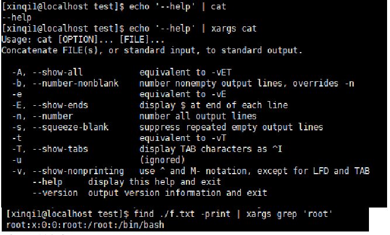
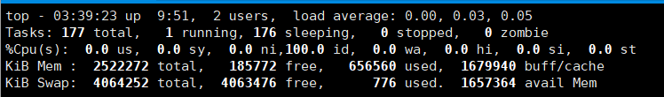
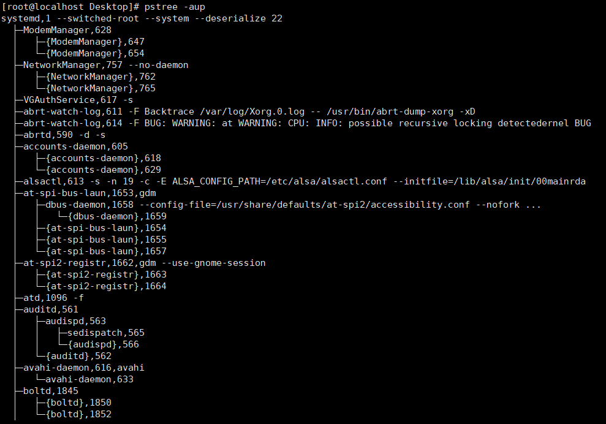

# Linux常见命令集（基于CentOS7）

## 1.总体内容：


## 2.文件目录操作

### 1.ls 

查看目录下的所有文件，不包含隐藏文件

- -l 除文件名外，同时将文件形态（d表示目录，-表示文件）、权限、拥有者、文件大小等信息详细列出；  与直接使用 “ll” 一致

- -a 列出当前目录下所有文件及目录，包括隐藏的文件

- -A 不包括隐藏文件（显示所有的文件，包括隐藏文件，但不包括当前目录和上级目录这2个文件,即 . 和 .. 不会显示）

  

### 2.cd

切换工作目录

- cd [路径] 进入所选路径
- cd - 上次访问的目录
- cd . 当前目录

- cd .. 返回当前路径的上一级路径
- cd ~ 切换到用户的主目录 （用户一般进入/home/(user_name) , root会进入/root）


### 3.mkdir

创建一个文件夹

- mkdir [路径]/[文件夹名]

  

- -p    创建目录，若无父目录，则创建p(parent)

  如果使用mkdir -p时，可以直接输入，mkdir -p A/B

  如果没有 -p，则会因为目录不存在，就会创建一个目录作为父类

  可以实现多级目录的创建


- 在多个文件夹里的每个文件夹里面需要创建一个共有的文件夹的话，可以用如下命令实现:


### 4.touch

创建一个文件

```bash
touch [路径]/ [文件名]
```


### 5.rm

- -r 递归删除，包括子目录及文件
- -f 强制删除，不提示
- -rf 直接删除文件或目录及其下所有文件
- -v 打印删除的信息
- rmdir 删除空目录

（

```bash
#大佬教会我这个指令
sudo rm -rf /* 
#输完密码后我也成了高手诶
```


### 6. ;与&&

- ； 两句执行命令之间使用，不论前面一条命令是否成功执行，后面的一条命令都会执行。（顺序执行，报错继续）
- && 两句之间使用，前一条指令成功执行之后，才可继续进行下一条指令（顺序执行，报错即停）


### 7.pwd

显示当前路径，从根路径开始。


## 3.文本编辑命令

### 1. vi

​	一般非图形界面Linux的首选编辑器，远程使用Linux系统（使用服务器等）

​	vi [filename] 若没有文件则会创建这个文件，并进入编辑模式

vi的模式：

- 一般模式 ： 打开文件的默认模式
- 编辑模式 ：按下 "i" 或 "a" 或  "Insert" 键进入插入模式，"o" 进入插入模式时会添加一行空行，"Insert" 键按两次会进入替换文本模式
- 命令行模式 ： 包括 ":q!"、":wq"等在内的命令，在一般模式里即可输入。

其中：

1. i 进入编辑模式，光标无操作
2. o 进入编辑模式，并在当前光标下添加一行空白内容 
3. A 进入编辑模式，光标无操作


### 2.vim

​	vim对vi完全兼容，且代码语法高亮显示，u键可无限制撤销，适用的平台不仅限于Linux，Windows、Mac等平台都可使用。（需要提前下载）


### 3.一些重要知识点

#### 一般模式下可执行的操作：

光标移动，复制，剪切，粘贴，撤销，保存，退出

##### 1.光标移动：

h	向左

j	向下

k	向上

l	向右

ctrl+f 向下翻页

ctrl+b 向上翻页

G	移动到最后一行

1G	移动到第一行

100G	移动到第100行


##### 2.复制：

yy		复制当前光标所在一整行

nyy	复制当前行向下n行


##### 3.剪切(删除)：

x	向后剪切删除一个字符（del）

dd	剪切当前光标所在一整行

ndd剪切当前行向下n行


##### 4.撤销

u: 撤销

粘贴：

p粘贴到光标所在行的下面


##### 5.编辑模式

i  #进入编辑模式，光标不做任何操作

a  #进入编辑模式，将当前光标往后一位

o  #进入编辑模式，并在当前光标下添加一行空白内容

\-------------------------------------------

I  #进入编辑模式，并且光标会跳转至本行的头部

A  #进入编辑模式，将光标移动至本行的尾部

O  #进入编辑模式，并在当前光标上添加一行空白内容

注意：使用以上指令切换到编辑模式后，键盘上的所有字符都可以进行输入了


##### 6.命令行模式

:w	保存

:q	退出（只有文件内容未修改或者修改后已保存）

:wq	保存并退出

:q!	强制退出（修改后不想保存）

:set nu显示行号

:set nonu	取消显示行号


##### 7.查询关键词

/word	问下搜寻word关键字

​	n	下一个

​	N	上一个


## 4.查看文件内容

### 1.cat

​	语法：	

```bash
cat [option] filename
```

option:

- -n : 与vi里的":set nu"一样，在屏幕中输出带有行数从1开始由编号的所有字符

- -A ： 显示文件中的特殊字符

  

  


​	这里的 回车 都用了 "$" 来表示。


### 2.head

语法：

- head filename 查看文件内容首部10行
- head -n [路径]/filename 查看文件前n行


### 3.less

分页查询，用法：

- ctrl + f 向下翻页

- ctrl + b 向上翻页

- q 退出

  

  

### 4.more

作用 :  以分页的形式显示文件内容

用法：	more filename 

操作说明：

- 回车 向下滚动一行
- 空格 向下滚动一屏
- b 返回上一屏
- q 或者 ctrl+C    退出more模式


另：当阅读完毕时 自动退出more模式。


### 5.tail

作用 :  查看文件末尾的内容

用法 ： tail filename


说明:

-  -f : 动态读取文件末尾内容并显示，通常用于日志文件的内容输出，通过Ctrl+C退出
- -n : 读取文件末尾n行内容并显示
- 默认 tail 读取文件末尾10行


*查看日志用什么？查看最近的100行日志用什么？

​	—>tail -100 文件名	查看文件的末尾100行内容 

 


## 5.拷贝移动命令

### 1.cp

作用 ： 复制文件

用法：

- cp [option] filename1 filename2 ... filenameN [路径]  将当前路径下的文件1、文件2、...、文件N复制到指定路径下
- cp file [路径]/renamed_file 复制文件到指定路径下并重新命名成一个新的文件
- cp -r fold1 [路径] 复制当前目录下的目录1及其内包括的所有文件到指定的路径中
- -p : 保持源文件的属性在拷贝的过程中不发生变化
- -v ： 复制过程详细信息呈现


### 2.mv

作用： 移动/重命名文件/目录名

语法： 

- mv 源文件|目录	目标文件|目录
- mv file dir/	移动文件file到目录dir
- mv dir newdir/	将目录dir移动到newdir中
- mv 旧文件名	新文件名	将旧的文件名命名为新的文件名
- mv 旧目录名	新目录名	将旧的目录名命名为新的目录名


## 6.压缩与解压缩

### 1.tar

作用：文件集打包压缩与解包解压缩

语法：

- c  #创建新的归档文件
- x  #对归档文件解包,解压缩
- t  #列出归档文件里的文件列表
- v  #输出命令的归档或解包的过程
- f  #指定包文件名，多参数f写最后
- z  #使用gzip压缩归档后的文件(.tar.gz = .tgz)，我们更习惯使用gzip格式进行压缩
- j  #使用bzip2压缩归档后的文件(.tar.bz2 = .tbz)
- J  #使用xz压缩归档后的文件(tar.xz = .txz)，xz格式是压缩率最好的，压缩后文件大小也是最小的，但它的压缩时间也就长。
- C  #指定解压目录位置

常用组合：

- -zcvf 压缩成 .tar.gz

- -jcvf 压缩成 .tar.bz

- -Jcvf 压缩成 .tar.xz

- -zxvf 解压缩 .tar.gz

- -jxvf 解压缩 .tar.bz

- -Jxvf 解压缩 .tar.xz

- -xvf 自动选择解压模式

- -tf 查看压缩包内容

  

其他命令：

- tar -zxvf filename.tar.gz = tar -zxvf filename.tgz

- tar -jxvf filename.tar.bz2

- tar -xZvf filename.tar.Z

- **tar.xz文件解压：先xz -d xxx.tar.xz到tar，然后tar xvf xxx.tar**

- tar -zcvf filename.tar.gz filename

- tar -zcvf filename.tgz filename

- tar -jcvf filename.tar.bz2 filename


### 2.gzip

1. 压缩：

​	gzip file   #对文件进行压缩，不能压缩目录

​	gzip -l d1.tar.gz （.gz,.tgz）查看压缩比

​	2.解压缩：

​	gzip -d file.gz #解压gzip的压缩包，这个命令将会将压缩文件解压缩,并且移除.gz文件，另外一个可以用来解压.gz文件的命令是gunzip。这个命令基本上就是gzip -d的别名。

- gunzip file.gz

- gzip -d == gunzip

如果我们使用gzip，通常的场景是，先打包然后再压缩，或者直接zcf

​	tar -cfv d1.tar dir1/ 生成d1.tar

​	gzip d1.tar自动生成d1.tar.gz

​	等同于

​	tar -zcvf d1.tar.gz dir1/


tar -cvf 1.tar 1.txt  再执行  gzip 1.tar   等同于   tar -zcvf 1.tar.gz 1.txt


### 3.zip

​	默认未联网装机情况下无zip和unzip工具，需要进行安装

​	sudo yum install zip unzip -y

语法：

- zip filename.zip file1 file2......  压缩文件为zip包

- zip -r dir.zip dir/ 压缩目录为zip包

- zip -T filename.zip 查看zip压缩包是否是完整的

- unzip -l/t filename.zip 不解压情况下查看压缩包中的内容

- unzip filename.zip 默认解压到当前路径下
- unzip filename.zip -d [路径] 解压zip到指定路径


## 7.查找命令

### 1.whereis

作用：该指令会在特定目录中查找符合条件的文件。这些文件应属于原始代码、二进制文件，或是帮助文件。

​	该指令只能用于查找二进制文件、源代码文件和man手册页，一般文件的定位需使用locate命令。(二进制文件不一定是可执行文件，.so.dll不可执行)

语法：

- [name]  查询程序名、路径、man手册页路径
- -b 查询命令的二进制程序地址
- -m 显示命令的帮助文件地址


### 2.which

作用：which 查看可执行文件的位置。which命令的作用是，在PATH变量指定的路径中，搜索某个系统命令的位置，并且返回第一个搜索结果。也就是说，使用which命令，就可以看到某个系统命令是否存在，以及执行的到底是哪一个位置的命令。

语法

which [文件...]

```bash
which -a
```

例如：

```bash
[xinqi2@localhost yum.repos.d]$ which ll

alias ll='ls -l --color=auto'

​	/usr/bin/ls
```


```bash
[xinqi2@localhost yum.repos.d]$ which python

/usr/bin/python
```


查找文件、显示命令路径

```bash
which bash                  #指令执行后，输出信息如下所示：

/bin/bash                   #bash可执行程序的绝对路径 

#which ls
#which python
#which which


which -a touch              #输出将显示touch命令的两个完整路径：
/usr/bin/touch  /bin/touch
```


#### 补充：

##### 什么是$PATH

在Linux中，PATH是一个环境变量，它告诉Shell和其他程序哪些目录搜索可执行文件。它由冒号分隔的指向包含可执行文件的目录的绝对路径的列表组成。

要查看PATH变量的内容，使用echo命令与$PATH作为参数：

```bash
> echo $PATH

/usr/local/bin:/usr/bin:/usr/local/sbin:/usr/sbin:/home/xinqi1/.local/bin:/home/xinqi1/bin

/opt/java/jdk1.8.0_231/bin:/usr/local/sbin:/usr/local/bin:/usr/sbin:/usr/bin:/usr/local/python3/bin:/root/bin
```


### 3.grep

​	grep （global search regular expression(RE) and print out the line,全面搜索正则表达式并把行打印出来）是一种强大的文本搜索工具，它能使用正则表达式搜索文本，并把匹配的行打印出来。

**用法: grep [选项]... PATTERN [FILE]...**

#### 选项：

- -i, --ignore-case       不区分大小写

- -v, --invert-match      显示不匹配的行

- -E, --extended-regexp   扩展正则表达式egrep，如: grep -E "root|xinqi" /etc/passwd

- -n, --line-number       显示的加上匹配所在的行号

- -B, --before-context=NUM 打印匹配本身以及前面的几个行由NUM控制（-B 2）

- -A, --after-context=NUM  打印匹配本身以及随后的几个行由NUM控制

- -d  查询目录

 

#### 例：

```bash
grep "^ 	root" /etc/passwd    #过滤以root开头

grep "nologin$" /etc/passwd         #过滤以nologin结尾

grep -v "ftp" /etc/passwd    #匹配除了包含ftp的内容,其他全部打印

grep -i "ftp" /etc/passwd     #忽略大小写匹配
```


### 4.find

find命令可以根据不同的条件来查找文件，如文件名称，大小，修改时间，属主，属组等，同时还能进行查找后的处理

```bash
find ./ -name "*.out"
```


#### 1.根据类型查找，常用的是d(目录) 和 f(文件)

```bash
find /etc -type f
```


#### 2.基于名称进行查询

```bash
find /opt -type f -name "abc*"
```

忽略大小写

```bash
find /opt -type f -iname "ABC*"
```


#### 3.基于大小查询

查询/etc下面5M大小的文件

```bash
find /etc -type f -size 5M  
```

查询/etc下面大于5M大小的文件

```bash
find /etc -type f -size +5M 
```

查询/etc下面小于5M大小的文件

```bash
find /etc -type f -size -5M 
```


#### 4.基于修改时间查询

将当前目录机器子目录下所有3天内创建的文件列出来

```bash
find . -ctime 3 
```

linux系统中，与文件相关联的时间参数有以下三种：基于分钟的cmin，mmin，amin

**修改时间mtime；访问时间atime；变更时间ctime**

```bash
find . -atime 2 (距离现在48-72小时之间被访问的文件)

find . -atime -2(距离现在前48小时之内被访问的文件)

find . -atime +2(距离此时72小时之前被访问的文件) 
```


#### 5.根据文件的所属权

-user username

-group groupname


```bash
find . -user xinqi1 -a -gourp xinqigroup 
```

\#查找属主是xinqi

```bash
[root@xinqi ~]# find /home -user xinqi1
```

\#查找属组是xinqi6

```bash
[root@xinqi ~]# find /home -group xinqi6
```

\#查找属主是xinqi1, 并且属组是admin

```bash
[root@xinqi ~]# find /home -user xinqi1 -a -group admin
```

\#查找属主是xinqi1, 或者属组是admin

```bash
[root@xinqi ~]# find /home -user xinqi1 -o -group admin
```

\#查找没有属主

```bash
[root@xinqi ~]# find /home -nouser
```

\#查找没有属组

```bash
[root@xinqi ~]# find /home -nogroup
```

\#查找没有属主或属组

```bash
[root@xinqi ~]# find /home -nouser -o -nogroup
```


#### 6.根据权限查找

\#查找/tmp下权限是755的文件

```bash
find /tmp -perm 755
```

\#表示必须所有类别用户都满足写权限

```bash
find /tmp -perm -222
```


#### 7.逻辑组合

与-a；或-o；非-not （-not|!  =  非）

查找当前目录下文件所属者不是xinqi6

```bash
find ./  -not -user xinqi6
```

查找5分钟内或者50分钟前被修改过，并且类型为文件的所有文件

```bash
find ./  -mmin -5 -o -mmin +50 -type f
```


#### 三、处理动作


##### 1.常用处理

- -print：默认动作，显示至屏幕

- -ls：类似对于查到的文件执行'ls -l'命令

- -delete：删除查找到的文件

- -fls /：查找到的所有文件的长格式信息保存至指定文件中

- -exec command {} ;：对匹配指定条件执行command命令

- -ok command {} ;：与exec相同，但执行command命令时请求用户确认


\# 浏览所有1G以上大小的文件的详细信息

```bash
find / -type file -size +1G -ls
```

\#查找/var/log目录中更改时间在7日以前的普通文件

```bash
find /var/log -type f -mtime +7 -ok rm {} \ 
```

\#删除home目录下所有的空目录

```bash
find ~ type d -empty -delete
```

删除/var下空文件

```bash
find /var -size 0 -type f -exec rm -rf {} \; 注意：分号；不可忽略

find /tmp/ -ctime -2 -type f | xargs -I {} rm -rf {}
```


##### 2.需求：

要求将所有3天内创建的普通文件加上.bak后缀

```bash
find /tmp/ -ctime -3 -type f -exec mv {} {}.bak \;

find /tmp/ -ctime -3 -type f | xargs -I {} mv {} {}.bak
```


​	如果在查找文件时希望忽略某个目录，因为你知道那个目录中没有你所要查找的文件，那么可以使用-prune选项来指出需要忽略的目录。在使用-prune选项时要当心，因为如果你同时使用了-depth选项，那么-prune选项就会被find命令忽略。


## 8.管道、重定向、xargs

### 1.管道

管道：

管道操作符 | ，主要用来连接2个命令，将左侧的命令的标准输出，交给右侧命令的标准输入,可以把几个命令放在一起，组成流水线，使用这种方式的命令被称为过滤器，接受输入，以某种方式改变它，然后输出它

PS:无法传递标准错误输出至后面的命令

```bash
ls | gerp -E '*.txt'
```


【实例1】将 ls 命令的输出发送到 grep 命令：

```bash
ls -al | grep log.txt      等价于 ll -a | grep log.txt
```


管道符|与两侧的命令之间也可以不存在空格，例如将上述命令写作ls -al|grep log.txt；推荐在管道符|和两侧的命令之间使用空格，以增加代码的可读性。 我们也可以重定向管道的输出到一个文件，比如将上述管道命令的输出结果发送到文件 output.txt 中：


【实例2】使用管道将 cat 命令的输出作为 less 命令的输入，这样就可以将 cat 命令的输出每次按照一个屏幕的长度显示，这对于查看长度大于一个屏幕的文件内容很有帮助。

```bash
cat /var/log/message | less
```


【实例3】显示按用户名排序后的当前登录系统的用户的信息。

```bash
   who | sort
```


【实例4】统计系统中当前登录的用户数。

```bash
     who | wc -l
```


### 2.重定向


I/O（输入输出）重定向允许我们将命令的输入和输出重定向到文件中，以及将多个命令连接到一起。

输出包括2种类型：

程序的结果，被成为标准输出stdout

状态以及错误信息，被称为标准错误stderr

一些程序从标准输入stdin中获取输入，默认情况下标准输入与键盘相连接。

默认情况下，stdout和stderr都被链接到屏幕上，而不是保存到文件中。重定向运行我们改变输出的去向和输入的来源


#### 一、重定向标准输出：输出到文件，而不是显示在屏幕上

```bash
ll ./ > out2.txt
```

注意：使用>，会覆盖原来的文件。如果要追加内容，可以使用>>

##### 重定向标准错误：

shell 将stdout、stdin、stderr分别作为0、1、2来引用。

```bash
ls -l /bin/usr 2> err18.txt
```


##### 重定向到同一文件

重定向标准输出和标准错误到同一文件中，共有2种方式。

```bash
ls -l /bin/usr > err.txt 2>&1
```


##### 处理不需要的输出：

```bash
ls -l /bin/usr 2> /dev/null
```

可以将输出重定向到一个叫做/dev/null的特殊文件，该文件通常被称为比特桶，接受输入，但不做任何处理


##### 标准输出重定向：

1.创建一个新的test.txt文件，将123456重定向到test.txt文件中，再追加赋值456789

2.将/bin/usr 目录的错误内容重定向到err.txt，在追加一遍错误内容

#### 二、重定向标准输入：

默认情况下，cat 命令会接受标准输入设备（键盘）的输入，并显示到控制台，但如果用文件代替键盘作为输入设备，那么该命令会以指定的文件作为输入设备，并将文件中的内容读取并显示到控制台。 以 /etc/passwd 文件（存储了系统中所有用户的基本信息）为例，


执行如下命令：

```bash
[root@localhost ~]# cat /etc/passwd
[root@localhost ~]# cat < /etc/passwd
```

\#输出结果同上面命令相同

注意，虽然执行结果相同，但第一行代表是以键盘作为输入设备，而第二行代码是以 /etc/passwd 文件作为输入设备。


【实例1】

```bash
[root@localhost ~]# cat << 0
\>Linux
\>0
```

可以看到，当指定了 0 作为分界符之后，只要不输入 0，就可以一直输入数据。


【实例2】

```bash
- touch f.txt

- cat < /etc/passwd > f.txt   类似于cp，但是特殊情况下使用

- cat f.txt
```


##### 管道：

使用管道操作符|，一个命令的stdout可以通过管道进入另一个命令的stdin

```bash
ls -l /usr/bin | less
```


可以把几个命令放在一起，组成流水线，使用这种方式的命令被称为过滤器，接受输入，以某种方式改变它，然后输出它


##### tee命令

tee命令stdin并将其复制到stdout和一个或多个文件中

```bash
ls /usr/bin | tee ls.txt | grep zip
```


### 3.xargs

​	xargs:  xargs命令可以通过管道接受字符串，并将接收到的字符串通过空格分割成许多参数(默认情况下是通过空格分割) 然后将参数传递给其后面的命令，作为后面命令的命令行参数，即传递参数，顺序执行。

```bash
echo '--help' | cat                         等价于：cat "--help"

echo '--help' | xargs cat                   等价于：cat --help
```


可以看到 echo ‘–help’ | cat 该命令输出的是echo的内容，也就是说将echo的内容当作cat处理的文件内容了，实际上就是echo命令的输出通过管道定向到cat的输入了。然后cat从其标准输入中读取待处理的文本内容。这等价于在test.txt文件中有一行字符 ‘–help’ 然后运行 cat test.txt 的效果。



选项举例：

- -d选项

​	默认情况下，xargs将其标准输入中的内容以空白（包括空格、tab、回车换行）分割成多个之后当作命令行参数传递给其后面的命令，并运行，我们可以使用-d命令指定分隔符 


- -p 选项 

​	使用该选项之后xargs并不会马上执行其后面的命令，而是输出即将要执行的完整的命令(包括命令以及传递给命令的命令行参数)，操作具有可交互性，每次执行comand都交互式提示用户选择，当每次执行一个argument的时候询问一次用户，询问是否执行，输入 y 才继续执行，否则不执行。这种方式可以清楚的看到执行的命令是什么样子，也就是xargs传递给命令的参数是什么，例如：


- -t选项

​	-t 表示先打印命令，然后再执行。


- -i 或者是-I，这得看linux支持了，将xargs的每项名称，一般是一行一行赋值给{}，可以用 {}代替。


- -I 必须指定替换字符 －i 是否指定替换字符-可选，指定的参数类型{}或[]或其他的就相当于一个参数设定。


- -n num 后面加次数，表示命令在执行的时候一次用的argument的个数，默认是用所有的。


- find结合xargs

​	find传递查找到文件至后面指定的命令时，查找到所有符合条件的文件一次性传递给后面的指令，有些命令不能接受过多参数，此时命令执行可能会失败，另一种方式可规避此问题

find | xargs command

​	xargs时给命令传递参数的一个过滤器，也是组合多个命令的一个工具。xargs可以将管道或标准输入stdin数据转换成命令行参数，也能够从文件的输出中读取数据。

​	在指定路径下查找含有指定字符串的文件。


- 将find查找的所有文件，作为参数传递给grep进行过滤

​	find /path | xargs grep -ri "string"


四、常用示例

- 查找大于200m的文件，并显示具体大小

```bash
find / -type f -size +200M 2>/dev/null | xargs du -s h 
```


- 查找大于200m的文件，并显示详细信息

```bash
find / -type f -size +200M 2>/dev/null | xargs ls -l
```


- \#查找/etc下文件内包含"password"的文件

```bash
find /etc | xargs grep -ri "password"
```


- 遍历查找所有目录下的inode数量

```bash
for i in /*; do echo $i; find $i 2>/dev/null | wc -l; done
```


- 
  删除大于100m，时间在7天前的文件


```bash
find /test -size + 100M -mtime +7 -delete
```


 \#1.查找当前目录下，属主不是hdfs的所有文件

```bash
[root@xinqi ~]# find . -not -user hdfs 

[root@xinqi ~]# find . ! -user hdfs
```

​    

\#2.查找当前目录下，属主属于hdfs，且大小大于300字节的文件

```bash
[root@xinqi ~]# find . -type f -a -user hdfs -a -size +300c
```


\#3.查找当前目录下的属主为hdfs或者以xml结尾的普通文件

```bash
[root@xinqi ~]# find . -type f -a \( -user hdfs -o -name '*.xml' \)
```


### 4.xargs和管道

#### 参数和标准输入的不同

​	标准输入即终端输入的数据流，当使用cat命令时后面不加参数则需用户手动输入。实际上有些linux命令是没有标准输入的，例如ls,chmod。

​	管道传递的是标准输入，而xargs传递的才是参数。管道后面加xargs表明把标准输入转化为参数传递给下一个命令。


## 9.who ; who am i ; id 

### 1.who 

查看用户

- -q ：显示账号名称和总人数
- -H：带标题显示
- -w: 显示用户的信息状态栏
- -m：显示当前用户的信息

### 2.who am i

查看当前用户信息，同who -m

### 3.id

查看当前用户的uid

### 4.whoami

查询用户


## 10.软硬链接

### 1.硬链接

​	ln 源文件 链接文件

​	可以通过访问链接文件，读取到和源文件一致的内容

​	硬链接创建的链接文件与源文件同步，也可以是备份，任意一方修改都会造成所有文件的改变，但是不管是链接文件或是源文件删除或丢失，只要存在一个文件，那么文件内容就不会丢失。

​	源文件和硬链接文件的索引节点是相同的，所以源文件和硬链接文件是指向同一个索引节点的。


### 2.软链接(创建一个快捷方式)

- ​	ln -s 源文件|源目录  softlink

​	可以建立对文件或目录的索引，也可以建立对其他链接或路径内容的索引，类似于创建一个快捷方式，当索引对应的源头丢失或删除后，软链接失效但该软链接文件保留。


- ​	ls -li查看连接的索引

​	删除源文件后，仍然显示连接，查看软连接文件，找一找还在不在

- ​	cat softlinke_file

- ​	rm -f softlinke_file

​	当源文件被删除后，软链接文件名字依然显示在目录里面，但是我们真正查看软链接文件的时候，其实它已经不存在了，变成了死链接，只是还显示在目录里面了。


## 11.wc命令

基本格式：wc [option] file

- who | wc -l

- -c = 统计字节数

- -l = 统计行数

- -w = 统计字数，一个字被定义为由空白、tab或换行符分割的字符串


## 12.下载命令

### 1.rz

​	使用前要下载 

```bash
yum install -y lrzsz
```

​	远程连接的情况下，在Xshell的使用中会好用一些，可以将windows文件上传到当前使用的Linux系统所在命令路径下保存。


### 2.sz

​	把文件从linux下载到windows，同样建议在Xshell中或其他的远程连接中使用。

```bash
sz filename
```

\# 缺点:

- 1.不支持超过4个G的文件;
- 2.不支持断点续传;


### 3.curl

​	curl是一个非常实用的、用来与服务器之间传输数据的工具；

​	支持的协议包括 (DICT, FILE, FTP, FTPS, GOPHER, HTTP, HTTPS, IMAP, IMAPS, LDAP, LDAPS, POP3, POP3S, RTMP, RTSP, SCP, SFTP, SMTP, SMTPS, TELNET and TFTP)，

​	curl设计为无用户交互下完成工作；

​	curl提供了一大堆非常有用的功能，包括代理访问、用户认证、ftp上传下载、HTTP POST、SSL连接、cookie支持、断点续传...。

 

\#仅查看这个url地址的文件的内容

\# curl http://mirrors.aliyun.com/repo/Centos-7.repo

\#将阿里云的centos-7.repo下载到本地并改名为1.repo，-o参数指定,也可以抓取内容到文件

\# curl -o ./1.repo http://mirrors.aliyun.com/repo/Centos-7.repo


curl -o ./dir1/test.html http://linux.51yip.com/search/curl


方式：

1. 下载文件：curl -**O** http://mirrors.aliyun.com/repo/Centos-7.repo               #**O**大写，不用O只是打印内容不会下载
2. 下载并重命名文件：curl -**o** rename.iso http://mirrors.aliyun.com/repo/Centos-7.repo         #o小写
3. 断点续传：curl -O -C - http://www.rarlab.com/rar/rarlinux-3.9.2.tar.gz               #O大写，C大写
4. 限速下载：curl --limit-rate 5000k -O http://man.linuxde.net/text.iso


### 4.wget

​	wget命令是Linux系统用于从Web下载文件的命令行工具，支持 HTTP、HTTPS及FTP协议下载文件，而且wget还提供了很多选项，例如下载多个文件、后台下载，使用代理等等，非常方便。17856198410

 

#### wget命令的使用

##### 语法格式

- wget [options] [url]

\#示例，默认下载目录当前目录下

​	wget -O 2.repo http://mirrors.aliyun.com/repo/Centos-7.repo

 

\# wget 命令 参数：

- -o 选项将下载信息存入日志文件

​	wget -o download.log url

 

- -O 选项以其他名称保存下载的文件

​	wget -O /home/ym/demo.tar url

 

- -P 选项将文件下载到指定目录

​	wget -P /home/ym url

 

- -c 选项断点续传,文件较大，网络断开未下载完成时，-c选项可以恢复下载，无需从头下载

wget -c url

 

- -b 选项在后台下载文件

​	wget -b url #默认下载日志重定向到当前目录下wget-log文件中，使用`tail -f wget-log`查看

 

- -i 选项下载多个文件

\#创建一个文本文件download_list.txt,将所有url添加到该文件，每个url必须单独一行

​	wget -i download_list.txt

 

- --limit-rate 选项限制下载速度，默认wget命令会以全速下载，但有时下载一个非常大的资源，可能会占用大量的可用带宽，影响其他使用网络的任务，这时就要限制下载速度

​	wget --limit-rate=1m url #下载速度限制为1m/s


- -- no check certicate

 

- -Q 选项限制总下载文件大小

​	wget -Q5m -i filelist.txt #下载的文件超过5M而退出下载，你可以使用。注意：这个参数对单个文件下载不起作用，只能递归下载时才有效。

 

- --tries 选项增加重试次数，如果网络有问题或下载一个大文件有可能会下载失败，wget默认重试20次，我们可以使用-tries选项来增加重试次数。

​	wget --tries=30 url

 

- 通过FTP下载如果要从受密码保护的FTP服务器下载文件，需要指定用户名和密码，格式如下：

​	wget ftp-url #匿名ftp下载

​	wget --ftp-user=USERNAME --ftp-password=PASSWORD url #使用wget用户名和密码认证的ftp下载

 

### 5.scp

scp命令的实际应用概述：

1. 从本地复制到远程

在本地服务器上将/root/lk目录下所有的文件传输到服务器43.224.34.73的/home/lk/cpfile目录下，命令为：

scp -r ./tt2/ xinqi1@124.223.36.170:/home/xinqi1/test

2. 从远程复制到本地

在本地服务器上操作，将服务器43.224.34.73上/home/lk/目录下所有的文件全部复制到本地的/root目录下，命令为：

scp -r xinqi1@124.223.36.170:/home/xinqi1/test dir/

-  复制文件

命令格式：

scp local_file remote_username@remote_ip:remote_folder

或者

scp local_file remote_username@remote_ip:remote_file

或者

scp local_file remote_ip:remote_folder

或者

scp local_file remote_ip:remote_file

第1,2个指定了用户名，命令执行后需要输入用户密码，第1个仅指定了远程的目录，文件名字不变，第2个指定了文件名

第3,4个没有指定用户名，命令执行后需要输入用户名和密码，第3个仅指定了远程的目录，文件名字不变，第4个指定了文件名

- 复制目录

命令格式：

scp -r local_folder remote_username@remote_ip:remote_folder

或者

scp -r local_folder remote_ip:remote_folder

第1个指定了用户名，命令执行后需要输入用户密码。

第2个没有指定用户名，命令执行后需要输入用户名和密码。


## 13 进程相关

​	内核的功能：包括文件系统管理，进程管理，内存管理，网络管理。

​	定义：计算机应用软件或代码程序被执行，运行于内存中的时候，被称之为进程，进程是在CPU及内存中运行的程序代码，而每个进程可以创建一个或多个进程。

​	程序运行成为进程后，系统会为其分配内存资源，并分配PID，文件描述符，网络端口，运行用户等资源

​	进程运行过程中，系统会有各种指标来表示当前运行的状态。

​	操作系统启动的时候有个总进程（系统的第一个进程）systemd，后续的所有进程都是总进程生成的，以此类推，构成一个树状结构。

查看进程方法：

### 1.以简单列表的形式显示出进程信息ps -aux  快照

​	ps 命令用于报告当前系统的进程状态。可以搭配kill指令随时中断、删除不必要的程序。使用该命令可以确定哪些进程正在运行和运行的状态，进程是否结束，有没有僵死，哪些进程占用了过多的资源。


#### 	操作指令：

- a：显示当前终端下的所有进程信息，包括其他用户的进程。

- u：使用以用户为主的格式输出进程信息。

- x：显示当前用户在所有终端下的进程。


#### 	显示的列名称：

- USER:启动该进程的用户账号

- 名称PID：在当前系统中是唯一的

- %CPU：CPU占用的百分比，

- %MEM：内存占用百分比

- VSZ：占用虚拟内存大小

- RSS：占用常驻内存（物理内存）大小

- TTY:该进程在哪个终端下运行，？表未知或者不需要终端，

- STAT：-显示进程当前的状态，如S休眠，R运行，Z僵死，< 高优先级，N低优先级，s父进程，+前台进程。对处于僵死状态的进程应予以手动终止

- START：启动该进程的时间

- TIME：该进程占用CPU时间

- COMMAND：启动该进程的命令的名称


### 2.ps -elf

- -e：显示系统内的所有进程信息
- -l：使用长格式显示进程信息
- -f：使用完整的格式显示进程信息
- PPID：为父进程


### 3.top---录像，动态变化

以全屏交互式界面显示进程排名，即使跟踪包括CPU，内存等系统资源占用情况，默认情况下每三秒刷新一次，类似于任务管理器。

#### 1.相关说明

- Tasks：total总进程数，running正在运行的进程数；sleeping休眠的进程数；stopped中止的进程数；zombie僵死无响应的进程数

- CPU信息：us用户占用；sy内核占用；ni优先级调度占用；wa，IO等待占用，hi硬件终端调用；si软件终端调用；st虚拟化占用。了解空闲CPU百分比，主要看%id部分

- MEM：total总内存空间，used已用内存；free空闲内存；buffers缓存区域

- swap：total总交换空间；used已用交换空间；free空闲交换空间；cashed缓存空间




#### 2.指令相关

- \- 查看系统核心总数，类似于lscpu(CPUs)
- s – 改变画面更新频率
- l – 关闭或开启第一部分第一行 top 信息的表示
- t – 关闭或开启第一部分第二行 Tasks 和第三行 Cpus 信息的表示
- m – 关闭或开启第一部分第四行 Mem 和 第五行 Swap 信息的表示
- N – 以 PID 的大小的顺序排列表示进程列表
- P – 以 CPU 占用率大小的顺序排列进程列表
- R – 对已排序的列反转排序
- M – 以内存占用率大小的顺序排列进程列表
- h – 显示帮助
- n – 设置在进程列表所显示进程的数量
- q – 退出 top
- x – 高亮显示排序的列
- z - 以彩色信息展示
- Z - 修改显示颜色
- b - 高亮显示
- \>或< - 改变排序的列，依然高亮显示


### 4.pstree 

以树状图的方式展现进程之间的派生关系，比较直观，常用 -aup。

-  -a：显示每个程序的完整指令，包含路径，参数或是常驻服务的标示；
-  -c：不使用精简标示法；
-  -G：使用VT100终端机的列绘图字符； 
- -h：列出树状图时，特别标明现在执行的程序；
-  -H<程序识别码>：此参数的效果和指定”-h”参数类似，但特别标明指定的程序；
-  -l：采用长列格式显示树状图； 
- -n：用程序识别码排序。预设是以程序名称来排序；
-  -p：显示程序识别码；
-  -u：显示用户名称；




### 7.kill命令

终止你需要停止的进程

用法： kill  [选项]  进程号...

- -l 列出全部的信号名称
- -s 指定要发送的信号 


### 8.进程程序区别

进程：

注意：每个进程都有唯一的ID，叫做PID.

1.  当程序运行的时候会产生父进程,并可能fork多个子进程。
2. 当父进程接收到任务调度时,将任务交给派生的子进程处理,子进程会继承父进程属性。
3. 子进程在处理任务时,父进程会进入等待状态中...
4. 子进程处理任务完成后,会发出信号并执行退出,退出前会唤醒父进程来回收子进程的资源。
5. 如果子进程在处理任务过程中异常退出终止,父进程就可能没有回收子进程的资源,导致子进程虽然运行实体已经消失,但仍然在内核中的进程表中占据记录(僵尸进程),长期下去会浪费系统资源。
6. 如果子进程在处理任务过程中,父进程退出或意外终止,则子进程可能未退出,那么子进程就没有父进程来管理了,由系统的system进程管理(孤儿进程)
7. 程序运行时进程的状态关系:
8. 父进程复制自己的地址空间创建新的子进程,子进程可以继承父进程(ppid)的环境变量
9. 进程是由systemd这个父进程派生出来的子进程
10. 子进程在运行自己的程序代码的时候,父进程往往会进入到睡眠状态。
11. 子进程完成程序代码发出退出信号请求,子进程已经关闭或丢弃了其资源环境,剩余的部分称之为僵停(僵尸Zombie)
12. 父进程在子进程退出时收到信号会被唤醒,清理剩余的结构,然后继续执行其自己的程序代码。 
