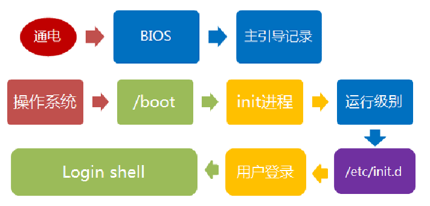
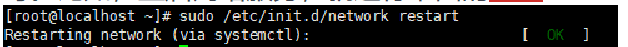
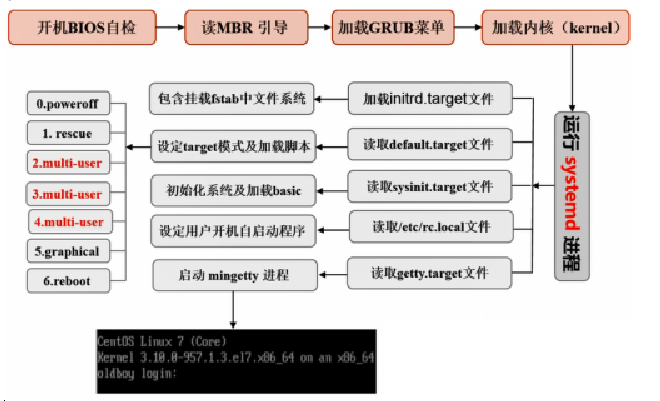
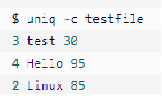
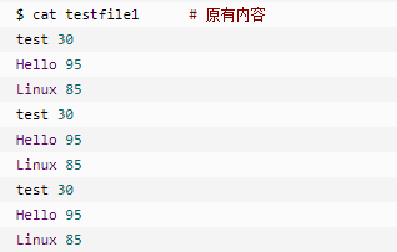
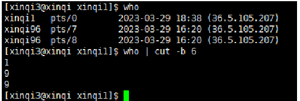
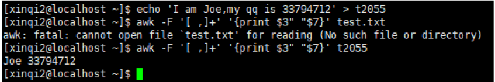
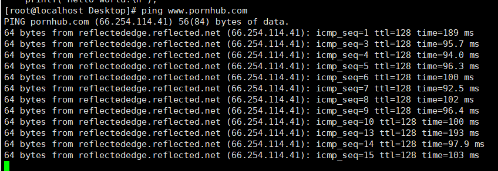
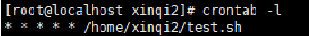

# Linux相关知识补充（一般需要则百度，非考点）


## 1.Linux开机启动过程

### 1.为什么要了解系统启动流程？

1. 主动让软件开机自启；
2. 电脑不能正常启动，排查出错的环节；
3. 排查黑客植入木马程序，到底将木马放到了哪里


### 2.启动流程：

在BIOS阶段，计算机的行为基本上是固定的，和windows也差不多；一般就是通电、BIOS、主引导记录。一般认为加载内核是linux启动流程的第一步。




- 内核的引导。
- 运行 init程序。
- 确定运行级别。
- 加载开机启动程序。
- 建立终端，用户登录系统。


#### 第一步、内核引导

首先是BIOS开机自检，按照BIOS中设置的启动设备（通常是硬盘）来启动。操作系统接管硬件以后，首先读入 /boot 目录下的内核文件。


#### 第二步、运行init

内核文件加载以后，就开始运行第一个程序 /sbin/init，它的作用是初始化系统环境。

由于init是第一个运行的程序，它的进程编号（pid）就是1。其他所有进程都从它衍生，都是它的子进程。


##### init程序的类型：

SysV: init, CentOS 5之前, 配置文件： /etc/inittab。

Upstart: init,CentOS 6, 配置文件： /etc/inittab, /etc/init/*.conf。

Systemd： systemd, CentOS 7,配置文件： /usr/lib/systemd/system、 /etc/systemd/system。

#### 第三步、确定运行级别

​	许多程序需要开机启动。它们在Windows叫做"服务"（service），在Linux就叫做"守护进程"（daemon）。

​	init进程的一大任务，就是去运行这些开机启动的程序。但是，不同的场合需要启动不同的程序，比如用作服务器时，需要启动Apache，用作桌面就不需要。Linux允许为不同的场合，分配不同的开机启动程序，这就叫做"运行级别"（runlevel）。也就是说，启动时根据"运行级别"，确定要运行哪些程序。

​	Linux预置七种运行级别（0-6）。一般来说，0是关机，1是单用户模式（也就是维护模式），6是重启。运行级别2-5，各个发行版不太一样，对于Debian来说，都是同样的多用户模式（也就是正常模式）。
​	init进程首先读取文件 /etc/inittab，它是运行级别的设置文件。打开它，如果看到第一行是这样的：    id:2:initdefault:

 

​	initdefault的值是2，表明系统启动时的运行级别为2。如果需要指定其他级别，可以手动修改这个值。

​	那么，运行级别2有些什么程序呢，系统怎么知道每个级别应该加载哪些程序呢？回答是每个运行级别在/etc目录下面，都有一个对应的子目录，指定要加载的程序。

​	上面目录名中的"rc"，表示run command（运行程序），最后的d表示directory（目录）。可以看到 /etc/rc2.d 目录中到底指定了哪些程序。


#### 第四步、加载开机启动程序

​	前面提到，七种预设的"运行级别"各自有一个目录，存放需要开机启动的程序。不难想到，如果多个"运行级别"需要启动同一个程序，那么这个程序的启动脚本，就会在每一个目录里都有一个拷贝。这样会造成管理上的困扰：如果要修改启动脚本，岂不是每个目录都要改一遍？

​	Linux的解决办法，就是七个 /etc/rcN.d 目录里列出的程序，都设为链接文件，指向另外一个目录 /etc/init.d ，真正的启动脚本都统一放在这个目录中。init进程逐一加载开机启动程序，其实就是运行这个目录里的启动脚本。

​	这样做的另一个好处，就是如果你要手动关闭或重启某个进程，直接到目录 /etc/init.d 中寻找启动脚本即可。比如，重启网络服务，就运行下面的命令：



​	至于在每个运行级中将运行哪些守护进程，用户可以通过chkconfig或setup中的"System Services"来自行设定。

#### 第五步、用户登录

开机启动程序加载完毕以后，就要让用户登录了。

一般来说，用户的登录方式有三种：

1. 命令行登录
2. ssh登录
3. 图形界面登录

这三种情况，都有自己的方式对用户进行认证。

1. 命令行登录：init进程调用getty程序（意为get teletype），让用户输入用户名和密码。输入完成后，再调用login程序，核对密码（linux还会再多运行一个身份核对程序/etc/pam.d/login）。如果密码正确，就从文件 /etc/passwd 读取该用户指定的shell，然后启动这个shell。

2. ssh登录：这时系统调用sshd程序（linux还会再运行/etc/pam.d/ssh ），取代getty和login，然后启动shell。

3. 图形界面登录：init进程调用显示管理器，Gnome图形界面对应的显示管理器为gdm（GNOME Display Manager），然后用户输入用户名和密码。如果密码正确，就读取/etc/gdm3/Xsession，启动用户的会话。


#### 第六步、进入 login shell

​	所谓shell，简单说就是命令行界面，让用户可以直接与操作系统对话。用户登录时打开的shell，就叫做login shell。

​	linux默认的shell是Bash，它会读入一系列的配置文件。上一步的三种情况，在这一步的处理，也存在差异。

1. 命令行登录：首先读入 /etc/profile，这是对所有用户都有效的配置；然后依次寻找下面三个文件，这是针对当前用户的配置。

```bash
　　~/.bash_profile

　　~/.bash_login

　　~/.profile
```

需要注意的是，这三个文件只要有一个存在，就不再读入后面的文件了。比如，要是 ~/.bash_profile 存在，就不会再读入后面两个文件了。

2. ssh登录：与第一种情况完全相同。

3. 图形界面登录：只加载 /etc/profile 和 ~/.profile。也就是说，~/.bash_profile 不管有没有，都不会运行。




## 2.字符处理命令

### 1.sort 命令

#### 1.sort:（不带参数）

```bash
sort file   
```

#### 2.sort -u file

​	它的作用很简单，就是在输出行中去除重复行。

```bash
sort -u file
```

#### 3.sort file -k 2 

​	指定按照第几列进行排序

```bash
sort file -k 2
```

#### 4.sort -r file

​	默认是升序改为降序

```bash
sort -r file
```

#### 5.sort -r src -o dst 

​	由于sort默认是把结果输出到标准输出，所以需要用重定向才能将结果写入文件，形如

```bash
sort filename > newfile
```

​	但是，如果你想把排序结果输出到原文件中，so用重定向可就不行了。会把原文件清空。


#### 6.sort -n  file。

​	有没有遇到过10比2小的情况。出现这种情况是由于排序程序将这些数字按字符来排序了，排序程序会先比较1和2，显然1小，所以就将10放在2前面。想改变这种现状，就要使用-n选项，来告诉sort，“要以数值来排序”！

```bash
sort -n file
```


#### 7.sort -n -k 2 -t : file

​	使用冒号作为分隔符，并针对第二列进行升序排序。

```bash
sort -n -k 2 -t : file
```


### 2uniq命令

​	作用：去重命令

```bash
uniq [option] file
```

#### 1.uniq -c file

检查文件并删除文件中重复出现的行，并在行首显示该行重复出现的次数。




#### 2.当重复的行并不相邻时，uniq 命令是不起作用的

​	即若文件内容为以下时，uniq 命令不起作用：



统计各行在文本中出现的次数：

```bash
sort file | uniq -c
```


在文件中找出重复的行：

```bash
sort file | uniq -d
```


### 3.cut 命令

​	从文件的每一行剪切字节、字符和字段并将这些字节、字符和字段写至标准输出。

​	如果不指定 File 参数，cut 命令将读取标准输入。必须指定 -b、-c 或 -f 标志之一。

参数:

- -b ：以字节为单位进行分割。这些字节位置将忽略多字节字符边界，除非也指定了 -n 标志。
- -c ：以字符为单位进行分割。
- -d ：自定义分隔符，默认为制表符。
- -f ：与-d一起使用，指定显示哪个区域。
- -n ：取消分割多字节字符。仅和 -b 标志一起使用。如果字符的最后一个字节落在由 -b 标志的 List 参数指示的
  范围之内，该字符将被写出；否则，该字符将被排除



### 4.awk语言

​	最基本功能是在文件或者字符串中基于指定规则浏览和抽取信息，awk抽取信息后，进行其他文本操作。通常，awk是以文件的一行为处理单位的。awk每接收文件的一行，然后执行相应的命令，来处理文本。

​       


## 3.history命令

### 1.查看最后n条历史命令

```bash
history n
```


### 2.清空历史命令

```bash
history -c
```


### 3.指定删除第几个命令的记录

```bash
history -d n
```


### 4.区别

一个是从头开始，一个是从尾开始

```bash
history | head -n 10 （）
```


## 4.进程使用内存问题

### 	1.内存泄露

​	mmemory leak，是指程序在申请内存后，无法释放已申请的内存空间，分配的空间不释放，一直占着。一次内存泄漏危害可以忽略，但内存泄漏堆积后果严重。内存发生泄漏是因为我们的程序通过大量的malloc或者new操作申请内存后，没有及时或者根本没有释放内存导致的，

### 	

### 	2.如何判断程序发生了内存泄漏？

​	Linux系统里，进行动态申请内存时如果物理内存足够，操作系统是不会停止并转储进程的，开发人员可以通过设置进程虚拟内存大小的阈值使进程自行产生DUMP，因为通常情况下我们是不知道进程发生了内存泄漏，程序往往因内存泄漏达到一定值时在当前目录下产生了DUMP文件，一般是去分析这些DUMP文件来定位解决问题的。


### 	3.内存溢出：

​	memory overflow，内存溢出是指程序在申请内存时，没有足够的内存空间供其使用，出现out of memory，比如申请了一个Integer小空间，但给它存了long才能存下的大量的数据，那就是内存溢出。程序申请的空间不够用，内存不足，内存不够用（日志里可能提示）。


## 5.网络联通

命令

```bash
ping [url]
```

ping www.baidu.com 不通，先考虑域名服务器是否配置；

ping IP 不通，考虑地址是否配错




## 6.crontab命令

​	查看计划任务表

```bash
crontab-l
```




​	修改计划任务表

```bash
crontab-e
```


## 7.Linux时间同步

​	有多台服务器进行通信的服务器集群如果时间不一致,在服务器之间的数据误差就会很大,寻找数据便会成为一件棘手的事情。若是时间无法同步,那么就算是备份了数据,你也可能无法在正确的时间将正确的数据备份。查找日志也很困难。

### 1.运行修改时间命令

​	比如执行date -s修改系统时间，这个方法适合自己测试环境用

```bash
date -s “2019-05-25 17:00:00”   

clock -w

-w, --systohc        set the hardware clock from the current system time
```


### 2.安装了一个ntpdate命令，然后同步时间的master是一个所有人都可以用的master

```bash
yum -y install ntp ntpdate

ntpdate cn.pool.ntp.org / time.windows.com
```


### 3.NTP服务

​	使用ntpd server，为多台机器同步时间。选择一台机器作为master，其他机器都和这台机器同步时间。


