# Linux进程相关(基于CentOS7)

## 1.进程

### 	1.定义：

​		计算机应用软件或代码程序被执行，运行于内存中的时候，被称之为进程，进程是在CPU及内存中运行的程序代码，而每个进程可以创建一个或多个进程。

​	程序运行成为进程后，系统会为其分配内存资源，并分配PID，文件描述符，网络端口，运行用户等资源

​		进程运行过程中，系统会有各种指标来表示当前运行的状态。

​		操作系统启动的时候有个总进程（系统的第一个进程）systemd，后续的所有进程都是总进程生成的，以此类推，构成一个树状结构。


### 2.内核功能：

​	包括文件系统管理，进程管理，内存管理，网络管理。


### 3.为了管理这些进程，用户应该能够：

●查看所有运行中的进程---------ps命令，top命令

●查看进程消耗资源-------------top命令，ps命令

●定位个别进程并且对其执行指定操作-------pidof，pgrep命令

●改变进程的优先级----------------nice命令

●杀死指定进程--------------------kill命令

●限制进程可用的系统资源等


### 4.查看进程方法：

- ps aux           快照
- ps -ef
- top                录像，动态变化
- pstree -aup


以树状图的方式展现进程之间的派生关系，比较直观。

```bash
pstree -aup | grep python
```

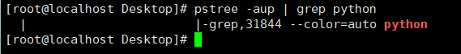


## 2.进程优先级

​	默认情况下，进程启动后以0的优先级启动。进程优先级可以通过top命令显示NI(nice value)列查看。

​	实际上，用户可以设置和改变进程的优先级。提高一个进程的优先级，内核会分配更多CPU时间片给这个进程。

​	进程优先级值的范围从-20到19，值越低，优先级越高。

```bash
nice -[优先值] [进程名]    #通过给定的优先级启动一个程序（需要root权限执行）
```

```bash
nice --3 top
```

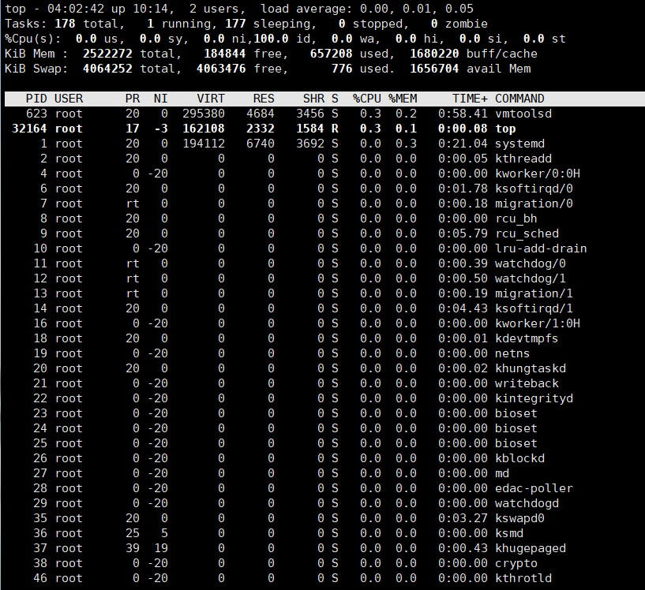


## 3.pidof与pgrep命令

### 	1.pidof

​	用于检索指定的命令，返回相应的进程ID。其中program是一个或多个命令或进程的名字。当需要终止某个进程时，传统的做法是利用ps命令列出所有的进程，使用grep命令选出目标进程，然后使用kill命令终止进程。利用pidof命令，可以省略ps与grep组合命令，直接把指定命令的进程ID写入到标准输出。

```bash
pidof top              #找到PID

kill -9 PID
```


### 	2.pgrep

​	一看到pgrep首先会想到什么？没错，grep！pgrep的p表明了这个命令是专门用于进程查询的grep。

```bash
$ pgrep top

$kill -9 1827
```


## 4.kill命令

### 	1.定义

​	从字面来看，就是用来杀死进程的命令，但事实上，这个或多或少带有一定的误导性。从本质上讲，**kill 命令只是用来向进程发送一个信号，至于这个信号是什么，是用户指定的。** 

​	也就是说，kill 命令的执行原理是这样的，kill 命令会向操作系统内核发送一个信号(多是终止信号)和目标进程的 PID，然后系统内核根据收到的信号类型，对指定进程进行相应的操作。


终止你需要停止的进程

用法：

```bash
 kill  [选项]  进程号...
```

- -l 列出全部的信号名称
- -s 指定要发送的信号 


### 2.信号的管理：

```bash
 kill 工具
```

用来向进程发送控制信号，以实现对进程管理，每个信号对应一个数字，信号名称以SIG开头，不区分大小写

```bash
 kill PID = kill -15 PID   #非强制

 kill -9 PID               #强制杀
```


#### 【例 1】 标准 kill 命令。

```bash
 kill PID
```

\#杀死进程，默认信号是15，正常停止
\#如果默认信号15不能杀死进程，则可以尝试-9信号，强制杀死进程


#### 【例 2】 使用“-19”信号，让进程暂停。

```bash
 vi test.sh      #使用vi命令编辑一个文件，不要退出
 ps aux | grep "vi" 
```

\#换一个不同的终端，查看一下这个进程的状态。进程状态是S（休眠）和+（位于后台），因为是在另一个终端运行的命令


```bash
kill -19 PID
```

\#使用-19信号，让PID进程暂停。相当于在vi界面按 Ctrl+Z 快捷键


```bash
ps aux | grep "vi" 
```

​	\#注意进程的状态，变成了 T（暂停）状态。这时切换回vi的终端,发现vi命令已经暂停，又回到了命令提示符，不过进程就会卡在后台。如果想要恢复，可以使用"kill -9 PID”命令强制中止进程

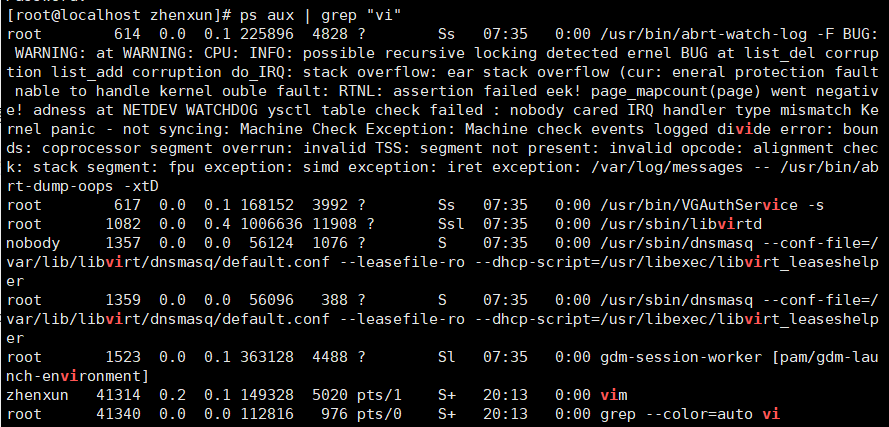

​	

​	重新读取一次参数的配置文件 （类似 reload）

```bash
	kill -1：
```


​	对daemon守护进程是重新读取配置，也就是重启进程；对普通进程就是杀掉。


​	杀死指定用户的所有进程

```bash
kill -9 $(ps -ef | grep hnlinux)     //方法一 过滤出hnlinux用户进程 
```


## 5.进程之间的通信

​	同一主机上：管道，套接字，文件映射，共享内存，信号


​	管道符的两边开启了2个进程 ：

```bash
cat f1 | grep ‘^3’
```

 分别为 cat 与 grep 两个进程


### 	1.跨主机通信：

​	socket：ip+port端口号，ip确定了设备在网络中的位置，端口号确定设备上的具体应用程序。


### 	2.ipcs命令：

​	该命令报告进程间通信设施状态。（共享内存，消息队列，信号量）

```bash
ipcs -p -m
```

  列出最近访问了共享内存段的进程的创建者的ID和进程ID


## 6.根据PID获取进程信息

​	/proc目录是一个特殊的文件系统，它不占用磁盘空间，该目录下的内容是根据用户请求的信息，由内核实时生成。

​	Linux在启动一个进程时，系统会在/proc下创建一个以PID命名的文件夹，在该文件夹下会有启动的进程的信息。

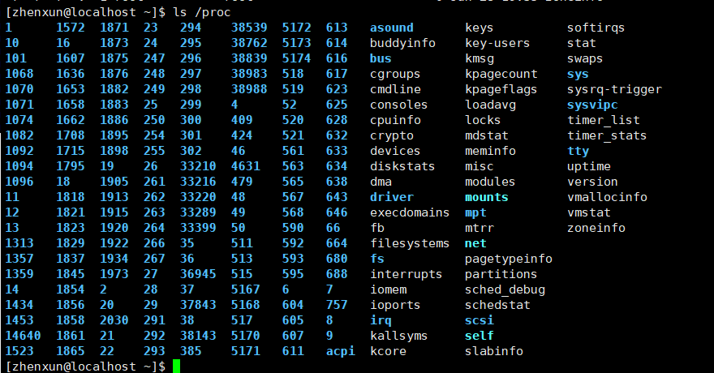

- cwd符号链接的是进程运行目录；
- exe符号链接就是执行程序的绝对路径；
- cmdline就是程序运行时输入的命令行命令；
- environ记录了进程运行时的环境变量；
- fd目录下是进程打开或使用的文件的符号链接


## 7.W指令

### 	1.作用

```bash
w
```

​	提供当前登录用户及其正在执行的进程的信息，显示信息头包含：当前时间，系统运行时长，登录用户数，过去的1，5，15分钟内的负载均衡数。

​	

### 	2.与who，who am i进行下对比

1.  JCPU指的是与该tty终端连接的所有进程占用的时间，不包括过去的后台作业时间；PCPU 指的是当前进程(即w项中显示的)所占用的时间。
2.  Linux系统初始化时会为每个cpu创建一个idle线程，当没有其他进程需要运行的时候，便运行idle线程。

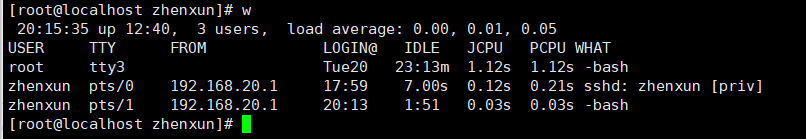


## 8.top指令

### 1.作用

​	top，监视系统中不同的进程所用的资源。它提供实时的系统状态信息。显示进程的数据包括PID、进程属主、优先级、%CPU、%MEM。


### 2.直接命令操作

- top -[option]
- top -d time指定每两次屏幕信息刷新之间的时间间隔。当然用户可以使用s交互命令来改变之
- top -p pid通过指定监控进程ID来仅仅监控某个进程的状态。
- top -s使top命令在安全模式中运行。这将去除交互命令所带来的潜在危险。
- top -i 使top不显示任何闲置或者僵死进程。
- top -c:显示整个命令行而不只是显示命令名。也可以在交互式操作里使用-c选项


### 3.交互式操作：

​	s – 改变画面更新频率，改变两次刷新之间的延迟时间。系统将提示用户输入新的时间，单位为s。如果有小数，就换算成m s。输入0值则系统将不断刷新，默认值是3s。需要注意的是如果设置太小的时间，很可能会引起不断刷新，从而根本来不及看清显示的情况，而且系统负载也会大大增加。


#### 1.指令：

- l – 关闭或开启第一部分第一行 top 信息的表示
- t – 关闭或开启第一部分第二行 Tasks 和第三行 Cpus 信息的表示
- m – 关闭或开启第一部分第四行 Mem 和 第五行 Swap 信息的表示
- N – 以 PID 的大小的顺序排列表示进程列表
- P – 以 CPU 占用率大小的顺序排列进程列表
- R – 对已排序的列反转排序
- M – 以内存占用率大小的顺序排列进程列表
- h – 显示帮助
- n – 设置在进程列表所显示进程的数量（先输入n，再输入整数）
- q – 退出 top
- x – 高亮显示排序的列（先指定按照P或M排序，然后键入x）
- z - 以彩色信息展示
- b - 高亮显示
- \>或< - 改变排序的列，依然高亮显示


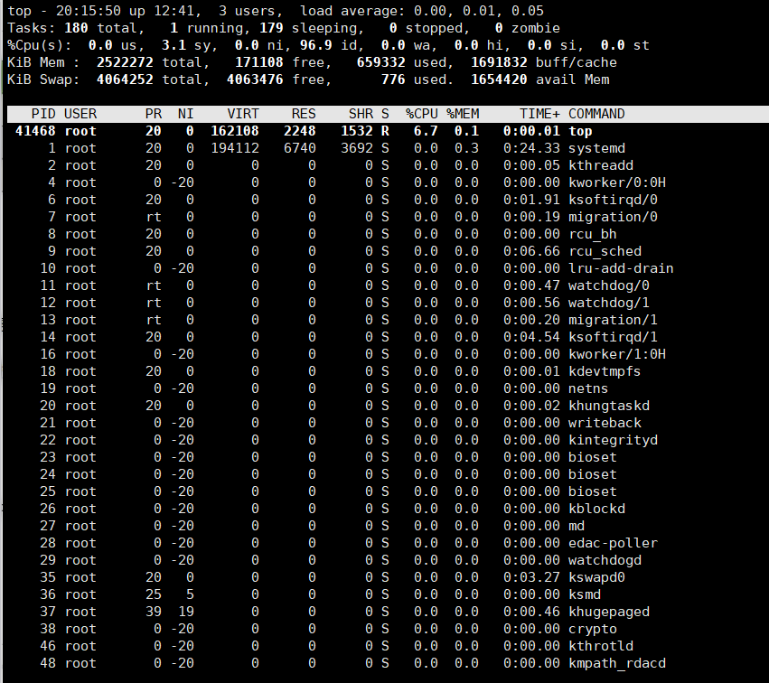


#### 2.说明： 

#####   1.第一行，任务队列信息，同 uptime 命令的执行结果


   系统时间：19:27:05

   运行时间：up 28 days,

   当前登录用户： 3 users

   负载均衡(uptime) load average: 0.01, 0.01, 0.05，average后面的三个数分别是1分钟、5分钟、15分钟的负载情况。


​	load average数据是每隔5秒钟检查一次活跃的进程数，然后按特定算法计算出的数值。显示的是平均值，即对于16核的系统，如果每个核上CPU利用率为30%，则系统负载应该维持在4.8%左右。对4核系统，如果负载维持在4左右，则意味着cpu几乎不存在空闲状态，利用率接近于100%。


​	补充：逻辑cpu数:一般情况下,逻辑cpu=物理CPU个数×每颗核数,如果不相等的话,则表示服务器的CPU支持超线程技术(HT:简单来说,它可使处理器中的1 颗内核如2 颗内核那样在操作系统中发挥作用。这样一来,操作系统可使用的执行资源扩大了一倍,大幅提高了系统的整体性能,此时逻辑cpu=物理CPU个数×每颗核数x2


##### 2.第二行，Tasks — 任务（进程）

总进程:150 total, 运行:1 running, 休眠:149 sleeping, 停止: 0 stopped, 僵尸进程: 0 zombie


##### 3.第三行，cpu状态信息

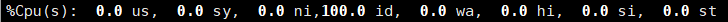

- us【user space】— 用户空间占用CPU的百分比。
- sy【sysctl】— 内核空间占用CPU的百分比。
- ni【】— 改变过优先级的进程占用CPU的百分比
- id【idolt】— 空闲CPU百分比
- wa【wait】— IO等待占用CPU的百分比
- hi【Hardware IRQ】— 硬中断占用CPU的百分比
- si【Software Interrupts】— 软中断占用CPU的百分比


##### 4.第四行,内存状态


##### 5.第五行，swap交换分区信息


###### *备注：

可用内存=free + buffer + cached


注意：对于内存监控，在top里我们要时刻监控第五行swap交换分区的used，如果这个数值在不断的变化，说明内核在不断进行内存和swap的数据交换，这是真正的内存不够用了。


第四行中使用中的内存总量（used）指的是现在系统内核控制的内存数，第四行中空闲内存总量（free）是内核还未纳入其管控范围的数量。


##### 6.第六行，空行

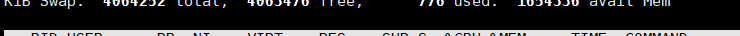

##### 7.第七行以下：各进程（任务）的状态监控


1. PID — 进程id；USER — 进程所有者；PR — 进程优先级；NI — nice值。负值表示高优先级，正值表示低优先级；VIRT — 进程使用的虚拟内存总量，单位kb，VIRT=SWAP+RES；RES — 进程使用的、未被换出的物理内存大小，单位kb。RES=CODE+DATA；SHR — 共享内存大小，单位kb；S —进程状态：（D=不可中断的睡眠状态 R=运行； S=睡眠 ；T=跟踪/停止 ；Z=僵尸进程）；%CPU — 上次更新到现在的CPU时间占用百分比；%MEM — 进程使用的物理内存百分比；TIME+ — 进程使用的CPU时间总计，单位1/100秒；COMMAND — 进程名称（命令名/命令行）
2. VIRT：virtual memory usage 虚拟内存1、进程“需要的”虚拟内存大小，包括进程使用的库、代码、数据等2、假如进程申请100m的内存，但实际只使用了10m，那么它会增长100m，而不是实际的使用量
3. RES：resident memory usage 常驻内存1、进程当前使用的内存大小，但不包括swap out2、包含其他进程的共享3、如果申请100m的内存，实际使用10m，它只增长10m，与VIRT相反4、关于库占用内存的情况，它只统计加载的库文件所占内存大小
4. SHR：shared memory 共享内存1、除了自身进程的共享内存，也包括其他进程的共享内存2、虽然进程只使用了几个共享库的函数，但它包含了整个共享库的大小3、计算某个进程所占的物理内存大小公式：RES – SHR4、swap out后，它将会降下来
5. DATA1、数据占用的内存。如果top没有显示，按f键可以显示出来。2、真正的该程序要求的数据空间，是真正在运行中要使用的。


#### 3.*总的指令

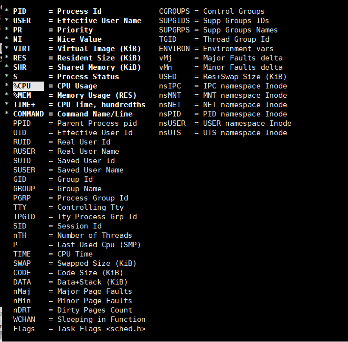


### 	常用命令说明

- Ctrl+L：擦除并且重写屏幕
- K：终止一个进程。系统将提示用户输入需要终止的进程PID，以及需要发送给该进程什么样的信号。一般的终止进程可以使用15信号；如果不能正常结束那就使用信号9强制结束该进程。默认值是信号15。在安全模式中此命令被屏蔽。
- r:重新安排一个进程的优先级别。系统提示用户输入需要改变的进程PID以及需要设置的进程优先级值。输入一个正值将使优先级降低，反之则可以使该进程拥有更高的优先权。默认值是10。
- f或者F：从当前显示中添加或者删除项目。
- o或者O：改变显示项目的顺序
- l：切换显示平均负载和启动时间信息。
- m:切换显示内存信息。
- t:切换显示进程和CPU状态信息。
- T:根据时间/累计时间进行排序。
- W:将当前设置写入~/.toprc文件中。


## 9.ps命令

​	ps命令用于报告当前系统的进程状态。可以搭配kill指令随时中断、删除不必要的程序。使用该命令可以确定哪些进程正在运行和运行的状态，进程是否结束，有没有僵死，哪些进程占用了过多的资源。


### (1) ps -a 列出所有运行中的进程，包括所有终端

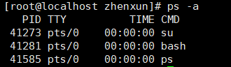

### （2）ps -elf命令：显示所有用户所有进程信息 

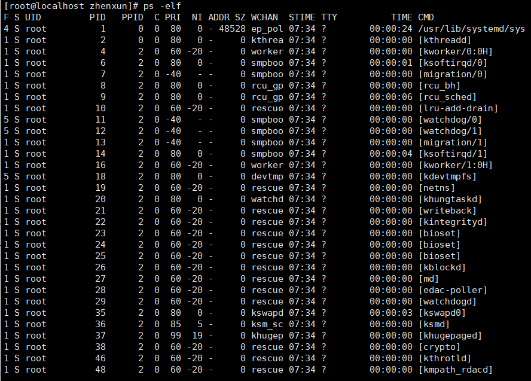

#### 1.命令

- -e：显示系统内的所有进程信息
- -l：使用长格式显示进程信息
- -f：使用完整的格式显示进程信息


#### 2.说明：

- UID:   进程被该UID所拥有;

- PID:    进程的标识号;

- PPID:   进程的父进程的标识号;

- C:     CPU使用的资源百分比;

- STIME:  进程开始的时间;

- TTY:    该进程是在哪个终端机上面运作,若与终端机无关,则显示?,另外,tty1-tty6是本机进程,若为pts/0等,则表示为由网络连接进主机的进程;

- TIME:   进程所使用的总的CPU时间;

- CMD:   正在执行的命令行。

  

  ```bash
  ps -elf | grep 列出需要的进程
  ```

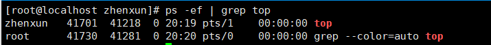


### （3）ps -aux：以简单列表的形式显示出进程信息ps aux-快照

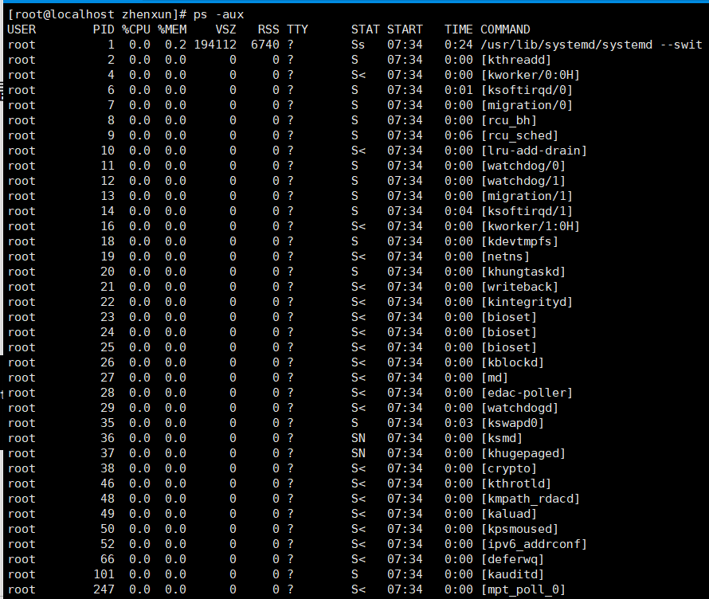

#### 1.命令：

- -a：显示所有终端机下执行的程序。
- -u：使用以用户为主的格式输出进程信息。
- -x：显示当前用户在所有终端下的进程。


#### 2.说明：

- USER：启动该进程的用户账号
- PID：进程ID，在当前系统中是唯一的
- %CPU：CPU占用的百分比
- %MEM：内存占用百分比
- VSZ：占用虚拟内存大小
- RSS：占用常驻内存（物理内存）大小
- TTY：该进程在哪个终端下运行，？表未知或者不需要终端
- STAT：-显示进程当前的状态，如S休眠，R运行，Z僵死，< 高优先级，N低优先级，s父进程，+前台进程。
- START：启动该进程的时间
- TIME：该进程占用CPU时间
- COMMAND：启动该进程的命令的名称

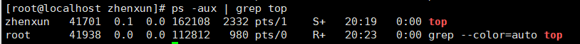


## 10.前台与后台进程

### 1.进程类型：

1. **守护进程-daemon**，计算机启动以后就自动运行，就和终端没关系了，如果不是守护进程的话，一旦命令行窗口关闭，程序就终止了。
2. **前台进程**-跟终端相关，通过终端启动的进程
3. **后台进程**


### 2.前后台进程管理---作业管理：

- 前台管理：依赖一个终端，在某个终端运行，启动后就占用这个终端，在这个终端就不能做其他的操作了。
- 后台管理：不占用终端资源，在进程执行的时候加一个&符号ping 19.10.12.12 > output.log tail -f output.log & 
- 前后台运行的切换：默认大多数命令都是在前台执行，CTRL+C就是给前台执行的程序发送终止信号，快捷键只对前台执行的生效。对后台执行的程序无效。
- CTRL+Z把前台程序放到后台（放到后台后就不运行了），通过bg作业编号，把后台停止的作业恢复成后台运行态


### 3.作业编号的查询：

​	jobs命令或者kill -18 %作业编号


### 4.后台运行->后台停止：

​	发送19信号：kill -19 %作业编号 


#### 	fg 作业编号----恢复到前台执行

​	后台执行的作用：前台执行都是按照循序执行的，后台执行都可以实现并行执行

​	注意：后台执行的任务在终端关闭后也会随之关闭


#### 	bg 作业编号----恢复到后台执行


​	命令后面接&表示后台运行

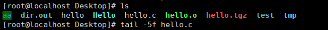

#### 	ctrl + z挂起，将任务暂停，挂至后台

#### 	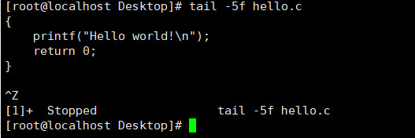

#### 	jobs显示所有的后台运行程序

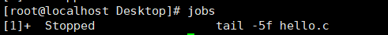

#### 	恢复命令使用fg 数字序号。

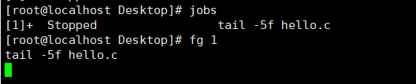

#### 	恢复后ctrl+c终止前台程序，再次输入jobs查询下，序号1的命令就不在了。

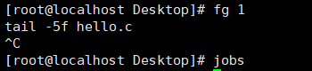


#### 	使用bg命令让程序在后台运行

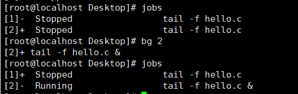

##### 	S: 唤醒，T: 停止

​	自己敲的命令属于用户态进程，[]属于内核态的进程。

#### Ctrl + A + D 切换至后台，且正常运行。

## 11.进程和程序

### 1.进程：

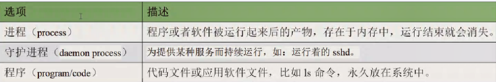

注意：每个进程都有唯一的ID，叫做PID.

1. 当程序运行的时候会产生父进程,并可能派生多个子进程。
2. 当父进程接收到任务调度时,将任务交给派生的子进程处理,子进程会继承父进程属性。
3. 子进程在处理任务时,父进程会进入等待状态中...
4. 子进程处理任务完成后,会发出信号并执行退出,退出前会唤醒父进程来回收子进程的资源。
5. 如果子进程在处理任务过程中异常退出终止,父进程就可能没有回收子进程的资源,导致子进程虽然运行实体已经消失,但仍然在内核中的进程表中占据记录(僵尸进程),长期下去会浪费系统资源。
6. 如果子进程在处理任务过程中,父进程退出或意外终止,则子进程可能未退出,那么子进程就没有父进程来管理了,由系统的system进程管理(孤儿进程)


### 2.程序运行时进程的状态关系:

1. 父进程复制自己的地址空间创建新的子进程,子进程可以继承父进程(ppid)的环境变量
2. 进程是由systemd这个父进程派生出来的子进程
3. 子进程在运行自己的程序代码的时候,父进程往往会进入到睡眠状态。
4. 子进程完成程序代码发出退出信号请求,子进程已经关闭或丢弃了其资源环境,剩余的部分称之为僵停(僵尸Zombie)
5. 父进程在子进程退出时收到信号会被唤醒,清理剩余的结构,然后继续执行其自己的程序代码。 
