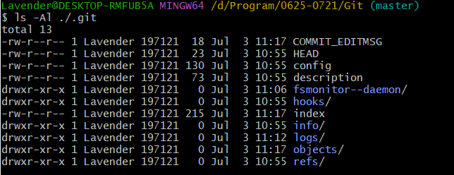
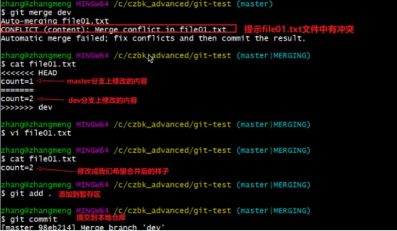

# Git分布式版本控制工具


## 1.作用

​	Git是一个分布式版本控制工具,主要用于管理开发过程中的源代码文件(Java类、xml文件、html页面等),在软件开发过程中被广泛使用。


## 2.概述

### 2.1.开发中的实际场景

```
场景一：备份
	没保存文件，硬盘炸了，文件没了
	
场景二：代码还原
	看着代码想了一周时间，突然想到了优化方案，再次打开文件时发现代码已经被改的面目全非无从下手修改
	
场景三：协同开发
	小明和小红同时上传了文件config.yaml，但是由于小明是优先上传成果，而小红上传在后，将小明的文件直接覆盖，导致小明的文件消失了。
	
场景四：追溯问题代码的编写人和编写时间
	员工A上周写了BUG代码导致运行公司项目时报一堆错误且无从下手修改，且该员工已经跑路，导致公司目前损失惨重。
```


### 2.2. 版本控制器的方式

```
a.集中式版本控制工具
	集中式版本控制工具，版本库是集中存放在中央服务器的，team里每个人对work时从中央服务器下载代码，是必须联网才能工作，局域网或互联网。个人修改后再次提交到中央版本库。
	举例：SVN和CVS
	
b.分布式版本控制工具
	分布式版本控制系统没有"中央服务器"，每个人的电脑上都是一个完整的版本库，这样工作的时候，无需联网，因为版本库在自己的电脑上。多人协作只需要各自的修改推送给对方，就能互相看到对方的修改了。
	举例：Git
```


### 2.3 SVN


补充：**什么是分布式？**

​	分布式是一种计算机系统的设计方法，它将计算机系统中的不同部分分散在不同的地方，通过网络连接起来，共同协作完成任务。图片中分别展示了集中式、分散式和分布式三种设计方法的示意图：


- 集中式系统：传统的数据库管理系统，如 Oracle、MySQL 和 Microsoft SQL Server 等，通常使用集中式模型。这些系统将所有数据存储在一个中央服务器上，并且客户端与服务器进行通信以访问和操作数据。另一个例子是源代码管理工具 Perforce，它使用中央服务器来存储代码库并进行版本控制。
- 分布式系统：大规模的分布式计算系统，例如 Apache Hadoop 和Apache Spark 等，将数据和计算任务分配到多个计算机节点上进行处理。每个节点都可以独立地执行任务，并使用通信协议进行交互。Google 的 MapReduce 框架也是一个分布式系统的示例，它用于处理大规模的数据集。（steam的分布式服务器(笑)）
- 分散式系统：比特币网络是一个分散式系统的典型示例。在比特币网络中，所有节点都是对等的，并且可以独立地处理交易请求。这种模型具有高度冗余性，因为即使其中一个节点失败，整个系统也会继续工作。另一个例子是 IPFS(Inter Planetary File System ) , 它是一个完全去中心化的文件共享协议，用户可以通过该协议安全地共享文件和信息。


### 2.4 Git

```
	Git是分布式的，Git不需要中心服务器，我们每台电脑拥有的东西都是一样的。我们使用Git并且有个中心服务器，仅仅是为了方便交换大家的修改，但是这个服务器的地位和我每个人的pc是一样的。我们可以把它当作一个开发者的pc就可以就是为了大家代码容易交流不关机用的。没有它大家一样可以工作，只不过"交换"修改不方便而已。
	Git 是一个开源的分布式版本控制系统，可以有效、高速地处理从很小到非常大的项目版本管理。Git是Linus Torvalds 为了帮助管理 Linux 内核开发 而开发的一个开放源码的版本控制软件。
	同生活中的许多伟大事务一样，Git诞生于一个极具纷争、大举创新的的年代。Linux内核开源项目有着为数众多的参与者。绝大多数的Linux内核维护工作都花在了提交补丁和保存归档的繁琐事务上(1991 - 2002年间)。到2002年，整个项目组开始启用一个专有的分布式版本控制系统 BitKeeper 来管理和维护代码。
	到了2005年，开发 BitKeeper 的商业公式同 Linux 内核开源社区的合作关系结束，他们收回了Linux 内核社区免费试用 BitKeeper 的权力。这就迫使 Linux 开源社区（特别是Linux的缔造者Linus Torvalds）基于使用 BitKeeper 时的经验教训，开发出自己的版本系统。他们对新的系统制定了若干目标：
	速度
	简单的设计
	对非线性开发模式的强力支持（允许成千上万个并行开发的分支）
	完全分布式
	有能力高效管理类似Linux内核一样的超大规模项目（速度和数据量）
```


### 2.5 Git工作流程图


命令如下：

1. clone(克隆)：从远程仓库中克隆代码到本地仓库
2. checkout(检出)：从本地仓库中检出一个仓库分支然后进行修改
3. add(添加)：在提交前先将代码提交到暂存区(index)
4. commit(提交)：提交到本地仓库。本地仓库中保存修改的各个历史版本
5. fetch(抓取)：从远程库，抓取到本地仓库，不进行任何的合并动作，一般操作比较少。
6. pull(拉取)：从远程库拉到本地库，自动进行合并(merge)，然后放到工作区，相当于fetch + merge
7. push(推送)：修改完成后，需要和团队成员共享代码时，将代码推送到远程仓库


## 3.安装与配置

### 1.下载与安装

下载地址：https://git-scm.com/download


下载完成后可以得如下安装文件：


​	打开并安装，默认一直“next”即可。安装完成后在电脑桌面(也可以是其他目录)点击右键，如果能看到如下的两个菜单则说明Git安装成功：


备注：

- `Git GUI`：Git提供的图形界面工具
- `Git Bash`：Git提供的命令行工具

​	当安装Git后首先要做的事便是设置用户名称和email地址。这是非常重要的，因为每次Git提交都会使用该用户信息


### 2.基本配置

1. 打开`Git Bash`
2. 设置用户信息

```bash
$ git config --global user.name "liuliyang"

$ git config --global user.email "leo7632527@live.com"
```


查看配置信息

```bash
$ git config --global user.name        #回车
liuliyang 

$ git config --global user.email       #回车查看
leo7632527@live.com
```


初始化所创建的文件夹

```bash
$ git init
```


### 3.为常用指令配置别名(可选)

​	有些常用的指令参数非常多，每次都要输入好多参数，我们可以使用别名。

​	（也就是指令的自定义化。）


1. 打开用户目录，创建`.bashrc`文件

   部分Windows系统不允许用户创建点号开头的文件，可以打开GitBash，执行`touch ~/.bashrc`

   

   

2. 在`.bashrc`文件中输入如下内容

   ```bash
   #用于输出git提交日志
   alias git-log='git log --pretty=oneline --all --graph --abbrev-commit'
   #用于输出当前目录所有文件及基本信息
   alias  ll='ls -al'
   #用于一次性暂存并提交所有修改和删除的文件
   alias commit='git commit -a'
   ```

3. 打开GitBash，执行`source ~/.bashrc`


### 4. 解决GitBash乱码问题

1. 打开GitBash执行下面命令

   ```bash
   git config --global core.quotepath false
   ```

2. `${git_home}/etc/bash.bashrc`文件最后加入下面两行

   ```bash
   export LANG="zh_CN.UTF-8"
   export LC_ALL="zh_CN.UTF-8"
   ```


### 附：疑难问题解决

#### 1.Windows下看不到隐藏文件(.bashrc、.gitignore)


#### 2.Windows下无法创建 .ignore|.bashrc 文件

这里以创建`.ignore`文件为例：

- 在git目录下打开GitBash
- 执行指令`touch .gitignore`


#### 3.补充：本地仓库内容

1. HEAD:指向当前活动分支的指针。
2. config：版本库的配置文件，包括用户名、邮件地址、编辑器等信息
3. description：用于在GitWeb等工具中显示有关版本库的描述信息
4. hooks: 包含可自定义的Git钩子脚本，用于实现特定功能或执行自动化任务
5. object：包含Git对象数据库，其中存储了版本库中所有的文件和提交历史记录
6. refs：包含分支和标签的指针文件，其中保存了每个分支和标签及其所指向的提交ID
7. index：暂存区的索引文件，用于记录下一次提交要包括的文件




## 4.基础操作指令

​	Git工作目录对于文件的修改(增加、删除、更新)会存在几个状态，这些修改的状态会随着我们执行Git的命令而发生变化。


### 1.如何使用命令来控制这些状态之间的转换：

1. git add [path] （工作区—>暂存区）
2. git commit -m "[description]" (暂存区—>本地仓库)


### 2.查看修改的状态(status)

- 作用：查看的修改的状态（暂存区、工作区）
- 命令形式`git status`


### 3.添加日志

这一步是方便我们在git仓库中查看文件上传时的一些备注信息等等

```bash
git commit -m "[description]"      #跟着的是注释
```

其中，`m`指的是message.


### 4.查看提交日志(log)

- 作用：查看提交记录
- 命令形式：`git log [option]`
  - options
    - `--all`显示所有分支
    - `--pretty=oneline`将提交信息显示为一行
    - `--abbrev-commit`使得输出的commitID更简短
    - `--graph`以图的形式显示


### 5.版本回退

- 作用：版本切换
- 命令形式：`git reset --hard commitID`
  - `commitID`可以使用`git-log`或`git log`指令查看
- 如何查看已经删除的记录？
  - `git reflog`
  - 这个指令可以查看到已经删除的提交记录
  - 但是一段的时间之后内容就会被清空！！！


### 6.添加文件至忽略列表

​	一般我们总会有些文件无需纳入Git的管理，也不希望它们总出现在未跟踪文件列表。通常都是些自动生成的文件，比如日志文件，或者编译过程中创建的临时文件等。在这种情况下，我们可以在工作目录中创建一个名为`.gitignore`的文件(文件名称固定)，列出要忽略的文件模式。下面是一个示例：

```bash
# no .a files
*.a
# but do track lib.a, even though you're ignoring .a files above
!lib.a
# only ignore the 'TODO' file in the current directory , not subdir/TODO
/TODO
# ignore all files in the 'build/' directory
build/
# ignore doc/notes.txt , but not doc/server/arch.txt
doc/*.txt
# ignore all .pdf files in the doc/ dirctory
doc/**/*.pdf
```


### 7.练习

```bash
###################仓库初始化#########################
# 创建目录(git_test01) 并在目录下打开GitBash

# 初始化Git仓库
git init

###################创建文件并提交######################
# 目录下创建文件 file01.txt
touch file01.txt

# 将修改加入暂存区(index)
git add .              #当前路径下的所有文件

# 将修改提交到本地仓库，提交记录内容为： commit 001
git commit -m "commit 001"

# 查看日志
git log

###################修改文件并提交######################
# 修改file01的内容为： count = 1
echo 'count = 1' > file01.txt

# 将修改加入暂存区
git add .

# 将修改提交到本地仓库，提交记录内容为：update file01
git commit -m "update file01"

# 查看日志
git log

# 以精简的方式显示提交记录
git log --pretty=oneline --all --graph --abbrev-commit

################将最后一次修改还原######################
# 查看提交记录
git log

# 找到倒数第2次提交的commitID
commit f89d15fddb11c9461b2d3d0fe6f76bac78c442b5
Author: liuliyang <leo7632527@live.com>
Date:   Mon Jul 3 11:12:10 2023 +0800

    add test.txt

# 版本回退
git reset --hard f89d15fddb     #无需完整写入commitID中，部分匹配到即可

# 查看文件内容
cat file01.txt

################将修改还原的操作还原######################
# 查看已经删除的记录
git reflog

# 找到需要还原被删除的commitID

#复原被修改的文件
git reset --hard commitID
```


## 5.分支

​	几乎所有的版本控制系统都以某种形式支持分支。使用分支意味着你可以把你的工作从开发主线上分离开来进行重大的Bug修改、开发新的功能，以免影响开发主线。

### 1.查看本地分支

- 命令：`git branch`


### 2.创建本地分支

- 命令：`git branch [branch_name]`


### 3.切换分支

​	命令：

- `git checkout [branch_name]`

- `git checkout -b 分支名`


### 4.合并分支

​	一个分支(合并分支)上的提交可以合并到另一个分支(目标分支)

- 需要先切换到目标分支: `git checkout [branch_name]`
- 合并命令：`git merge [合并命令]`


### 5.删除分支

​	**不能删除当前分支，只能删除其他分支**

- `git branch -d [branch_name]` 删除分支时，需要做各种检查
- `git branch -D [branch_name]`不做任何检查，强制删除

- eg：

### 6.解决冲突

​	当两个分支上对文件的修改可能会存在冲突，例如同时修改了同一个文件的同一行，这时就需要手动解决冲突，解决冲突的步骤：

1. 处理文件中冲突的地方
2. 将解决完冲突的文件加入暂存区(add)(index)
3. 提交到仓库(commit)

​	冲突部分的内容处理如下：




### 7.开发中分支使用原则与流程

​	几乎所有的版本控制系统都以某种形式支持分支。使用分支意味着你可以把你对工作从开发主线上分离开来进行重大的Bug修改、开发新的功能，以免影响开发主线。

​	在开发中，一般有如下分支使用原则与流程：

- master (生产) 分支

​		线上分支，主分支，中小规模项目作为线上运行的应用对应的分支。

- develop (开发) 分支

​		是从master创建的分支，一般作为开发部门的主要开发分支，如果没有其他并行开发不同期上线要求，都可以在此版本进行开发，阶段开发完成后，需要是合并到master分支，准备上限。

- feature/xxxx分支

​		从develop创建的分支，一般是同期并行开发，但不同期上线时创建的分支，分支上的研发任务完成后合并到develop分支

- hotfix/xxxx分支

  从master派生的分支，一般作为线上bug修复使用，修复完成后需要合并到master、test、develop分支。

- 还有一些其他分支，如test分支(用于代码测试)、pre分支(预线上分支)等等。


## 6.Gitee

### 1.注册并登录Gitee

​	[注册 - Gitee.com](https://gitee.com/signup?redirect_to_url=%2F)


### 2.在工作台进行创建新仓库


	

创建，之后通过GitBash进行远程仓库连接上传


### 3.添加远程仓库

​	先初始化本地库，然后与已创建的远程库进行对接。

​	命令： `git remote add [远程名称] [仓库路径]`

- 远程名称，默认是origin，取决于远端服务器设置

- 仓库路径，从远端服务器获取此URL

如：

```bash
  $ git remote add origin https://gitee.com/leo7632527/note.git
```


### 4.查看远程仓库

​	命令：`git remote`


### 5.推送到远程仓库

- ​	命令：`git push [	-f] [ --set-upstream] [远端名称[ 本地分支名[：远端分支名]]] ` 

  - 远程分支名与本地分支名一致时可只写本地分支

    - `git push origin master=git push origin master:master`

  - `-f` = `--force` 表示强制覆盖

  - `-u` = `--set-upstream` 推送到远端的同时并且建立起和远端分支的关联关系

    - `git push --set upstream origin master`

  - 如果当前分支已经和远端分支关联，则可以省略分支名和远端吗。

    - `git push` 将master分支推送到已关联的远端分支。

    

  - **`git push -u origin` 第一次使用时需要**

    **之后上传只需要`git push`**


### 6.本地分支与远程分支的关联关系

- 查看关联关系我们可以使用`git branch -vv` 命令


### 7.从远程仓库克隆

​	如果已经有一个远端仓库，可以直接使用`git clone`到本地

- 命令： `git clone [仓库路径] [本地目录]`

  - 本地目录可以忽略，会自动生成一个目录

  

  

  


### 8.从远程仓库中抓取和拉取

​	远程分支和本地的分支一样，我们可以进行merge操作进行合并，只需要先把远端仓库的更新都下载到本地在进行操作。

- 抓取 命令：`git fetch [remote_name] [branch_name]`
  - 抓取指令就算将仓库里的更新都抓取到本地，不会进行合并
  - 如果不指定远端名称和分支名，则抓取所有分支。
- 拉取 命令：`git pull [remote_name] [branch_name]`
  - 拉取指令将远端仓库的修改拉到本地并自动进行合并覆盖，相当于`fetch+merge`
  - 不指定远端名称和分支名，则抓取所有并更新当前分支。


### 9.解决合并冲突

​	在一段时间里，两个用户修改了同一文件的同一行位置的代码，就会发生合并冲突。

​	A用户在本地修改代码后优先推送到远程仓库，而B用户还在本地修改代码，之后B用户提交到本地仓库并推送到远程仓库，此时B用户晚于A用户，**所以需要先拉区远程仓库的提交，经过合并后才能推送到远端分支。**

​	


## 7.Commit message的格式

​	对[4.3](###3.添加日志)的补充，包括有 **Header**，**Body** 和 **Footer**。


​	任何一行都不得超过72个字符（或100个字符-自定义）。这是为了避免自动换行影响美观


格式为：

```bash
<type>(<scope>): <subject>
# 空一行
<body>
# 空一行
<footer>
```


### 1.Header

  	Header部分只有一行，包括三个字段：`type`（必需）、`scope`（可选）和`subject`（必需）。

- type用于说明commit的类型，只允许这7个标识

1. feat：新功能（feature）

2. fix：修补bug

3. docs：文档（documentation）

4. style： 格式（不影响代码运行的变动）

5. refactor：重构（即不是新增功能，也不是修改bug的代码变动）

6. test：增加测试

7. chore：构建过程或辅助工具的变动


- scope用于说明commit的影响范围，比如数据层、控制层、视图层等等，视项目不同而不同

​	commitizen也给出了几个 如：location 、browser、compile；或者可以约定为

```bash
all ：表示影响面大 ，如修改了网络框架  会对真个程序产生影响

loation： 表示影响小，某个小小的功能

module：表示会影响某个模块 如登录模块、首页模块 、用户管理模块等等
```


- subject是commit的简短描述，不超过50个字符

  - 以动词开头，使用第一人称现在时，比如`change`，而不是`changed`或`changes`

  - 第一个字母小写

  - 结尾不加句号（`.`）


### 2.Body

   Body 部分是对本次 commit 的详细描述，可以分成多行。

```bash
More detailed explanatory text, if necessary.  Wrap it to 
about 72 characters or so. 

Further paragraphs come after blank lines.

- Bullet points are okay, too
- Use a hanging indent
```

   注意：

- ​	使用第一人称现在时，比如使用`change`而不是`changed`或`changes`。
- ​	应该说明代码变动的动机，以及与以前行为的对比。


### 3.Footer

​       可以描写备注；如果是 bug ，可以把bug id放入

1. 不兼容变动

​	如果当前代码与上一个版本不兼容，则 Footer 部分以BREAKING CHANGE开头，后面是对变动的描述、以及变动理由和迁移方法。

```bash
BREAKING CHANGE: isolate scope bindings definition has changed.

    To migrate the code follow the example below:

    Before:

    scope: {
      myAttr: 'attribute',
    }

    After:

    scope: {
      myAttr: '@',
    }

    The removed `inject` wasn't generaly useful for directives so there should be no code using it.
```


2. 关闭Issue

- 如果当前 commit 针对某个issue，那么可以在 Footer 部分关闭这个 issue 。

```bash
Closes #234
```

- 也可以一次关闭多个issue

```bash
Closes #123 , #245 , #992
```


### 4.revert

​	还有一种特殊情况，如果当前 commit 用于撤销以前的 commit，则必须以`revert:`开头，后面跟着被撤销 Commit 的 Header。Body部分的格式是固定的，必须写成`This reverts commit <hash>.`，其中的`hash`是被撤销 commit 的 SHA 标识符。

```bash
revert: feat(pencil): add 'graphiteWidth' option

This reverts commit 667ecc1654a317a13331b17617d973392f415f02.
```

​	如果当前 commit 与被撤销的 commit，在同一个发布（release）里面，那么它们都不会出现在 Change log 里面。如果两者在不同的发布，那么当前 commit，会出现在 Change log 的`Reverts`小标题下面。

