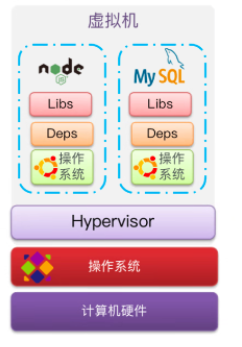

# 0704 Docker (基于Windows10)

## 1.Docker介绍

### 	1.作用

​	Docker 是一个开源的应用容器引擎，基于 Go 语言 并遵从 Apache2.0 协议开源。

​	Docker 可以让开发者打包他们的应用以及依赖包到一个轻量级、可移植的容器中，然后发布到任何流行的 Linux 机器上，也可以实现虚拟化。

​	容器是完全使用沙箱机制，相互之间不会有任何接口（类似 iPhone 的 app）,更重要的是容器性能开销极低。

​	打包生成的容器，不论在任何平台上运行，结果是一致的。

## 	2.Docker的工作原理

​	大型项目组件多且运行环境较复杂，可能会遇到：

- 依赖关系复杂，容易出现兼容问题
- 开发、测试、生产环境之间存在差异


​	使用Docker时：

- 将应用的 libs (函数库) 、 deps (依赖) 、 配置与应用一起打包
- 将每个应用放到一个隔离容器中运行，互相之间运行相对独立互不干扰,类似于沙盒
- 运行环境都为Docker，Docker镜像中包含完整的运行环境，包括系统函数库，且Docker只依赖Linux内核，因此可以在任意Linux操作系统上运行。


​	Docker是一个Client-Server结构的系统，Docker守护进程运行在主机上， 然后通过Socket连接从客户端访问，守护进程从客户端接受命令并管理运行在主机上的容器。 容器，是一个运行时环境。


## 	3.Linux内核

### 	1.什么是Linux内核

​	Linux是一种开源电脑操作系统内核。它是一个用C语言写成，符合POSIX标准的类Unix操作系统

​	操作系统是一个用来和硬件打交道并为用户程序提供一个有限服务集的低级支撑软件。一个计算机系统是一个硬件和软件的共生体，它们互相依赖，不可分割。

​	计算机的硬件，含有外围设备、处理器、内存、硬盘和其他的电子设备组成计算机的发动机。但是没有软件来操作和控制它，自身是不能工作的。

​	完成这个控制工作的软件就称为操作系统，在Linux的术语中被称为“内核”，也可以称为“核心”。

​	Linux内核的主要模块（或组件）分以下几个部分：存储管理、CPU和进程管理、文件系统、设备管理和驱动、网络通信，以及系统的初始化（引导）、系统调用等。

​	Ubuntu和CentOS都是基于Linux内核，但系统应用不同，所提供的函数库有差异。


### 2.Linux内核的作用

#### 	1.管理进程：

​	内核负责创建和销毁进程, 并处理它们与外部世界的联系(输入和输出)，不同进程间通讯(通过信号，管道，或者进程间通讯原语)对整个系统功能来说是基本的，也由内核处理。 另外， 调度器， 控制进程如何共享CPU，是进程管理的一部分。更通常地，内核的进程管理活动实现了多个进程在一个单个或者几个CPU 之上的抽象。

#### 	2.管理内存：

​	计算机的内存是主要的资源， 处理它所用的策略对系统性能是至关重要的。内核为所有进程的每一个都在有限的可用资源上建立了一个虚拟地址空间。内核的不同部分与内存管理子系统通过一套函数调用交互，从简单的malloc/free对到更多更复杂的功能。

#### 	3.文件系统：

​	Unix 在很大程度上基于文件系统的概念;几乎Unix中的任何东西都可看作一个文件。内核在非结构化的硬件之上建立了一个结构化的文件系统，结果是文件的抽象非常多地在整个系统中应用。另外，Linux 支持多个文件系统类型，就是说，物理介质上不同的数据组织方式。例如，磁盘可被格式化成标准Linux的ext3文件系统，普遍使用的FAT文件系统，或者其他几个文件系统。

#### 	4.设备控制：

​	几乎每个系统操作终都映射到一个物理设备上，除了处理器，内存和非常少的别的实体之外，全部中的任何设备控制操作都由特定于要寻址的设备相关的代码来进行。这些代码称为设备驱动。内核中必须嵌入系统中出现的每个外设的驱动，从硬盘驱动到键盘和磁带驱动器。内核功能的这个方面是本书中的我们主要感兴趣的地方。

#### 5.网络管理：

​	网络必须由操作系统来管理，因为大部分网络操作不是特定于某一个进程： 进入系统的报文是异步事件。报文在某一个进程接手之前必须被收集，识别，分发，系统负责在程序和网络接口之间递送数据报文，它必须根据程序的网络活动来控制程序的执行。另外，所有的路由和地址解析问题都在内核中实现。


#### *总结

​	Linux的作用：管理和控制硬件资源。


## 4.Docker与虚拟机

### 	1.虚拟机

​	虚拟机 是在操作系统中模拟硬件设备并运行另一个操作系统的操作的软件，如在Windows里运行其他的操作系统如CentOS系统，那么就可以通过虚拟机来运行任意的CentOS应用。

​	

​	

​	而Docker却是直接运行在当前操作系统上的一个进程，不需要使用到虚拟机：


### 	2.Docker与虚拟机的差异

- 在性能上，Docker接近原生，运行时占用的系统资源不多，而虚拟机性能较差，一般运行虚拟机时会占用较多的系统资源
- 硬盘占用上，Docker仅仅是一个容器，一般占用硬盘空间以 MB 为单位，而虚拟机却需要安装一个或多个操作系统，占用硬盘空间很大，通常占用空间大小是以 GB 为单位。
- 启动上，Docker仅仅是一个进程，所以在非图形化界面的命令行中**启动一般都是秒级**，非常快速便启动打开，而虚拟机启动上时，需要先启动虚拟机，再启动虚拟机内的操作系统，**过程上花费的启动时间一般为分钟级**。


总结：

1. docker是一个系统进程；虚拟机是在操作系统中的操作系统
2. docker体积小、启动速度快、性能好；虚拟机体积大、启动速度慢、性能一般


## 	5.Docker安装(基于Windows10 家庭版)

### 	1.打开虚拟环境

​	开机进入BIOS/UEFI , 打开Intel虚拟化技术，开机之后通过任务管理器查看CPU页下的虚拟化显示为"已开启"


​	

### 	2.安装虚拟开发环境

​	一般情况下，Windows 10 直接通过打开Hyper -V即可完成虚拟化环境的开启，但是系统要求里除了"家庭版"：


​	

​	所以需要考虑安装替代的**WSL**：

```
	WSL是适用于 Linux 的 Windows 子系统（Windows Subsystem for Linux），可让开发人员原生运行 GNU/Linux 环境 - 包括大多数命令行工具、实用工具和应用程序。也就是说，对于使用 Windows10 系统的开发人员，要开发  Linux 环境下的程序——尤其是Linux环境下的web程序以及处理和使用开源项目，一般只能使用虚拟机安装   Linux，但是虚拟机在使用中相当于一台独立的计算机，有许多不足，比如性能低、启动慢、管理不便、和宿主机 Win10 系统互操作不方便。WSL就是为使用 Windows10 系统的软件开发人员准备的 Linux 开发环境。
```


#### 	安装WSL：

​	安装『适用于 Linux 的 Windows 子系统』和『虚拟机平台』可选组件，可以用两种方式安装。

##### 	1.用命令行安装。以管理员身份打开 PowerShell 并运行命令：


```shell
dism.exe /online /enable-feature /featurename:Microsoft-Windows-Subsystem-Linux /all /norestart

dism.exe /online /enable-feature /featurename:VirtualMachinePlatform /all /norestart
```


##### 	2.打开 『控制面板』『Windows功能』对话框安装或查看。


##### 	3.WSL 2 需要更新其内核组件。

​	有关信息，请访问 https://aka.ms/wsl2kernel

​	按照此文档说明，下载并安装 wsl_update_x64.msi

​	 https://wslstorestorage.blob.core.windows.net/wslblob/wsl_update_x64.msi

​	这个升级包下载可能比较慢。(若无则不需要安装)


### 	3.下载并安装Docker

#### 	1.下载Docker for Windows

​	[Docker中文网 官网 (p2hp.com)](https://docker.p2hp.com/)


#### 	2.打开后自动安装


​	默认安装到系统所在盘，安装完成后会注销


#### 	3.打开Docker Desktop


​	

## 	6.CPU架构

### 	1.X86

​	X86架构是微处理器自行的计算机语言指令集，指的是一个Intel通用计算机系列的标准编号缩写，也标识一套通用的计算机指令的集合。大家通常称呼它为32位指令集，是因为它从386就开始被这样称呼的，一直沿用至今，是一种cisc指令集，Intel以及amd早期的cpu都支持这种指令集，Intel官方文档里称之为“IA-32”。

​	1978年6月8日，Intel发布了新款16位微处理器8086，开启了一个新时代。在接下来的40年的发展中，x86家族不断壮大，期间还限制了很多竞争对手的发展，让不少的处理器厂商将其架构技术成为历史名字，比如苹果的PowerPC。


### 	2.x86_64

​	指的是x86开始迈向64位，当时有两个方向：1、兼容x86；2、完全重新设计，不兼容x86。

​	这时候AMD抢跑了，率先制造了商用的兼容x86的CPU，AMD称为AMD64，获得了64位PC的第一桶金，得到了用户的认可。

​	Intel刚开始设计了一套不兼容x86的全新指令集，但是后来因为是全新的CPU，没有编译器，也不支持windows，后来开始了支持AMD64的指令集，但是换了个名字，叫x86_64，表示是x86指令集的64位扩展，大概是不愿因承认这玩意是AMD设计出来的。

​	实际上x86_64、x64、AMD64基本上是同一个东西，现在用的intel/amd的桌面级CPU基本上都是x86_64，与之相对的arm、ppc等都不是x86_64。

​	x86_64和x86的主要区别就是32位和64位的问题，x86中有8个32位通用寄存器，eax、ebx、ecx、edx、ebp、esp、esi、edi。x86_64把这8个通用寄存器扩展成了64位的，并且增加了8个寄存器并且也支持更大的内存。


### 	3.AMD64/x86-64

​	x86-64是1999年由AMD设计，AMD首次公开64位集以扩充给IA-32，称为x86-64(后来改名为AMD64)。AMD64架构在IA-32上新增了64位寄存器，并兼容早期的16位和32位软件，因此许多操作系统以及产品，尤其是在Intel开发Intel64之前就引入x86-64支持的，使用AMD64同时指代AMD64和Intel64。Intel64是后续支持了AMD64，不过不愿意叫AMD64，改了名字叫x86_64。


### 4.ARM，AMD，x86，aarch64

​	AMD(中文名：超威半导体)，除了英特尔以外最大的x86架构微处理供应商，也是除了英伟达之外仅有的独立图形处理供应商。

​	x86泛指一系列由Intel公司开发的处理器架构，最早为1978年面世的Intel8086版本的CPU。

​	ARM(Advanced RISC Machine或Acorn RISC Machine)也是一个架构，非常适合用于移动通信这种低成本高性能低功耗的领域。

​	AArch64是ARMv8的一种执行状态。为了更广泛地向企业领域推进，需要引入64位架构，同时也需要在ARMv8架构中引入新的AArch64执行状态。它不是一个单纯的32位ARM架构扩展，而是ARMv8的全新架构，完全使用全新的a64指令集，这些都是源自于对现在架构设计的深入研究。更重要的是，AArch64作为一个分离出来的执行状态，意味着一些未来的处理器可能不支持旧的AArch32执行状态。这种设计会使得许多有益的实现得到权衡，如在默认的情况下，使用一个较大的64K的页面，可以使得纯净的64位的ARM服务器不受遗留代码的影响，立即进行这种划分是很重要的，因为可能在未来几年内将出现支持64位的服务器系统，没有必要在新的64位架构中去实现一个完整的32位流水线，这将会提高未来ARM服务器系统的能效。

​	ARMV8-A将64位架构支持引入ARM架构中，其中包括：

​	**64位通用寄存器、SP(堆栈指针)和PC（程序计数器）**

​	**64位数据处理和扩展的虚拟寻址**

​	两种主要执行状态：

​	**AArch64 64位执行状态，包括该状态的异常模型、内存模型、程序员模型和指令集支持**

​	**AArch32 32位执行状态，包括该状态的异常模型、内存模型、程序员模型和指令集支持**

​	

​	这些执行状态支持三个主要指令集：

​	1.A32(或者ARM32)：32位固定长度指令集，通过不同架构变体增强部分32位架构执行环境现在称为AArch32。

​	2.T32（Thumb）:以16位固定长度指令集的形式引入，随后在引入Thumb-2技术时增强为16位和32位混合长度指令集，部分32位架构执行环境现在称为AArch32。

​	3.A64：提供了与ARM和Thumb指令集类似功能的32位固定长度指令集。随ARMv8-A一起引入，它是一种AArch64指令集。

​	4.ARM ISA不断改进，以满足前沿应用程序开发人员日益增长的要求，同时保留了必要的向后兼容性，以保护软件开发投资。在ARMv8-A中，对A32和T32进行了一些增补，以保持与A64指令集一致。


## 	7.Docker相关解释

### 	1.镜像、容器和工作流

- 镜像(images)：Docker将应用程序及其所需的依赖、函数库、环境等文件打包在一起的文件称为镜像

- 容器(container)：镜像中的应用程序运行后形成的进程为容器，Docker会把容器做隔离，对外不可见
- 工作流(Stream)：
  - 构建自定义镜像或从DockerRegistry拉去镜像
  - 根据镜像创建容器并运行


### 	2.Docker和DockerHub

​	DockerHub：一个Docker镜像的托管平台（类似于Github）。这样的平台称为Docker Registry

​	国内有类似于DockerHub的公开服务，如清华云镜像库、阿里云镜像库等。


### 	3.Docker 架构

​	Docker是一个CS架构的程序，由两部分组成：

- 服务端(Server)：Docker守护进程，负责处理Docker指令，管理镜像、容器等
- 客户端(Client)：通过命令或RestAPI向Docker服务端发送指令。可在本地或远程向服务端发送指令。


## 	8.镜像基本操作

### 	1.镜像相关的命令

​		镜像名称一般包括两部分：[repository] : [tag]

​		在未指定 tag 时默认是 latest 最新版本镜像。

​	


### 	2.镜像操作命令

- docker build  构建镜像
- docker push  推送镜像到服务器
- docker pull 从服务器拉去镜像
- docker images 查看镜像
- docker rmi 删除镜像
- docker save 保存镜像为一个压缩包 (.tar)
- docker load 加载压缩包为镜像


### 	3.镜像拉取

#### 	1.翻墙打开镜像仓库搜索需要的镜像，[DockerHub](https://hub.docker.com/)

​	

#### 	2.根据查看到的镜像名称拉取到自己需要的镜像，通过 `docker pull mysql`


​	

#### 	3.通过命令：docker images 查看拉取到的镜像


​	

```
案例： 利用docker save 将nginx镜像导出磁盘，然后再通过load加载回来

步骤一：利用docker xx --help命令查看docker save和docker load

步骤二：使用docker save导出到磁盘

步骤三：使用docker load加载镜像
```


## 9.容器相关命令

### 1.常用指令

- docker run 容器创建运行
- docker start 容器运行
- docker stop 容器停止
- docker pause 容器暂停
- docker unpause 容器继续运行
- docker exec 进入容器执行命令
- docer logs 查看容器运行日志
- docker ps 查看所有运行的容器及状态  (-a 查看全部容器，包括已停止的容器)
- docker rm 删除指定容器


### 2.创建并运行一个nginx容器

#### 	1.dock hub查看nginx的容器运行的命令以及对应的容器端口号：

```bash
docker run --name containerName -p 80:80 -d nginx
```


解释：

- docker run : 创建并运行一个容器
- --name ：给容器起一个名字，比如 xmp
- -p：将宿主机端口与容器端口映射，冒号左边是宿主机端号，右边是容器端口
- -d：后台运行容器
- nginx：镜像名称


### 	3.容器的删除

​	只有在容器暂停或者强制删除时，才可以删除运行中的容器


### 4.案例

​	进入nginx容器，修改HTML文件内容，添加"Hello world!"

1. 进入容器

   ```bash
   docker exec -it xmp bash
   ```

   解释：

   - docker exec ：进入容器内部并执行一个命令
   - -it：给当前进入的容器创建一个标准输入、输出终端，允许与容器交互
   - xmp：要进入容器的名称
   - bash：进入容器后执行的命令

2. 进入nginx的HTML所在目录 /usr/share/nginx/html

   ```bash
   cd /usr/share/nginx/html
   ```

3. 修改index.html内容

   ```bash
   sed -i 's#Welcome to nginx#Hello world!#g' index.html
   
   sed -i 's#<head>#<head><meta charset="utf-8">#g' index.html
   ```

   

## 10.数据卷

### 	1.容器与数据耦合的问题

1. 不便于修改：修改容器nginx的html时需要进入容器内部修改
2. 数据不可复用：容器内的修改对外不可见，且对新创建的容器不可复用
3. 升级维护困难：升级容器需要把旧容器删除，数据也随之被删除


### 	2.作用

​	数据卷(volume)是一个虚拟目录，指向宿主机文件系统中的某个目录


### 	3.操作数据卷

#### 	1.基本语法

```bash
docker volume [command]
```

#### 	2.相关指令

- create         创建一个volume
- inspect       显示一个或多个volume的信息
- ls                 列出所有的volume
- prune         删除所有未使用的volume
- rm              删除一个或多个指定的volume


#### 	3.案例

​		创建一个数据卷，并查看数据卷在宿主机的目录位置

 1.创建数据卷

```bash
docker volume create html
```

 2.查看所有数据

```bash
docker volume ls	
```

3.查看数据卷详细信息卷

```bash
docker volume inspect html
```


### 	4.挂载数据卷

#### 	1.指令

​	创建容器时可以通过 -v 参数来挂载一个数据卷到某个容器目录

```bash
docker run --name xmp -v html:/usr/share/nginx/html -p 10010:80 -d nginx
```

​	解释：

- docker run :创建并运行容器
- --name xmp：容器命名
- -v html:/usr/share/nginx/html ：把html数据卷挂载到容器内的/usr/share/nginx/html这个目录中
- nginx：镜像名称


#### 	2.注意

​	Windows下运行docker，实际上运行的虚拟Linux，需要打开挂载的Linux并找到 docker-desktop-data/data/docker/volumes 才能找到数据卷映射在Linux里并且在Windows本地的文件。


#### 	3.案例

​	**创建一个nginx容器，修改容器内容的html目录内的index.html内容**

​	需求说明:上个案例中，我们进入nginx容器内部，已经知道nginx的html目录所在位置/usr/share/nginx/ntml，我们需要把这个目录挂载到html这个数据卷上，方便操作其中的内容。提示:运行容器时使用 -v 参数挂载数据卷

​	步骤:

1. 创建容器并挂载到数据卷到容器内的HTML目录

   ```bash
   docker run --name xmp -v html:/usr/share/nginx/html -p 10010:80 -d nginx
   ```

   

2. 进入html数据卷所在位置，并修改HTML内容

   ```bash
   docker volume inspect html
   
   打开本地资源管理器，找到挂载的Linux下的docker-desktop-data , 进入data/docker/volumes/home/_data/，找到50x.html 与 index.html文件，并对index.html用记事本或其他软件进行修改即可
   ```

   


### 5.数据卷挂在的方式的对比


​		**数据卷直接在容器与宿主机之间连接**

## 11.Docker容器与宿主机端口映射信息

### 	1.容器也有端口

 宿主机有端口，而容器也有端口，但由于容器是一个独立的沙箱环境，二者的端口并不冲突。
       

不同容器之间端口不会冲突；        
容器与宿主机之间的端口不会冲突；
同一个容器内部不允许出现端口冲突。

### 	2.端口映射

####      1.外部机器无法直接访问容器

​	如图所示，外部机器可以访问宿主机，宿主机可以访问容器（宿主机相当于代理），但外部机器却不可以直接访问容器。

 

####     2.解决方案：端口映射

​	端口映射是指：将宿主机的A端口与某一个容器的B端口进行绑定。当外部机器访问A端口时，宿主机将以代理的身份访问容器的B端口。如此一来，就实现了外部机器对容器B端口的访问。


#### 	3.如何实现端口映射 

创建容器时加入-p参数：

```bash
-p <宿主机端口>:<容器端口>
```


