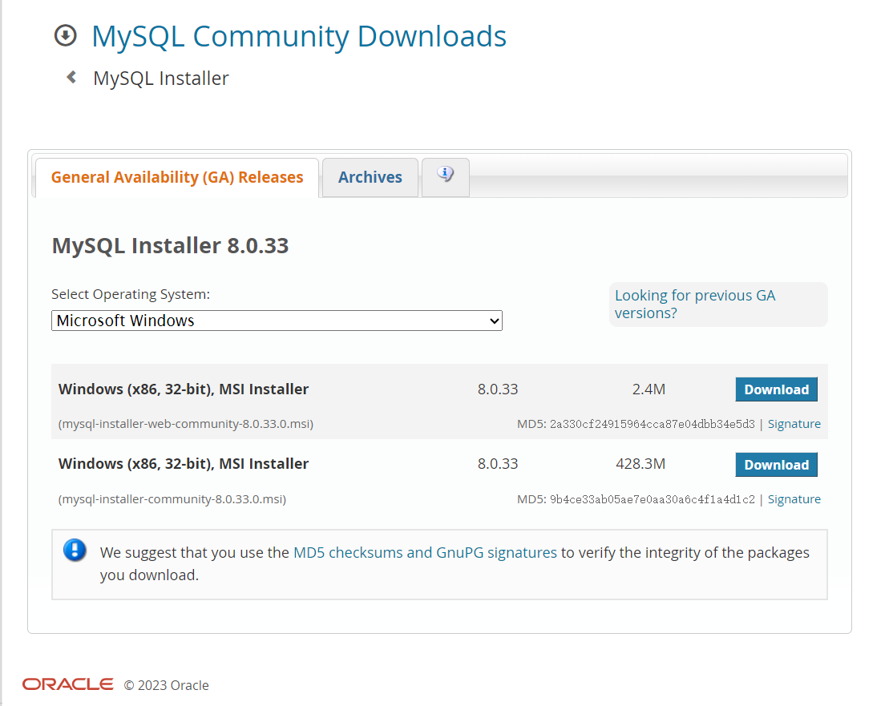
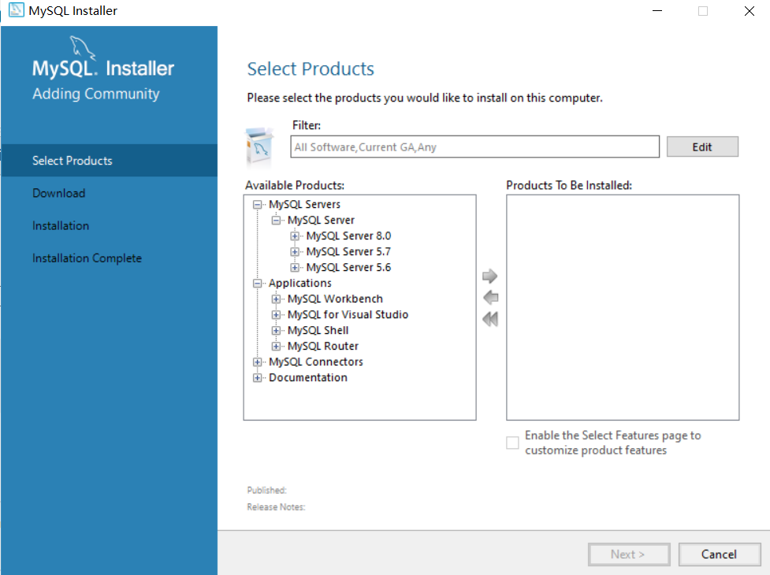
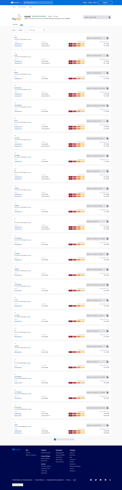
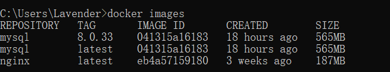
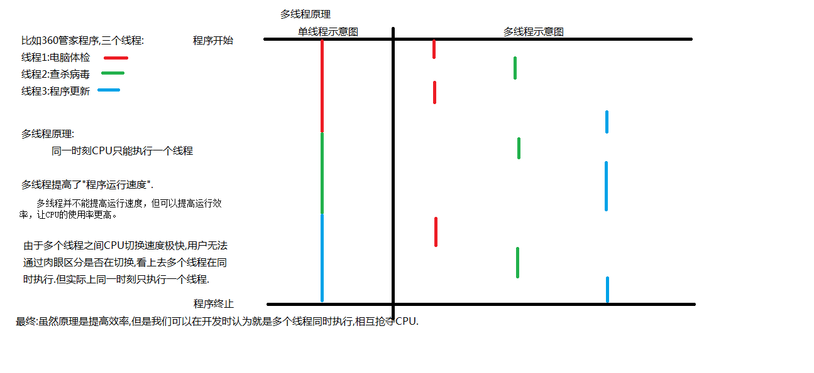
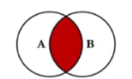
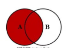
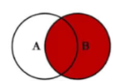
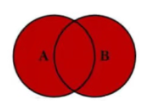

# 0705-0707 MySQL8 安装与相关指令

## 1.MySQL8的安装

### 	1.Windows的安装过程

​	打开网址：[MySQL :: Download MySQL Installer](https://dev.mysql.com/downloads/windows/installer/8.0.html)



​	

​	下载，并且按照需求下载并安装完即可，中间需要配置端口号以及登陆时的用户名和密码，完成后打开（一步到位，环境配置也省略）


### 2.docker内安装

#### 1.docker的安装

​	见  [03_Docker](../03_Docker/0704_Docker.md)

#### 2.docker内安装MySQL

指令：`docker pull mysql:[Tag名]`




安装完之后，在终端中输入指令 `docker images`查看是否安装成功




运行mysql：

```bash
$ docker run --name zhenxun -e MYSQL_ROOT_PASSWORD=root -p 11451:3306 -d mysql:8.0.33
```


查看运行中的容器：

```shell
$ docker ps

CONTAINER ID   IMAGE          COMMAND                   CREATED       STATUS         PORTS                                NAMES
7dc785ccae77   mysql:8.0.33   "docker-entrypoint.s…"   7 hours ago   Up 5 minutes   33060/tcp, 0.0.0.0:11451->3306/tcp   zhenxun
```


通过第三方软件进行连接即可，以下是宿主机的配置：

```
主机：127.0.0.1
端口号：11451
用户名：root
密码：root
```


## 2.SQL

### 1.定义

​	Structured Query Language 结构化查询语言，用于访问和处理数据库的标准计算机语言。

- 1974年由Boyce和Chamberlin提出并在IBM公司研制的System R上实现

- 美国国家标准局(ANSI)着手制定SQL标准，1986年10月实现最早标准
- 1989年发表SQL-89
- 1992年制定SQL-92
- 1999年ISO发布SQL-99
- 目前很多数据库只支持SQL-99部分特征，大部分数据库都支持SQL-92


### 2.SQL特点

- 具有综合统一性
- 非过程化语言
- 语言简捷
- 一种语法结构提供两种使用方式


### 3.SQL语言的组成

- 数据定义语言 -DDL
- 数据操作语言 -DML
- 数据控制语言 -DCL
- 数据查询语言 -DQL


### 4.SQL语法特点

- 对关键字大小写不敏感
- 可单行或多行书写，以分号结束
- SQL的注释，单行注释为`-- `与`#`，`-- `之后要加一个空格;`/*  */`可多行注释


## 3.数据库系统

### 1.数据库

​	Database，即DB，是一个以某种组织方式存储在磁盘上的数据的集合


### 2.数据库应用

​	指基于数据库的应用软件


### 3.数据库管理系统

​	Database Management System,简称DBMS，用于创建和维护数据库。


### 4.数据库管理系统 分类

#### 	1.关系数据库

- Oracle数据库 （公司用，稳定性强，最挣钱的数据库）
- MySQL数据库（最流行中型数据库）
- SQL Server数据库（Microsoft开发的数据库，WIndows上用）
- PostgreSQL（功能最强大的开源数据库，且以体积小，功能性强流行）
- SQL ite（最流行的嵌入式数据库）


#### 	2.非关系数据库(NoSQL (Not only SQL))

- MongiDB
- Redis
- Voldemort


## *进程和线程

### 	1.进程

​	一个在内存中运行的应用程序。每个进程都有自己独立的一块内存空间，一个进程可以有多个线程，比如在Windows系统中，一个运行的xx.exe就是一个进程。


### 	2.线程

​	进程中的一个执行任务（控制单元），负责当前进程中程序的执行。一个进程至少有一个线程，一个进程可以运行多个线程，多个线程可共享数据。

​	与进程不同的是同类的多个线程共享进程的堆和方法区资源，但每个线程有自己的程序计数器、虚拟机栈和本地方法栈，所以系统在产生一个线程，或是在各个线程之间作切换工作时，负担要比进程小得多，也正因为如此，线程也被称为轻量级进程。


### 	3.进程与线程的区别总结

​	线程具有许多传统进程所具有的特征，故又称为轻型进程(Light—Weight Process)或进程元；而把传统的进程称为重型进程(Heavy—Weight Process)，它相当于只有一个线程的任务。在引入了线程的操作系统中，通常一个进程都有若干个线程，至少包含一个线程。

#### 1.根本区别：

​	进程是操作系统资源分配的基本单位，而线程是处理器任务调度和执行的基本单位

#### 2.资源开销：

​	每个进程都有独立的代码和数据空间（程序上下文），程序之间的切换会有较大的开销；线程可以看做轻量级的进程，同一类线程共享代码和数据空间，每个线程都有自己独立的运行栈和程序计数器（PC），线程之间切换的开销小。

#### 3.包含关系：

​	如果一个进程内有多个线程，则执行过程不是一条线的，而是多条线（线程）共同完成的；线程是进程的一部分，所以线程也被称为轻权进程或者轻量级进程。

#### 4.内存分配：

​	同一进程的线程共享本进程的地址空间和资源，而进程之间的地址空间和资源是相互独立的

#### 5.影响关系：

​	一个进程崩溃后，在保护模式下不会对其他进程产生影响，但是一个线程崩溃整个进程都死掉。所以多进程要比多线程健壮。

#### 6.执行过程：

​	每个独立的进程有程序运行的入口、顺序执行序列和程序出口。但是线程不能独立执行，必须依存在应用程序中，由应用程序提供多个线程执行控制，两者均可并发执行

### 	4.多进程和多线程区别

​	多进程：操作系统中同时运行的多个程序

​	多线程：在同一个进程中同时运行的多个任务

​	举个例子，多线程下载软件，可以同时运行多个线程，但是通过程序运行的结果发现，每一次结果都不一致。 因为多线程存在一个特性：随机性。造成的原因：CPU在瞬间不断切换去处理各个线程而导致的，可以理解成多个线程在抢CPU资源。

多线程提高CPU使用率



​	多线程并不能提高运行速度，但可以提高运行效率，让CPU的使用率更高。但是如果多线程有安全问题或出现频繁的上下文切换时，运算速度可能反而更低。


## 4.MySQL介绍

### 	1.简介

- 瑞典的DataKonsultAB公司研发，之后公司被Sun公司收购，再之后Sun公司被Oracle公司收购，如今MySQL为Oracle旗下产品
- MySQL使用的SQL语言是用于访问数据库的最常用标准化语言。分 社区版 和 商业版 。
- 体积小、速度快、总体拥有成本低，一般中小型网站开发基于MySQL作为网站数据库。


### 	2.特点

- MySQL数据库基于C和C++语言编写，具有源码可移植性
- 支持多平台
- 支持多线程
- 为多种编程语言提供API接口
- MySQL优化了SQL算法，有效提高了查询速度
- MySQL开放源代码且无版权制约，自主性强，使用成本低
- MySQL历史久，社区及用户非常活跃，问题很容易有解决方案


### 	3.版本

- MySQL Community Server 社区版，免费，但无官方技术支持
- MySQL Enterprise Edition 商业版，可试用30天，提供官方技术支持
- MySQL Cluster 集群版，开源免费，可把多个Server封装成一个Server
- MySQL Cluster CGE 高级集群版，收费
- MySQL Workbench（GUI TOOL） 专为MySQL设计的ER/数据库建模工具


### 	4.OS下的配置以及安装配置

​	百度！


### 	5.连接的第三方工具

- Navicat 收费
- DataGrip 收费
- MySQL Workbench CE 社区版免费


## 5.MySQL数据库基本操作 -DDL

​	DDL,Data Definition Language , 数据定义语言，包括

### 1.对数据库的常用操作

- ```mysql
  show databases        							#查看所有数据库
  
  create database [if not exists] mydb1 [charset=utf8] #创建数据库
  -- []内的可以不写
  
  use mydb1								#切换数据库
  
  drop database [if exists] mydb1			#删除数据库
  
  alter database mydb1 [option]			#修改数据库
  ```

  

### 2.对表结构的常用操作

- ```mysql
  create table [if not exists] Table_name(
  	字段名1 类型[(宽度)] [约束条件] [comment '字段说明'] ,
  	字段名2 类型[(宽度)] [约束条件] [comment '字段说明'] ,
  	字段名3 类型[(宽度)] [约束条件] [comment '字段说明'] ,
  )[表的一些设置]；
  
  #comment 用于代码的查看时，作为说明解释的部分
  ```

- ```mysql
  use QCbase;
  CREATE TABLE `score` (
    `student_id` int(10) unsigned zerofill DEFAULT NULL,
    `course_id` int(10) unsigned zerofill DEFAULT NULL,
    `score` int DEFAULT NULL
  ) ENGINE=InnoDB DEFAULT CHARSET=utf8mb4 COLLATE=utf8mb4_0900_ai_ci;
  ```

- | 功能                       | SQL                      |
  | -------------------------- | ------------------------ |
  | 查看当前数据库的所有表名称 | show tables;             |
  | 查看指定某个表的创建语句   | show create table 表名； |
  | 查看表的结构               | desc 表名                |
  | 删除表                     | drop table 表名          |

### 3.修改表结构

#### 1.添加列

​	语法格式：`alter table 表名  add  列名  类型（长度）[约束]；`

​	例子： 

```mysql
ALTER TABLE  STUDENT ADD  dept VARCHAR(20);
```

#### 2.修改列名和类型

语法格式：`alter table  表名  change  旧列名    新列名   类型（长度） 约束；`

例子：

```mysql
ALTER TABLE  student  change  dept  department   VARCHAR(30);
```

#### 3.删除列

语法格式：`alter table 表名  drop 列名；`

例子：

```mysql
ALTER TABLE student  DROP  department；
```

#### 4.修改表名

语法格式：`rename table 表名  to  新表名；`

例子：

```mysql
rename  table  student  to  stu;
```


## 6.MySQL数据据库基本操作-DML

### 1.数据插入

格式：

```mysql
insert into table_name(列1，列2......) values(值1，值2，....) #推荐
insert into table_name values(值1，值2，....)				 #不推荐
```


### 2.数据修改

格式：

```mysql
update table_name set 字段名=值，字段名=值...;
update table_name set 字段名=值，字段名=值... where [condition];
```


### 3.数据删除

格式:

```mysql
delete from table_name [where [condition]];	#删除表的内容，但非重建

truncate table table_name					#删除表内的所有内容并重建表(ruin)
#类似于 drop table ;create table
truncate table_name							#直接用表名删除，和上一条相似
```


## 7.MySQL约束

### 1.概念

​	约束英文: constraint，实际上就是表中数据的限制条件。

### 2.作用

​	表在设计的时候加入约束的目的就是为了保证表中的记录完整性和有效性，比如用户表有些列的值（手机号)厂不能为空，有些列的值(身份证号)不能重复。

### 3.分类

- 主键primary key
- 自增长auto_increment
- 非空not null
- 唯一unique
- 默认default
- 零填充zerofill
- 外键foreign key


### 4.主键约束

#### 1.概念

- MySQL主键约束是一个列或者多个列的组合，其值能唯一地标识表中的每一行,方便在RDBMS中尽快的找到某一行。主键约束相当于唯一约束＋非空约束的组合，主键约束列不允许重复，也不允许出现空值。
- 每个表最多只允许一个主键
- 主键约束的关键字是:primary key
- 当创建主键的约束时，系统默认会在所在的列和列组合上建立对应的唯一索引。

#### 2.操作

- 添加单列主键

- 添加多列联合主键

- 删除主键

#### 3.添加单列主键

方式一：

```mysql
create table 表名(
	...
	<字段名> <数据类型> primary key
	...
);
```


方式二：

```mysql
create table 表名(
	...
	[constraint <约束名>] primary key [字段名]
);
```


#### 4.修改表结构添加主键

```mysql
alter table <表名> add primary key (字段列表)
```


#### 5.删除主键约束

```mysql
alter table <表名> drop primary key
```


#### 6.常用修改指令

- add

- drop

- modify

  


### 5.自增长约束(auto_increment)

#### 1.概念

​	在MySQL中，当主键定义为自增长后，这个主键的值就不再需要用户输入数据了，而由数据库系统根据定义自动赋值。每增加一条记录,主键会自动以相同的步长进行增长。
​	通过给字段添加`auto_increment`属性来实现主键自增长


#### 2.语法

```mysql
字段名 数据类型 auto_increment
```


#### 3.增/删/改 同主键约束一致


#### 4.delete和truncate在删除自增列的变化

- delete数据之后从自动增长从断点开始
- truncate数据之后从默认起始值开始


### 6.非空约束(not null)

#### 1.概念

​	MySQL非空约束(not null）指字段的值不能为空。对于使用了非空约束的字段，如果用户在添加数据时没有指定值，数据库系统就会报错。

#### 2.语法

```mysql
方式1：<字段名> <数据类型> not null;

方式2：alter table 表名 modify 字段 类型 not null;
```


### 7.唯一约束(unique)

#### 1.概念

​	唯一约束(Unique Key)是指所有记录中字段的值不能重复出现。例如，为id字段加上唯一性约束后,每条记录的id值都是唯一的，不能出现重复的情况。

#### 2.语法

```mysql
方式1：<字段名> <数据类型> unique

方式2：alter table 表名 add constraint 约束名 unique (列)
#删除用drop 修改用modify  添加在索引里查看
```


### 8.默认约束(default)

#### 1.概念

​	MySQL默认值约束用来指定某列的默认值。

#### 2.语法

```
方式1:<字段名> <数据类型> default <默认值>;
方式2: alter tab1e 表名 modify 列名 类型 default 默认值;

修改：modify column 字段名 类型 default 值;
删除：modify column 字段名 类型 default null;
```


### 9.零填充约束(zerofill)

#### 1.概念

​	插入数据时，当该字段的值的长度小于定义的长度时，会在该值的前面补上相应的0，zerofill默认为int(10)
​	当使用zerofill时，默认会自动加unsigned (无符号）属性，使用unsigned属性后，数值范围是原值的2倍,例如，有符号为-128 ~ +127，无符号为0~256.


#### 2.语法

```
方式1:<字段名> <数据类型> zerofill;
方式2：add
删除： modify 字段名 类型
```


## 8.MySQL数据库基本操作-DQL-基本查询

### 1.概念

- ​	数据库管理系统一个重要功能就是数据查询，数据查询不应只是简单返回数据库中存储的数据，还应该根据需要对数据进行筛选以及确定数据以什么样的格式显示。
- ​	MySQL提供了功能强大、灵活的语句来实现这些操作。
- ​	MySQL数据库使用select语句来查询数据。


### 2.语法格式

```
select
	[all | distinct]
	<目标列的表达式1>[别名]，
	<目标列的表达式2>[别名]...
from <表名或视图名> [别名]，<表名或视图名> [别名]...
[where <条件表达式>]
[group by <列名>]
[having <条件表达式>]]
[order by<列名>[ asc | desc] ]
[limit<数字或者列表>];

即：select *|列名 from 表 where [conditions]
```


### 3.运算符

#### 1.算数运算符

| 算术运算符 |        说明        |
| :--------: | :----------------: |
|     +      |      加法运算      |
|     -      |      减法运算      |
|     *      |      乘法运算      |
|  / 或 DIV  |  除法运算，返回商  |
|  % 或 MOD  | 求余运算、返回余数 |


#### 2.比较运算符

|    比较运算符     |                             说明                             |
| :---------------: | :----------------------------------------------------------: |
|         =         |                             等于                             |
|      < 和 <=      |                        小于和小于等于                        |
|      > 和 >=      |                        大于和大于等于                        |
|        <=>        | 安全的等于,两个操作码均为NULL时，其所得值为1;而当一个操作码为NULL时。其所得值为0 |
|     <> 或 !=      |                            不等于                            |
| IS NULL 或 ISNULL |                     判断一个值是否为NULL                     |
|    IS NOT NULL    |                    判断一个值是否不为NULL                    |
|       LEAST       |               当有两个或多个参数时，返回最小值               |
|     GREATEST      |               当有两个或多个参数时，返回最大值               |
|    BETWEEN AND    |                 判断一个值是否落在两个值之间                 |
|        IN         |               判断一个值是IN列表中的任意一个值               |
|      NOT IN       |              判断一个值不是IN列表中的任意一个值              |
|       LIKE        |                          通配符匹配                          |
|      REGEXP       |                        正则表达式匹配                        |


#### 3.逻辑运算符

| 逻辑运算符 |   说明   |
| :--------: | :------: |
|  NOT 或 !  |  逻辑非  |
| AND 或 &&  |  逻辑与  |
| OR 或 \|\| |  逻辑或  |
|    XOR     | 逻辑异或 |


### 4.排序查询

`order by`

| 类型 | 作用 |
| :--: | :--: |
| DESC | 降序 |
| ASC  | 升序 |


### 5.聚合查询

#### 1.简介

​	纵向查询，对列的值进行计算，然后返回一个单一的值，过程中会忽略空值。


#### 2.语法

```
SELECT 字段名1，字段名2... FROM 表名
```


#### 3.函数相关

| 聚合函数 |                             作用                             |
| :------: | :----------------------------------------------------------: |
| count()  |                 统计指定列不为NULL的记录行数                 |
|  sum()   | 计算指定列的数值和，如果指定类型不是数值类型，计算的结果就为0 |
|  max()   | 计算指定列的最大值，如果指定类型不是字符串类型，使用字符串排序运算 |
|  min()   | 计算指定列的最小值，如果指定类型不是字符串类型，使用字符串排序运算 |
|  avg()   | 计算指定列的平均值，如果指定类型不是数值类型，计算的结果就为0 |


### 6.分组查询

#### 1.**GROUP BY**简介

​	分组查询是指使用`group by`字句对查询信息进行分组。

#### 2.**GROUP BY**语法

```mysql
SELECT 字段名1，字段名2... FROM 表名 GROUP BY 分组字段 HAVING 分组条件
```

#### 3.**GROUP BY**注意项

　如果要进行分组，SELECT子句之后，只能出现分组的字段和统计函数，其他的字段不能出现。

#### 3.分组之后的条件筛选－HAVING

- 分组之后的条件筛选-having
- 分组之后对统计结果进行筛选的话必须使用having，不能使用where
- where子句用来筛选 FROM子句中指定的操作所产生的行
- group by子句用来分组WHERE子句的输出。
- having等句用来从分组的结果中筛选行

#### 4.HAVING 语法

```mysql
　select 字段１，字段２．．．from 表名 group by 分组字段  having　分组条件；
```


### 7.分页查询-limit

#### 1.简介

​	分页查询在项目开发中常见，由于数据量很大，显示屏长度有限，因此对数据需要采取分页显示方式。例如数据共有30条，每页显示5条，第一页显示1-5条，第二页显示6-10条。

#### 2.格式

```
方式1-显示前n条：
select 字段1，字段2... from 表名 1imit n

方式2-分页显示：
select 字段1，字段2... from 表名 limit m,n

m:整数，表示从第几条索引开始，计算方式―(当前页-1)*每页显示条数
n:整数,表示查询多少条数据
```


## 9.MySQL多表操作

### １.多表关系

​	可以概括为：

- 一对一
- 一对多/多对一
- 多对多


#### 1.一对一关系

- 一个学生只有一串身份证号，而一串身份证号只能对应一个学生
- 在任一表中添加唯一外键，指向另一方主键。确保一对一关系
- 一般一对一关系很少见，遇到一对一关系的表最好是合并表


#### 2.一对多/多对一关系

- 一个部门可以有多名员工，而一个员工只能对应一个部门
- 一个班里有多名学生，而一名学生只能对应一个班级

​	实现原则：在多的一方建立外键。，指向一的一方的主键。


#### 3.多对多关系

- 一个学生可以选择多门课程，而一个课程也可以被多名学生选择
- 一名老师可以教多门课程，而一个课程也可以由多名老师来教学

​	实现原则：多对多关系实现需要借助第三张中间表，一般至少包含两个字段，将多对多的关系拆分成一对多的关系，中间表至少由两个外键，这两个外键分别指向原来的那两张表的主键


### 2.外键约束

#### 1.介绍

​	MySQL外键约束(FOREIGN KEY)是表的-个特殊字段，经常与主键约束-起使用。 对于两个具有关联关系的表而言，相关联字段中主键所在的表就是主表(父表)，外键所在的表就是从表(子表) 。
​	外键用来建立主表与从表的关联关系，为两个表的数据建立连接，约束两个表中数据的一.致性和完整性。比如，一个水果摊，只有苹果、桃子、李子、西瓜等4种水果，那么，你来到水果摊要买水果就只能选择苹果、桃子、李子和西瓜，其它的水果都是不能购买的。

​	

#### 2.特点

定义一个外键是需要遵守下列规则：

- 主表必须已经存在于数据库，或者是当前正在创建的表
- 必须为主表定义外键
- 主键不能包含空值，但允许在外键中出现空值。只要外键的每个非空值出现在指定的外键中，这个外键的内容就是正确的。
- 主表的表名后面指定列名或列名的组合，必须是主表的主键或候选键
- 外键中列的数目必须和主表的主键中列的数目相同
- 外键中的数据类型必须和主键中对应列的数据类型相同


#### 3.操作

​	方式1-在创建表时设置外键约束

```mysql
[constraint <外键名>] foreign key 字段名 [,字段名2,...] references <主表名> 主键列1 [,主键列2,...]
```


​	方式2-创建外键约束

```mysql
alter table 表名 add constraint 主键列 foreign key(外键名) references <主表名> (主表列)
```


## 10.MySQL多表联合查询

### 1.介绍

​	同时查询两个或两个以上的表，有时用户在查看数据时需要显示的数据来自多张表。


### 2.多表查询分类

- 交叉连接查询(产生笛卡尔积)

  - 语法：

    ```mysql
    select* from A、B;
    ```

- 内连接查询(使用的关键字 inner join  -inner可以省略)

  - 隐式内连接(SQL92标准)：

    ```mysql
    select *from A,B where conditions;
    ```

  - 显示内连接(SQL99标准)：

    ```mysql
    select* from A inner join B on conditions;
    ```

- 外连接查询(使用的关键字 outer join  -outer可以省略)

  - 左外连接：`left outer join`

    ```mysql
    select * from A left outer join B on conditions;
    ```

  - 右外连接：`right outer join`

    ```mysql
    select *from A right outer join B on conditions;
    ```

  - 满外连接：`full outer join`

    ```mysql
    select *from A full outer join B on conditions
    ```

- 子查询 ： select 的嵌套

- 表自关联 ： 将一张表当作多张表使用


### 3.内连接查询

​	查询多张表的交集



```mysql
SELECT <select_list>
FROM TABLE A
INNER JOIN TABLE B				#SQL99
ON A_KEY=B_KEY

SELECT <select_list>
FROM TABLE A,B			
WHERE A_KEY=B_KEY				#SQL92
```


### 4.外连接查询

​	外连接分为左连接、右连接、满外连接

​	***注：oracle里面由`full join`,但在mysql对`full join`支持不好，这里可以使用`union`来达到目的。**

#### 1.左外连接



```mysql
select * from A left outer join B on conditions;
```


#### 2.右外连接



```mysql
select * from A right outer join B on conditions;
```


#### 3.满外连接



```mysql
select * from A full outer join B on conditions;
```


### 5.子查询

#### 1.作用

​	子查询就是指的在-一个完整的查询语句之中，嵌套若干个不同功能的小查询，从而- -起完成复杂查询的一种编写形式，通俗- 点就是包含select嵌套的查询。


#### 2.特点

​	子查询可以返回的数据类型 一共分为四种:

- 单行单码:返回的是-一个具体列的内容，可以理解为-一个单值数据:
- 单行多列:返回一行数据中多个列的内容:
- 多行单列:返回多行记录之中同- -列的内容，相当于给出了一个操作范围;
- 多行多列:查询返回的结果是一张临时表


#### 3.子查询关键字

​	在子查询中，有一些常用的逻辑关键字，这些关键字可以给我们提供更丰富的查询功能，主要关键字如下:

- ALL关键字（不常用）
- ANY关键字（不常用）
- SOME关键字（不常用）
- IN关键字（不推荐）
- EXISTS关键字


#### 4.子查询关键字-ALL

##### 1.格式

```mysql
select ... from ... where c > all (查询语句)
#等价于
select ... from ... where c > result1 and c > result2 and c > result3
```


##### 2.特点

- ALL: 与子查询返回的所有值比较为true 则返回true
- ALL可以与=、>、 >=、 <、 <=、 <> 结合是来使用，分别表示等于、大于、大于等于、小于、小于等于、不等于其中的所有数据。
- ALL表示指定列中的值必须要大于子查询集的每一个值，即必须要大于子查询集的最大值:如果是小于号即小于子查询集的最小值。同理可以推出其它的比较运算符的情况。


#### 5.子查询关键字-IN

##### 1.格式

```mysql
select ... from ... where c in(查询语句)
#等价于
select ... from ... where c = result1 and c = result2 and c = result3
```


##### 2.特点

- IN关键字。用于判断某个记录的值，是否在指定的集合中
- 在IN关键字前边加 上not可以将条件反过来


#### 6.子查询关键字-EXISTS

##### 1.格式

```mysql
select ... from ... where exists(查询语句)
```


##### 2.特点

- 该子查询如果“有数据结果" (至少返回- -行数据)，则该EXISTS() 的结果为"true", 外层查询执行
- 该子查询如果“ 没有数据结果”(没有 任何数据返回)，则该EXISTS)的结果为 "false"外层查询不执行
- EXISTS后面的子查询不返回任何实际数据，只返回真或假，当返回真时where条件成立
- 注意，EXISTS关键字，比IN关键字的运算效率高，因此，在实际开发中，特别是大数据量时，推荐使用EXISTS关键字


### 6.自关联查询

#### 1.作用

​	MySQL有时在信息查询时需要进行对表自身进行关联查询，即一张表自己和自己关联，-张表当成多张表来用。注意自关联时表必须给表起别名。


#### 2.格式

```mysql
select ... from 表1 a , 表1 b where conditions;
#或者
select ... from 表1 a [left] join 表1 b on conditions;
```

