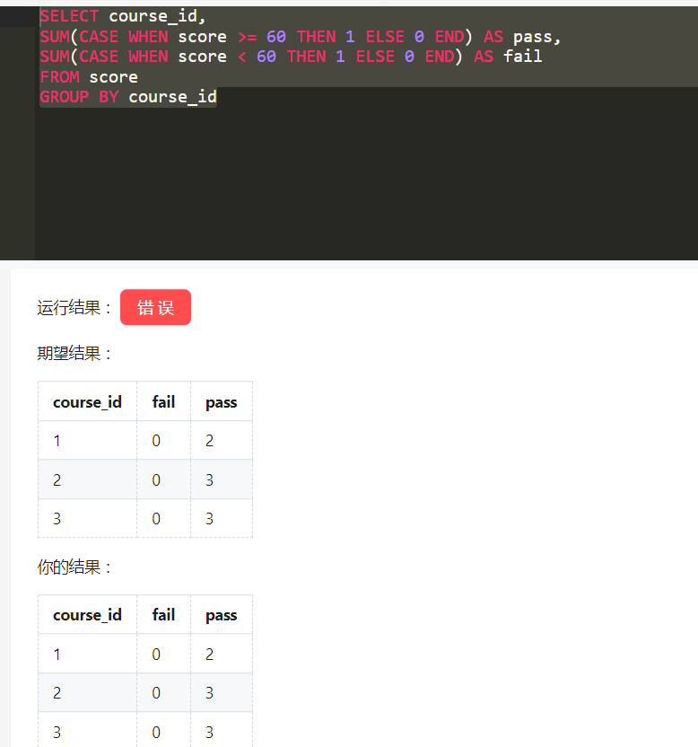
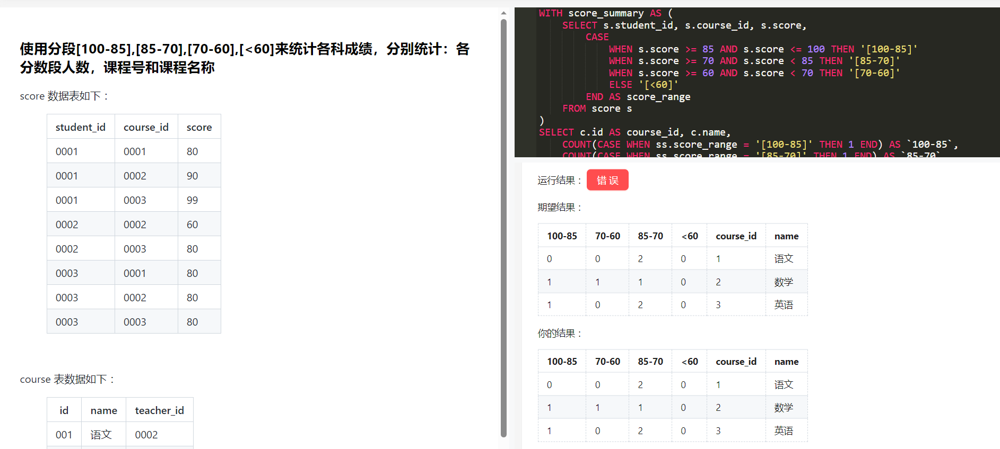

# Mysql 47道面试题(答案见.pdf)

## 有些比较难的题目：

- [21](##21.查询没有选修所有课的学生的学号、姓名)
- [28](##28.查询出每门课程的及格人数(别名pass)和不及格人数(别名fail)(60 分以下为不及格))
- [29](##29.使用分段[100-85],[85-70],[70-60],[<60]来统计各科成绩，分别统计：各分数段人数，课程号和课程名称)

以及36以后的题目

## 1.查询姓“猴”的学生名单

student 数据表如下：

| id   | name   | birth      | sex  |
| ---- | ------ | ---------- | ---- |
| 001  | 猴子   | 1989-01-01 | 男   |
| 002  | 猴子   | 1990-12-21 | 女   |
| 003  | 马云   | 1991-12-21 | 男   |
| 004  | 王思聪 | 1990-5-20  | 男   |

```mysql
select *from student where substring(name,1,1)="猴"
```


## 2.查询姓名中最后一个字是“猴”的学生名单

student 数据表如下：

| id   | name   | birth      | sex  |
| ---- | ------ | ---------- | ---- |
| 001  | 猴子   | 1989-01-01 | 男   |
| 002  | 猴子   | 1990-12-21 | 女   |
| 003  | 马云   | 1991-12-21 | 男   |
| 004  | 王思聪 | 1990-5-20  | 男   |

```mysql
select *from student where name like '__猴'
```


## 3.查询姓名中带“猴”的学生名单

student 数据表如下：

| id   | name   | birth      | sex  |
| ---- | ------ | ---------- | ---- |
| 001  | 猴子   | 1989-01-01 | 男   |
| 002  | 猴子   | 1990-12-21 | 女   |
| 003  | 马云   | 1991-12-21 | 男   |
| 004  | 王思聪 | 1990-5-20  | 男   |

```mysql
select *from student where name like'%猴%'
```


## 4.查询姓“孟”老师的个数(字段别名 count_tea)

teacher 数据表如下：

| id   | name   |
| ---- | ------ |
| 0001 | 孟扎扎 |
| 0002 | 马化腾 |
| 0003 | NULL   |
| 0004 |        |

```mysql
select count(name) as count_tea
from teacher 
where substring(name,1,1)="孟" 
group by name
```


## 5.查询课程编号为“0002”的总成绩

score 数据表如下：

| student_id | course_id | score |
| ---------- | --------- | ----- |
| 0001       | 0001      | 80    |
| 0001       | 0002      | 90    |
| 0001       | 0003      | 99    |
| 0002       | 0002      | 60    |
| 0002       | 0003      | 80    |
| 0003       | 0001      | 80    |
| 0003       | 0002      | 80    |
| 0003       | 0003      | 80    |

```mysql
select sum(score) as 'sum(score)'
from score 
where
course_id = "0002"
```


## 6.查询已经选课的学生人数（可能存在一个同学选了多门课）

score 数据表如下：

| student_id | course_id | score |
| ---------- | --------- | ----- |
| 0001       | 0001      | 80    |
| 0001       | 0002      | 90    |
| 0001       | 0003      | 99    |
| 0002       | 0002      | 60    |
| 0002       | 0003      | 80    |
| 0003       | 0001      | 80    |
| 0003       | 0002      | 80    |
| 0003       | 0003      | 80    |

```mysql
select count(DISTINCT student_id) 
from score 
```


## 7.查询各科成绩最高和最低分查询各科成绩最高和最低分, 按课程号分组

score 数据表如下：

| student_id | course_id | score |
| ---------- | --------- | ----- |
| 0001       | 0001      | 80    |
| 0001       | 0002      | 90    |
| 0001       | 0003      | 99    |
| 0002       | 0002      | 60    |
| 0002       | 0003      | 80    |
| 0003       | 0001      | 80    |
| 0003       | 0002      | 80    |
| 0003       | 0003      | 80    |

```mysql
select course_id,max(score),min(score) 
from score 
group by course_id
```


## 8.查询每门课被选修的学生人数(别名 student_num)

score 数据表如下：

| student_id | course_id | score |
| ---------- | --------- | ----- |
| 0001       | 0001      | 80    |
| 0001       | 0002      | 90    |
| 0001       | 0003      | 99    |
| 0002       | 0002      | 60    |
| 0002       | 0003      | 80    |
| 0003       | 0001      | 80    |
| 0003       | 0002      | 80    |
| 0003       | 0003      | 80    |

```mysql
select distinct course_id,count(course_id) as 'student_num' 
from score 
group by course_id
```


## 9.查询男生、女生人数（别名 sex_num）, 并按性别分组

student 数据表如下：

| id   | name   | birth      | sex  |
| ---- | ------ | ---------- | ---- |
| 001  | 猴子   | 1989-01-01 | 男   |
| 002  | 猴子   | 1990-12-21 | 女   |
| 003  | 马云   | 1991-12-21 | 男   |
| 004  | 王思聪 | 1990-5-20  | 男   |

```mysql
select sex,count(sex) as sex_num 
from student 
group by sex
```


## 10.查询平均成绩大于60分学生的学号和平均成绩

score 数据表如下：

| student_id | course_id | score |
| ---------- | --------- | ----- |
| 0001       | 0001      | 80    |
| 0001       | 0002      | 90    |
| 0001       | 0003      | 99    |
| 0002       | 0002      | 60    |
| 0002       | 0003      | 80    |
| 0003       | 0001      | 80    |
| 0003       | 0002      | 80    |
| 0003       | 0003      | 80    |

```mysql
select avg，student_id
from score 
group by student_id 
having avg(score)>60 
```


## 11.查询至少选修两门课程的学生学号

score 数据表如下：

| student_id | course_id | score |
| ---------- | --------- | ----- |
| 0001       | 0001      | 80    |
| 0001       | 0002      | 90    |
| 0001       | 0003      | 99    |
| 0002       | 0002      | 60    |
| 0002       | 0003      | 80    |
| 0003       | 0001      | 80    |
| 0003       | 0002      | 80    |
| 0003       | 0003      | 80    |

```mysql
select count(course_id),student_id 
from score 
group by student_id 
having count(course_id)>=2
```


## 12.查询同名同姓学生名单并统计同名人数

student 数据表如下：

| id   | name   | birth      | sex  |
| ---- | ------ | ---------- | ---- |
| 001  | 猴子   | 1989-01-01 | 男   |
| 002  | 猴子   | 1990-12-21 | 女   |
| 003  | 马云   | 1991-12-21 | 男   |
| 004  | 王思聪 | 1990-5-20  | 男   |

```mysql
select count(name),name 
FROM student 
group by name 
having count(name)>1
```


## 13.查询不及格的课程并按课程号从大到小排列(60分为及格)

score 数据表如下：

| student_id | course_id | score |
| ---------- | --------- | ----- |
| 0001       | 0001      | 80    |
| 0001       | 0002      | 90    |
| 0001       | 0003      | 99    |
| 0002       | 0002      | 60    |
| 0002       | 0003      | 80    |
| 0003       | 0001      | 80    |
| 0003       | 0002      | 80    |
| 0003       | 0003      | 80    |

```mysql
select * 
from score 
where score < '60' 
order by course_id
```


## 14.查询每门课程的平均成绩（别名用 avg_score），结果按平均成绩升序排序，平均成绩相同时，按课程号降序排列

score 数据表如下：

| student_id | course_id | score |
| ---------- | --------- | ----- |
| 0001       | 0001      | 80    |
| 0001       | 0002      | 90    |
| 0001       | 0003      | 99    |
| 0002       | 0002      | 60    |
| 0002       | 0003      | 80    |
| 0003       | 0001      | 80    |
| 0003       | 0002      | 80    |
| 0003       | 0003      | 80    |

```mysql
select course_id,avg(score) as avg_score 
from score 
group by course_id 
order by avg_score ASC, course_id DESC
```


## 15.检索课程编号为“0004”且分数小于60的学生学号，结果按按分数降序排列

score 数据表如下：

| student_id | course_id | score |
| ---------- | --------- | ----- |
| 0001       | 0001      | 80    |
| 0001       | 0002      | 90    |
| 0001       | 0003      | 99    |
| 0002       | 0002      | 60    |
| 0002       | 0003      | 80    |
| 0003       | 0001      | 80    |
| 0003       | 0002      | 80    |
| 0003       | 0003      | 80    |

```mysql
select student_id,score 
from score 
where score < 60 and course_id='0004'
order by score desc
```


## 16.统计每门课程的学生选修人数(超过2人的课程才统计),要求输出课程号和选修人数(别名用num)，查询结果按人数降序排序，若人数相同，按课程号升序排序

score 数据表如下：

| student_id | course_id | score |
| ---------- | --------- | ----- |
| 0001       | 0001      | 80    |
| 0001       | 0002      | 90    |
| 0001       | 0003      | 99    |
| 0002       | 0002      | 60    |
| 0002       | 0003      | 80    |
| 0003       | 0001      | 80    |
| 0003       | 0002      | 80    |
| 0003       | 0003      | 80    |

```mysql
select DISTINCT course_id,count(student_id) as num 
from score 
GROUP BY course_id 
HAVING COUNT(student_id)>2
ORDER BY num DESC, course_id ASC
```


## 17.查询两门及两门以上不及格课程的同学的学号及其平均成绩(若95分以下为不及格)

score 数据表如下：

| student_id | course_id | score |
| ---------- | --------- | ----- |
| 0001       | 0001      | 80    |
| 0001       | 0002      | 90    |
| 0001       | 0003      | 99    |
| 0002       | 0002      | 60    |
| 0002       | 0003      | 80    |
| 0003       | 0001      | 80    |
| 0003       | 0002      | 80    |
| 0003       | 0003      | 80    |

```mysql
select student_id,avg(score) 
from score
group by student_id
having count(score < 95) >=2
```


## 18.查询学生的总成绩(别名用 sum_score)并进行排名

score 数据表如下：

| student_id | course_id | score |
| ---------- | --------- | ----- |
| 0001       | 0001      | 80    |
| 0001       | 0002      | 90    |
| 0001       | 0003      | 99    |
| 0002       | 0002      | 60    |
| 0002       | 0003      | 80    |
| 0003       | 0001      | 80    |
| 0003       | 0002      | 80    |
| 0003       | 0003      | 80    |

```mysql
select student_id,sum(score) as sum_score 
from score
group by student_id
order by sum_score 
```


## 19.查询平均成绩大于60分的学生的学号和平均成绩（别名用avg_score）, 通过学号分组

score 数据表如下：

| student_id | course_id | score |
| ---------- | --------- | ----- |
| 0001       | 0001      | 80    |
| 0001       | 0002      | 90    |
| 0001       | 0003      | 99    |
| 0002       | 0002      | 60    |
| 0002       | 0003      | 80    |
| 0003       | 0001      | 80    |
| 0003       | 0002      | 80    |
| 0003       | 0003      | 80    |

```mysql
select student_id,avg(score) as avg_score
from score
group by student_id
having avg_score > 60
```


## 20.查询所有课程成绩小于90分学生的学号、姓名

student 数据表如下

| id   | name   | birth      | sex  |
| ---- | ------ | ---------- | ---- |
| 001  | 猴子   | 1989-01-01 | 男   |
| 002  | 猴子   | 1990-12-21 | 女   |
| 003  | 马云   | 1991-12-21 | 男   |
| 004  | 王思聪 | 1990-5-20  | 男   |

score 数据表如下：

| student_id | course_id | score |
| ---------- | --------- | ----- |
| 0001       | 0001      | 80    |
| 0001       | 0002      | 90    |
| 0001       | 0003      | 99    |
| 0002       | 0002      | 60    |
| 0002       | 0003      | 80    |
| 0003       | 0001      | 80    |
| 0003       | 0002      | 80    |
| 0003       | 0003      | 80    |


```mysql
select student.id,student.name
from student,score
where student.id=score.student_id
group by student_id
having max(score) <90
```


## 21.查询没有选修所有课的学生的学号、姓名

student 数据表如下

| id   | name   | birth      | sex  |
| ---- | ------ | ---------- | ---- |
| 001  | 猴子   | 1989-01-01 | 男   |
| 002  | 猴子   | 1990-12-21 | 女   |
| 003  | 马云   | 1991-12-21 | 男   |
| 004  | 王思聪 | 1990-5-20  | 男   |

score 数据表如下：

| student_id | course_id | score |
| ---------- | --------- | ----- |
| 0001       | 0001      | 80    |
| 0001       | 0002      | 90    |
| 0001       | 0003      | 99    |
| 0002       | 0002      | 60    |
| 0002       | 0003      | 80    |
| 0003       | 0001      | 80    |
| 0003       | 0002      | 80    |
| 0003       | 0003      | 80    |


```mysql
SELECT student.id, student.name
FROM student 
LEFT JOIN score ON student.id = score.student_id
GROUP BY student.id, student.name
HAVING COUNT(score.course_id) < (SELECT COUNT(DISTINCT course_id) FROM score)
```


## 22.查询出只选修了两门课程的全部学生的学号和姓名

student 数据表如下

| id   | name   | birth      | sex  |
| ---- | ------ | ---------- | ---- |
| 001  | 猴子   | 1989-01-01 | 男   |
| 002  | 猴子   | 1990-12-21 | 女   |
| 003  | 马云   | 1991-12-21 | 男   |
| 004  | 王思聪 | 1990-5-20  | 男   |

score 数据表如下：

| student_id | course_id | score |
| ---------- | --------- | ----- |
| 0001       | 0001      | 80    |
| 0001       | 0002      | 90    |
| 0001       | 0003      | 99    |
| 0002       | 0002      | 60    |
| 0002       | 0003      | 80    |
| 0003       | 0001      | 80    |
| 0003       | 0002      | 80    |
| 0003       | 0003      | 80    |


```mysql
SELECT s.id, s.name
FROM student s
INNER JOIN score sc ON s.id = sc.student_id
GROUP BY s.id, s.name
HAVING COUNT(DISTINCT sc.course_id) = 2;
```


## 23.查询出1990年出生的学生名单

student 数据表如下：

| id   | name   | birth      | sex  |
| ---- | ------ | ---------- | ---- |
| 001  | 猴子   | 1989-01-01 | 男   |
| 002  | 猴子   | 1990-12-21 | 女   |
| 003  | 马云   | 1991-12-21 | 男   |
| 004  | 王思聪 | 1990-5-20  | 男   |

```mysql
select birth,id,name,sex 
from student
where birth like "%1990%"
```


## 24.查询本月过生日的学生

student 数据表如下：

| id   | name   | birth      | sex  |
| ---- | ------ | ---------- | ---- |
| 001  | 猴子   | 1989-01-01 | 男   |
| 002  | 猴子   | 1990-12-21 | 女   |
| 003  | 马云   | 1991-12-21 | 男   |
| 004  | 王思聪 | 1990-5-20  | 男   |

```mysql
SELECT id, name
FROM student
WHERE MONTH(birth) = MONTH(CURRENT_DATE()) 
```


## 25查询所有学生的学号、姓名、选课数(别名course_count)、总成绩（别名sum_score）

student 数据表如下：

| id   | name   | birth      | sex  |
| ---- | ------ | ---------- | ---- |
| 001  | 猴子   | 1989-01-01 | 男   |
| 002  | 猴子   | 1990-12-21 | 女   |
| 003  | 马云   | 1991-12-21 | 男   |
| 004  | 王思聪 | 1990-5-20  | 男   |

 

score 数据表如下：

| student_id | course_id | score |
| ---------- | --------- | ----- |
| 0001       | 0001      | 80    |
| 0001       | 0002      | 90    |
| 0001       | 0003      | 99    |
| 0002       | 0002      | 60    |
| 0002       | 0003      | 80    |
| 0003       | 0001      | 80    |
| 0003       | 0002      | 80    |
| 0003       | 0003      | 80    |


```mysql
#无选课的学生不显示的做法
select student.id,student.name,count(score.course_id) as course_count,sum(score.score) as sum_score
from student,score
where student.id=score.student_id
group by student.id

#显示限选课的学生的做法
SELECT student.id, student.name, COUNT(score.course_id) AS course_count, SUM(score.score) AS sum_score
FROM student
LEFT JOIN score ON student.id = score.student_id
GROUP BY student.id
```


## 26.查询平均成绩大于85的所有学生的学号、姓名和平均成绩(别名avg_score)

student 数据表如下：

| id   | name   | birth      | sex  |
| ---- | ------ | ---------- | ---- |
| 001  | 猴子   | 1989-01-01 | 男   |
| 002  | 猴子   | 1990-12-21 | 女   |
| 003  | 马云   | 1991-12-21 | 男   |
| 004  | 王思聪 | 1990-5-20  | 男   |

 

score 数据表如下：

| student_id | course_id | score |
| ---------- | --------- | ----- |
| 0001       | 0001      | 80    |
| 0001       | 0002      | 90    |
| 0001       | 0003      | 99    |
| 0002       | 0002      | 60    |
| 0002       | 0003      | 80    |
| 0003       | 0001      | 80    |
| 0003       | 0002      | 80    |
| 0003       | 0003      | 80    |

```mysql
select score.student_id,student.name,avg(score.score) as avg_score
from student,score
where student.id=score.student_id
group by student.id,student.name
having avg(score.score)>85
```


## 27.查询学生的选课情况：学号(别名 student_id)，姓名(别名 student_name)，课程号(别名 course_id)，课程名称(别名course_name)

student 数据表如下：

| id   | name   | birth      | sex  |
| ---- | ------ | ---------- | ---- |
| 001  | 猴子   | 1989-01-01 | 男   |
| 002  | 猴子   | 1990-12-21 | 女   |
| 003  | 马云   | 1991-12-21 | 男   |
| 004  | 王思聪 | 1990-5-20  | 男   |

 

score 数据表如下：

| student_id | course_id | score |
| ---------- | --------- | ----- |
| 0001       | 0001      | 80    |
| 0001       | 0002      | 90    |
| 0001       | 0003      | 99    |
| 0002       | 0002      | 60    |
| 0002       | 0003      | 80    |
| 0003       | 0001      | 80    |
| 0003       | 0002      | 80    |
| 0003       | 0003      | 80    |

 

course 表数据如下：

| id   | name | teacher_id |
| ---- | ---- | ---------- |
| 001  | 语文 | 0002       |
| 002  | 数学 | 0001       |
| 003  | 英语 | 0003       |

```mysql
SELECT score.student_id,student.name AS student_name,
score.course_id,course.name as course_name
FROM student,score,course
WHERE student.id=score.student_id AND
score.course_id=course.id
```


## 28.查询出每门课程的及格人数(别名pass)和不及格人数(别名fail)(60 分以下为不及格)

score 数据表如下：

| student_id | course_id | score |
| ---------- | --------- | ----- |
| 0001       | 0001      | 80    |
| 0001       | 0002      | 90    |
| 0001       | 0003      | 99    |
| 0002       | 0002      | 60    |
| 0002       | 0003      | 80    |
| 0003       | 0001      | 80    |
| 0003       | 0002      | 80    |
| 0003       | 0003      | 80    |

 

```mysql
#这道题的判定好像出现了问题
SELECT course_id,
SUM(CASE WHEN score >= 60 THEN 1 ELSE 0 END) AS pass,
SUM(CASE WHEN score < 60 THEN 1 ELSE 0 END) AS fail
FROM score
GROUP BY course_id
```




## 29.使用分段[100-85],[85-70],[70-60],[<60]来统计各科成绩，分别统计：各分数段人数，课程号和课程名称

score 数据表如下：

| student_id | course_id | score |
| ---------- | --------- | ----- |
| 0001       | 0001      | 80    |
| 0001       | 0002      | 90    |
| 0001       | 0003      | 99    |
| 0002       | 0002      | 60    |
| 0002       | 0003      | 80    |
| 0003       | 0001      | 80    |
| 0003       | 0002      | 80    |
| 0003       | 0003      | 80    |

 

course 表数据如下：

| id   | name | teacher_id |
| ---- | ---- | ---------- |
| 001  | 语文 | 0002       |
| 002  | 数学 | 0001       |
| 003  | 英语 | 0003       |

 

```mysql
SELECT
	s.course_id,
	c.name,
	sum( CASE WHEN s.score BETWEEN 85 AND 100 THEN 1 ELSE 0 END ) AS `100-85`,
	sum( CASE WHEN s.score >= 70 AND s.score < 85 THEN 1 ELSE 0 END ) AS `85-70`,
	sum( CASE WHEN s.score >= 60 AND s.score < 70 THEN 1 ELSE 0 END ) AS `70-60`,
	sum( CASE WHEN s.score < 60 THEN 1 ELSE 0 END ) AS `<60` 
FROM
	score AS s
	inner JOIN course AS c ON s.course_id = c.id 
GROUP BY
	c.id
```





## 30.查询课程编号为0003且课程成绩在80分以上的学生的学号和姓名

student 数据表如下：

| id   | name   | birth      | sex  |
| ---- | ------ | ---------- | ---- |
| 001  | 猴子   | 1989-01-01 | 男   |
| 002  | 猴子   | 1990-12-21 | 女   |
| 003  | 马云   | 1991-12-21 | 男   |
| 004  | 王思聪 | 1990-5-20  | 男   |

 

score 数据表如下：

| student_id | course_id | score |
| ---------- | --------- | ----- |
| 0001       | 0001      | 80    |
| 0001       | 0002      | 90    |
| 0001       | 0003      | 99    |
| 0002       | 0002      | 60    |
| 0002       | 0003      | 80    |
| 0003       | 0001      | 80    |
| 0003       | 0002      | 80    |
| 0003       | 0003      | 80    |


```mysql
SELECT score.student_id,student.name
FROM student,score
WHERE student.id = score.student_id AND
      score.course_id = '0003' AND score.score > 80

```


## 31.检索"0001"课程分数小于90，按分数降序排列的学生信息

student 数据表如下：

| id   | name   | birth      | sex  |
| ---- | ------ | ---------- | ---- |
| 001  | 猴子   | 1989-01-01 | 男   |
| 002  | 猴子   | 1990-12-21 | 女   |
| 003  | 马云   | 1991-12-21 | 男   |
| 004  | 王思聪 | 1990-5-20  | 男   |

 

score 数据表如下：

| student_id | course_id | score |
| ---------- | --------- | ----- |
| 0001       | 0001      | 80    |
| 0001       | 0002      | 90    |
| 0001       | 0003      | 99    |
| 0002       | 0002      | 60    |
| 0002       | 0003      | 80    |
| 0003       | 0001      | 80    |
| 0003       | 0002      | 80    |
| 0003       | 0003      | 80    |


```mysql
SELECT score.student_id, student.name
FROM student,score
WHERE student.id = score.student_id AND
      score.course_id = '0001' AND score.score < 90
ORDER BY score.score DESC

```


## 32.查询不同老师所教课程平均分(别名avg_score)从高到低显示

teacher 数据表如下：

| id   | name   |
| ---- | ------ |
| 0001 | 孟扎扎 |
| 0002 | 马化腾 |
| 0003 | NULL   |
| 0004 |        |

 

course 表数据如下：

| id   | name | teacher_id |
| ---- | ---- | ---------- |
| 001  | 语文 | 0002       |
| 002  | 数学 | 0001       |
| 003  | 英语 | 0003       |

 

score 数据表如下：

| student_id | course_id | score |
| ---------- | --------- | ----- |
| 0001       | 0001      | 80    |
| 0001       | 0002      | 90    |
| 0001       | 0003      | 99    |
| 0002       | 0002      | 60    |
| 0002       | 0003      | 80    |
| 0003       | 0001      | 80    |
| 0003       | 0002      | 80    |
| 0003       | 0003      | 80    |

```mysql
SELECT teacher.name,AVG(score.score) AS avg_score
FROM teacher,course,score
WHERE teacher.id = course.teacher_id AND course.id=score.course_id
GROUP BY teacher.name
ORDER BY avg_score DESC
```


## 33.查询课程名称为"数学"，且分数低于90的学生姓名和分数

student 数据表如下：

| id   | name   | birth      | sex  |
| ---- | ------ | ---------- | ---- |
| 001  | 猴子   | 1989-01-01 | 男   |
| 002  | 猴子   | 1990-12-21 | 女   |
| 003  | 马云   | 1991-12-21 | 男   |
| 004  | 王思聪 | 1990-5-20  | 男   |

 

score 数据表如下：

| student_id | course_id | score |
| ---------- | --------- | ----- |
| 0001       | 0001      | 80    |
| 0001       | 0002      | 90    |
| 0001       | 0003      | 99    |
| 0002       | 0002      | 60    |
| 0002       | 0003      | 80    |
| 0003       | 0001      | 80    |
| 0003       | 0002      | 80    |
| 0003       | 0003      | 80    |

 

course 表数据如下：

| id   | name | teacher_id |
| ---- | ---- | ---------- |
| 001  | 语文 | 0002       |
| 002  | 数学 | 0001       |
| 003  | 英语 | 0003       |

```mysql
SELECT course.name,student.name,score.score
FROM student,score,course
WHERE course.name='数学' 
AND student.id=score.student_id 
AND score.course_id=course.id
AND score.score < 90
```


## 34.查询任何一门课程成绩在70分以上的姓名、课程名称和分数

student 数据表如下：

| id   | name   | birth      | sex  |
| ---- | ------ | ---------- | ---- |
| 001  | 猴子   | 1989-01-01 | 男   |
| 002  | 猴子   | 1990-12-21 | 女   |
| 003  | 马云   | 1991-12-21 | 男   |
| 004  | 王思聪 | 1990-5-20  | 男   |

 

score 数据表如下：

| student_id | course_id | score |
| ---------- | --------- | ----- |
| 0001       | 0001      | 80    |
| 0001       | 0002      | 90    |
| 0001       | 0003      | 99    |
| 0002       | 0002      | 60    |
| 0002       | 0003      | 80    |
| 0003       | 0001      | 80    |
| 0003       | 0002      | 80    |
| 0003       | 0003      | 80    |

 

course 表数据如下：

| id   | name | teacher_id |
| ---- | ---- | ---------- |
| 001  | 语文 | 0002       |
| 002  | 数学 | 0001       |
| 003  | 英语 | 0003       |


```mysql
SELECT student.id,course.name,score.score
FROM student,score,course
WHERE student.id=score.student_id
AND score.course_id=course.id
AND score >70
```


## 35.查询不同课程成绩相同的学生的学生编号、课程编号、学生成绩

score 数据表如下：

| student_id | course_id | score |
| ---------- | --------- | ----- |
| 0001       | 0001      | 80    |
| 0001       | 0002      | 90    |
| 0001       | 0003      | 99    |
| 0002       | 0002      | 60    |
| 0002       | 0003      | 80    |
| 0003       | 0001      | 80    |
| 0003       | 0002      | 80    |
| 0003       | 0003      | 80    |

```mysql
SELECT s1.student_id, s1.course_id, s1.score
FROM score s1
JOIN (
    SELECT student_id, score
    FROM score
    GROUP BY student_id, score
    HAVING COUNT(DISTINCT course_id) > 1
) s2 ON s1.student_id = s2.student_id AND s1.score = s2.score
ORDER BY s1.student_id, s1.course_id;

```


## 36.查询课程编号为“0002”的课程比“0001”的课程成绩高的所有学生的学号、姓名

student 数据表如下：

| id   | name   | birth      | sex  |
| ---- | ------ | ---------- | ---- |
| 001  | 猴子   | 1989-01-01 | 男   |
| 002  | 猴子   | 1990-12-21 | 女   |
| 003  | 马云   | 1991-12-21 | 男   |
| 004  | 王思聪 | 1990-5-20  | 男   |

 

score 数据表如下：

| student_id | course_id | score |
| ---------- | --------- | ----- |
| 0001       | 0001      | 80    |
| 0001       | 0002      | 90    |
| 0001       | 0003      | 99    |
| 0002       | 0002      | 60    |
| 0002       | 0003      | 80    |
| 0003       | 0001      | 80    |
| 0003       | 0002      | 80    |
| 0003       | 0003      | 80    |

```mysql
SELECT student.id,student.name,sc2.score
FROM student
INNER JOIN score sc1 ON student.id = sc1.student_id AND sc1.course_id = '0001'
INNER JOIN score sc2 ON student.id = sc2.student_id AND sc2.course_id = '0002' AND sc2.score > sc1.score;
```


## 37.查询学过编号为“0001”的课程并且也学过编号为“0002”的课程的学生的学号、姓名

student 数据表如下：

| id   | name   | birth      | sex  |
| ---- | ------ | ---------- | ---- |
| 001  | 猴子   | 1989-01-01 | 男   |
| 002  | 猴子   | 1990-12-21 | 女   |
| 003  | 马云   | 1991-12-21 | 男   |
| 004  | 王思聪 | 1990-5-20  | 男   |

 

score 数据表如下：

| student_id | course_id | score |
| ---------- | --------- | ----- |
| 0001       | 0001      | 80    |
| 0001       | 0002      | 90    |
| 0001       | 0003      | 99    |
| 0002       | 0002      | 60    |
| 0002       | 0003      | 80    |
| 0003       | 0001      | 80    |
| 0003       | 0002      | 80    |
| 0003       | 0003      | 80    |

```mysql
SELECT student.id,student.name 
FROM student
INNER JOIN score sc1 ON student.id = sc1.student_id AND sc1.course_id = '0001'
INNER JOIN score sc2 ON student.id = sc2.student_id AND sc2.course_id = '0002';
```


## 38.查询学过“孟扎扎”老师所教的所有课的同学的学号、姓名

student 数据表如下：

| id   | name   | birth      | sex  |
| ---- | ------ | ---------- | ---- |
| 001  | 猴子   | 1989-01-01 | 男   |
| 002  | 猴子   | 1990-12-21 | 女   |
| 003  | 马云   | 1991-12-21 | 男   |
| 004  | 王思聪 | 1990-5-20  | 男   |

 

teacher 数据表如下：

| id   | name   |
| ---- | ------ |
| 0001 | 孟扎扎 |
| 0002 | 马化腾 |
| 0003 | NULL   |
| 0004 |        |

 

score 数据表如下：

| student_id | course_id | score |
| ---------- | --------- | ----- |
| 0001       | 0001      | 80    |
| 0001       | 0002      | 90    |
| 0001       | 0003      | 99    |
| 0002       | 0002      | 60    |
| 0002       | 0003      | 80    |
| 0003       | 0001      | 80    |
| 0003       | 0002      | 80    |
| 0003       | 0003      | 80    |

 

course 表数据如下：

| id   | name | teacher_id |
| ---- | ---- | ---------- |
| 001  | 语文 | 0002       |
| 002  | 数学 | 0001       |
| 003  | 英语 | 0003       |

```mysql
SELECT student.id, student.name
FROM student 
INNER JOIN score ON student.id = score.student_id
INNER JOIN course ON score.course_id = course.id
INNER JOIN teacher ON course.teacher_id = teacher.id
WHERE teacher.name = '孟扎扎';
```


## 39.查询没学过"孟扎扎"老师课程的学生姓名

student 数据表如下：

| id   | name   | birth      | sex  |
| ---- | ------ | ---------- | ---- |
| 001  | 猴子   | 1989-01-01 | 男   |
| 002  | 猴子   | 1990-12-21 | 女   |
| 003  | 马云   | 1991-12-21 | 男   |
| 004  | 王思聪 | 1990-5-20  | 男   |

 

teacher 数据表如下：

| id   | name   |
| ---- | ------ |
| 0001 | 孟扎扎 |
| 0002 | 马化腾 |
| 0003 | NULL   |
| 0004 |        |

 

score 数据表如下：

| student_id | course_id | score |
| ---------- | --------- | ----- |
| 0001       | 0001      | 80    |
| 0001       | 0002      | 90    |
| 0001       | 0003      | 99    |
| 0002       | 0002      | 60    |
| 0002       | 0003      | 80    |
| 0003       | 0001      | 80    |
| 0003       | 0002      | 80    |
| 0003       | 0003      | 80    |

 

course 表数据如下：

| id   | name | teacher_id |
| ---- | ---- | ---------- |
| 001  | 语文 | 0002       |
| 002  | 数学 | 0001       |
| 003  | 英语 | 0003       |

```mysql
SELECT student.id
FROM student 
WHERE student.id NOT IN (
SELECT DISTINCT score.student_id
FROM score 
INNER JOIN course ON score.course_id = course.id
INNER JOIN teacher ON course.teacher_id = teacher.id
WHERE teacher.id = "0001"
);
```


## 40.查询选修“孟扎扎”老师所授课程的学生中成绩最高的学生姓名及其成绩

student 数据表如下：

| id   | name   | birth      | sex  |
| ---- | ------ | ---------- | ---- |
| 001  | 猴子   | 1989-01-01 | 男   |
| 002  | 猴子   | 1990-12-21 | 女   |
| 003  | 马云   | 1991-12-21 | 男   |
| 004  | 王思聪 | 1990-5-20  | 男   |

 

teacher 数据表如下：

| id   | name   |
| ---- | ------ |
| 0001 | 孟扎扎 |
| 0002 | 马化腾 |
| 0003 | NULL   |
| 0004 |        |

 

score 数据表如下：

| student_id | course_id | score |
| ---------- | --------- | ----- |
| 0001       | 0001      | 80    |
| 0001       | 0002      | 90    |
| 0001       | 0003      | 99    |
| 0002       | 0002      | 60    |
| 0002       | 0003      | 80    |
| 0003       | 0001      | 80    |
| 0003       | 0002      | 80    |
| 0003       | 0003      | 80    |

 

course 表数据如下：

| id   | name | teacher_id |
| ---- | ---- | ---------- |
| 001  | 语文 | 0002       |
| 002  | 数学 | 0001       |
| 003  | 英语 | 0003       |

```mysql
SELECT student.name, score.score,student.id,score.course_id
FROM student 
INNER JOIN score ON student.id = score.student_id
INNER JOIN course ON score.course_id = course.id
INNER JOIN teacher ON course.teacher_id = teacher.id
WHERE teacher.id = '0001'
AND score.score = (
    SELECT MAX(score)
    FROM score
    INNER JOIN course ON score.course_id = course.id
    INNER JOIN teacher ON course.teacher_id = teacher.id
    WHERE teacher.id = '0001'
);
```


## 41.查询至少有一门课与学号为“0001”的学生所学课程相同的学生的学号和姓名

student 数据表如下：

| id   | name   | birth      | sex  |
| ---- | ------ | ---------- | ---- |
| 001  | 猴子   | 1989-01-01 | 男   |
| 002  | 猴子   | 1990-12-21 | 女   |
| 003  | 马云   | 1991-12-21 | 男   |
| 004  | 王思聪 | 1990-5-20  | 男   |

 

score 数据表如下：

| student_id | course_id | score |
| ---------- | --------- | ----- |
| 0001       | 0001      | 80    |
| 0001       | 0002      | 90    |
| 0001       | 0003      | 99    |
| 0002       | 0002      | 60    |
| 0002       | 0003      | 80    |
| 0003       | 0001      | 80    |
| 0003       | 0002      | 80    |
| 0003       | 0003      | 80    |

```mysql
select DISTINCT s.id,s.name
from student s
inner join score sc1 on s.id=sc1.student_id 
inner join score sc2 on sc2.course_id=sc1.course_id 
WHERE sc2.student_id = '0001' AND s.id != '0001';
```


## 42.按平均成绩从高到低显示所有学生的所有课程的成绩以及平均成绩(别名数学-> math, 语文-> chinese, 英语-> english)

score 数据表如下：

| student_id | course_id | score |
| ---------- | --------- | ----- |
| 0001       | 0001      | 80    |
| 0001       | 0002      | 90    |
| 0001       | 0003      | 99    |
| 0002       | 0002      | 60    |
| 0002       | 0003      | 80    |
| 0003       | 0001      | 80    |
| 0003       | 0002      | 80    |
| 0003       | 0003      | 80    |

 

course 表数据如下：

| id   | name | teacher_id |
| ---- | ---- | ---------- |
| 001  | 语文 | 0002       |
| 002  | 数学 | 0001       |
| 003  | 英语 | 0003       |

```mysql
select
	avg(s.score) as avg_score,
	max(case when c.id=1 and s.course_id=c.id then s.score else null end) as chinese,
	max(case when c.id=2 and s.course_id=c.id then s.score else null end) as math,
	max(case when c.id=3 and s.course_id=c.id then s.score else null end) as english,
	s.student_id
from score s ,course c
group by s.student_id
order by avg(s.score) desc
```


## 43.查询学生平均成绩(别名avg_score)及其名次

score 数据表如下：

| student_id | course_id | score |
| ---------- | --------- | ----- |
| 0001       | 0001      | 80    |
| 0001       | 0002      | 90    |
| 0001       | 0003      | 99    |
| 0002       | 0002      | 60    |
| 0002       | 0003      | 80    |
| 0003       | 0001      | 80    |
| 0003       | 0002      | 80    |
| 0003       | 0003      | 80    |

```mysql
select 
	student_id,
	avg(score) as avg_score,
	rank() over(order by avg(score) desc) 'ranking'
from score
group by student_id
order by avg_score desc
```


## 44.按各科成绩进行排序，并显示排名

score 数据表如下：

| student_id | course_id | score |
| ---------- | --------- | ----- |
| 0001       | 0001      | 80    |
| 0001       | 0002      | 90    |
| 0001       | 0003      | 99    |
| 0002       | 0002      | 60    |
| 0002       | 0003      | 80    |
| 0003       | 0001      | 80    |
| 0003       | 0002      | 80    |
| 0003       | 0003      | 80    |

```mysql
select 
  course_id,
  rank() over(partition by course_id order by score desc) 'ranking',
  score,
  student_id
from score
order by course_id asc,score desc
```


## 45.查询每门课程成绩最好的前两名学生姓名

student 数据表如下：

| id   | name   | birth      | sex  |
| ---- | ------ | ---------- | ---- |
| 001  | 猴子   | 1989-01-01 | 男   |
| 002  | 猴子   | 1990-12-21 | 女   |
| 003  | 马云   | 1991-12-21 | 男   |
| 004  | 王思聪 | 1990-5-20  | 男   |

 

score 数据表如下：

| student_id | course_id | score |
| ---------- | --------- | ----- |
| 0001       | 0001      | 80    |
| 0001       | 0002      | 90    |
| 0001       | 0003      | 99    |
| 0002       | 0002      | 60    |
| 0002       | 0003      | 80    |
| 0003       | 0001      | 80    |
| 0003       | 0002      | 80    |
| 0003       | 0003      | 80    |

```mysql
select a.student_id,s.name 
from (
select *,
dense_rank() over (partition by course_id order by score) ranking
from score ) a ,student s 
where a.student_id = s.id and ranking <= 2 
group by s.id 
```


## 46.查询所有课程的成绩第2名到第3名的学生信息

student 数据表如下：

| id   | name   | birth      | sex  |
| ---- | ------ | ---------- | ---- |
| 001  | 猴子   | 1989-01-01 | 男   |
| 002  | 猴子   | 1990-12-21 | 女   |
| 003  | 马云   | 1991-12-21 | 男   |
| 004  | 王思聪 | 1990-5-20  | 男   |

 

score 数据表如下：

| student_id | course_id | score |
| ---------- | --------- | ----- |
| 0001       | 0001      | 80    |
| 0001       | 0002      | 90    |
| 0001       | 0003      | 99    |
| 0002       | 0002      | 60    |
| 0002       | 0003      | 80    |
| 0003       | 0001      | 80    |
| 0003       | 0002      | 80    |
| 0003       | 0003      | 80    |

```mysql
select a.student_id,s.name,s.birth,s.sex
from (
select *,
dense_rank() over (partition by course_id order by score desc) ranking
from score) a ,student s 
where a.student_id = s.id and ranking > 1 and ranking < 4 
group by s.id
```


## 47.查询各科成绩前三名的记录

student 数据表如下：

| id   | name   | birth      | sex  |
| ---- | ------ | ---------- | ---- |
| 001  | 猴子   | 1989-01-01 | 男   |
| 002  | 猴子   | 1990-12-21 | 女   |
| 003  | 马云   | 1991-12-21 | 男   |
| 004  | 王思聪 | 1990-5-20  | 男   |

 

score 数据表如下：

| student_id | course_id | score |
| ---------- | --------- | ----- |
| 0001       | 0001      | 80    |
| 0001       | 0002      | 90    |
| 0001       | 0003      | 99    |
| 0002       | 0002      | 60    |
| 0002       | 0003      | 80    |
| 0003       | 0001      | 80    |
| 0003       | 0002      | 80    |
| 0003       | 0003      | 80    |

```mysql
SELECT DISTINCT
 a.student_id,st.name 
FROM
 ( SELECT *, rank() over ( PARTITION BY sc.course_id ORDER BY sc.score DESC ) ranking
FROM score sc ) a
 INNER JOIN student st ON a.student_id = st.id 
WHERE
 ranking < 4
```

