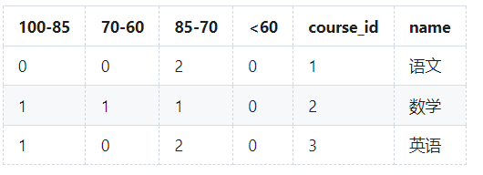
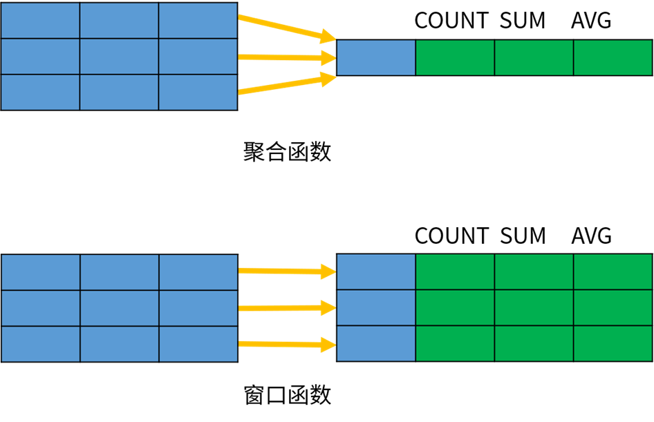
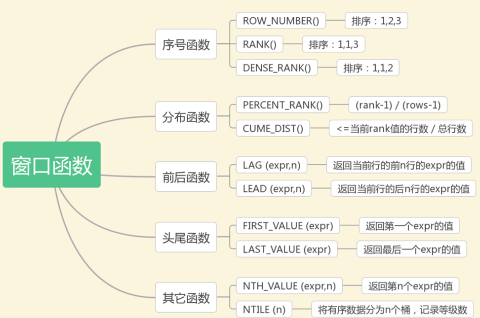
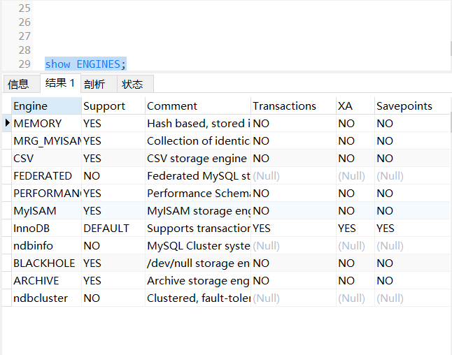

# MySQL8_函数

## 1.MySQL函数

### 1.作用

​	提高代码重用性和隐藏实现细节，函数可被理解为别人封装好的模板代码


### 2.分类

主要分为以下几类：

- 聚合函数
- 数学函数
- 字符串函数
- 日期函数
- 控制流函数
- 窗口函数


## 2.聚合函数

### 1.作用

​	**聚合函数**，也称聚集函数或分组函数，它是**对一组数据进行汇总**的函数，输入的是一组数据的集合，输出的是单个值。

### 2.常用的聚合函数

- `AVG()`：求平均值
- `SUM()`：  求总和
- `MAX()` ：求最大值
- `MIN()`：求最小值
- `COUNT()`：求个数


## 3.数学函数

### 1.表一

| 函数名                             | 描述                      | 实例                                                        |
| ---------------------------------- | ------------------------- | ----------------------------------------------------------- |
| ABS(x)                             | 返回x的绝对值             | 返回 -1的绝对值 :SELECT ABS(-1)     --返回1                 |
| CEIL(x)                            | 返回大于或等于x的最小整数 | SELECT CEIL(2.5)     --返回3                                |
| FLOOR(x)                           | 返回小于或等于x的最大整数 | 小于或等于2.5的整数：SELECT FLOOR(2.5)  --返回2             |
| GREATEST(expr1,expr2,expr3,......) | 返回列表中的最大值        | 返回数字或字符串列表中的最大值(字符串首字母开始比较ASCII码) |
| LEAST(expr1,expr2,expr3,......)    | 返回列表中的最小值        | 返回数字或字符串列表中的最小值(字符串首字母开始比较ASCII码) |


### *字符串比较大小

​	比较字符串常见场景及描述

1. 做比较的两个字符串长度不一致，不是长的字符串就一定”大”。如：例如，字符串c=“EFG”与字符串,d=“EAFG"第二个字符分是‘F’和’A’，所以C>D。
2. 大写字母和小写字母的ASCII代码值是有区别的，所以”good”>”GOOD”。
3. 当字符串全部用英文字母的大写(或小写)组成时，字符串的大小顺序和它们在字典中的顺序相同。
4. 由汉字组成的字符串可以参加比较。如”张三”>”安琪”。它们的大小实际是由其拼音构成的字符串的大小来决定的。上例即：”ZHANGSAN”>”ANQI”。
5. 当字符串有空格时，空格也参加比较。如“abcd”>“a bcd


### 2.表二

| 函数名          | 描述                         | 实例                                                         |
| --------------- | ---------------------------- | ------------------------------------------------------------ |
| MAX(expression) | 返回字段expression中的最大值 | 返回数据表Products中字段Price的最大值： SELECT MAX(Price) AS Largest Price FROM Products |
| MIN(expression) | 返回字段expression中的最小值 | 返回数据表Products中字段Price的最小值： SELECT MIN(Price) AS Largest Price FROM Products |
| MOD(x,y)        | 返回x除以y后的余数           | 5除以2的余数： SELECT MOD(5,2)  --1                          |
| PI()            | 返回圆周率(3.141593)         | SELECT PI()  --3.141593                                      |
| POW(x,y)        | 返回x的y次方                 | 2的3次方：  SELECT POW(2,3)  --8                             |


### 3.表三

| 函数名        | 描述                                                         | 实例                                            |
| ------------- | ------------------------------------------------------------ | ----------------------------------------------- |
| RAND()        | 返回0到1的随机数                                             | SELECT RAND()  --0.93099315644334               |
| ROUND(x)      | 返回离x最近的整数(遵循四舍五入)                              | SELECT ROUND(1.23456)  --1                      |
| ROUND(x,y)    | 返回指定位数的小数(遵循四舍五入)                             | SELECT ROUND(1.23456,3)        --1.235          |
| TRUNCATE(x,y) | 返回数值x保留到小数点后y为的值(与ROUND最大的区别是不会进行四舍五入) | SELECT TRUNCATE(1.23456,3)              --1.234 |


## 4.字符串函数

### 1.表一

| 函数                      | 描述                                                         | 实例                                                         |
| ------------------------- | ------------------------------------------------------------ | ------------------------------------------------------------ |
| CHAR_LENGTH               | 返回字符串s的字符数                                          | 返回字符串RUNOOB的字符数 SELECT CHAR_LENGTH("RUNOOB") AS LengthOfString; |
| CHARACTER_LENGTH(s)       | 返回字符串s的字符数                                          | 返回字符串RUNOOB的字符数 SELECT CHAR_LENGTH("RUNOOB") AS LengthOfString; |
| CONCAT(s1,s2,...,sn)      | 字符串s1,s2等多个字符串合并为一个字符串                      | 合并多个字符串   SELECT CONCAT("SQL ", "Runoob ", "Gooogle ", "Facebook") AS ConcatenatedString; |
| CONCAT_WS(x,s1,s2,...,sn) | 同CONCAT（s1,s2,...)函数，但是每个字符串之间要加上x，x可以是分隔符 | 合并多个字符串，并添加分隔符：SELECT CONCAT_WS("-", "SQL", "Tutorial", "is", "fun!")AS ConcatenatedString; |
| FIELD(s,s1,s2,...)        | 返回第一个字符串s在字符串列表(s1,s2,...)中的位置             | 返回字符串 c 在列表值中的位置：SELECT FIELD("c", "a", "b", "c", "d", "e"); |


### 2.表二

| 函数              | 描述                                                         | 实例                                                         |
| ----------------- | ------------------------------------------------------------ | ------------------------------------------------------------ |
| LTRIM(s)          | 去掉字符串 s 开始处的空格                                    | 去掉字符串  RUNOOB开始处的空格：  SELECT  LTRIM("  RUNOOB") AS  LeftTrimmedString;-- RUNOOB |
| MID(s,n,len)      | 从字符串 s 的 n 位置截取长度为  len 的子字符串，同  SUBSTRING(s,n,len) | 从字符串  RUNOOB 中的第 2 个位置截取 3个  字符：  SELECT  MID("RUNOOB", 2, 3) AS ExtractString; -- UNO |
| POSITION(s1 IN s) | 从字符串 s 中获取 s1 的开始位置                              | 返回字符串  abc 中 b 的位置：  SELECT  POSITION('b' in 'abc') -- 2 |
| REPLACE(s,s1,s2)  | 将字符串 s2 替代字符串 s 中的字符串 s1                       | 将字符串  abc 中的字符 a 替换为字符 x：  SELECT  REPLACE('abc','a','x') --xbc |
| REVERSE(s)        | 将字符串s的顺序反过来                                        | 将字符串 abc 的顺序反过来：  SELECT  REVERSE('abc')  -- cba  |


### 3.表三

| 函数                            | 描述                                                         | 实例                                                         |
| ------------------------------- | ------------------------------------------------------------ | ------------------------------------------------------------ |
| RIGHT(s,n**)**                  | 返回字符串 s 的后 n 个字符                                   | 返回字符串  runoob 的后两个字符：  SELECT  RIGHT('runoob',2) -- ob |
| RTRIM(s**)**                    | 去掉字符串 s 结尾处的空格                                    | 去掉字符串  RUNOOB 的末尾空格：  SELECT  RTRIM("RUNOOB   ") AS  RightTrimmedString;  -- RUNOOB |
| STRCMP(s1,s2)                   | 比较字符串 s1 和 s2，如果 s1  与 s2  相等返回 0 ，如果  s1>s2 返回 1，如果  s1<s2 返回 -1 | 比较字符串：  SELECT  STRCMP("runoob", "runoob"); -- 0       |
| **SUBSTR(s, start, length)**    | 从字符串 s 的 start 位置截取长度为  length 的子字符串        | 从字符串  RUNOOB 中的第 2 个位置截取 3个  字符：  SELECT  SUBSTR("RUNOOB", 2, 3) AS ExtractString; -- UNO |
| **SUBSTRING(s, start, length)** | 从字符串 s 的 start 位置截取长度为  length 的子字符串        | 从字符串  RUNOOB 中的第 2 个位置截取 3个  字符：  SELECT  SUBSTRING("RUNOOB", 2, 3) AS ExtractString;  -- UNO |


### 4.表四

| 函数     | 描述                                | 实例                                                         |
| -------- | ----------------------------------- | ------------------------------------------------------------ |
| TRIM(s)  | 去掉字符串 s 开始和结尾处的空格     | 去掉字符串  RUNOOB 的首尾空格：  SELECT  TRIM('  RUNOOB  ') AS TrimmedString; |
| UCASE(s) | 将字符串转换为大写                  | 将字符串  runoob 转换为大写：  SELECT  UCASE("runoob"); -- RUNOOB |
| UPPER(s) | 将字符串转换为大写                  | 将字符串  runoob 转换为大写：  SELECT  UPPER("runoob"); -- RUNOOB |
| LCASE(s) | 将字符串  s  的所有字母变成小写字母 | 字符串  RUNOOB 转换为小写：  SELECT LCASE('RUNOOB') --  runoob |
| LOWER(s) | 将字符串  s  的所有字母变成小写字母 | 字符串  RUNOOB 转换为小写：  SELECT LOWER('RUNOOB') -- runoob |


## 5.日期函数

### 1.表一

| 函数名                                           | 描述                                   | 实例                                                         |
| ------------------------------------------------ | -------------------------------------- | ------------------------------------------------------------ |
| UNIX_TIMESTAMP()                                 | 返回从1970-01-01  00:00:00到当前毫秒值 | select  UNIX_TIMESTAMP() -> 1632729059                       |
| UNIX_TIMESTAMP(DATE_STRING)                      | 将制定日期转为毫秒值时间戳             | SELECT  UNIX_TIMESTAMP('2011-12-07 13:01:03');               |
| FROM_UNIXTIME(BIGINT UNIXTIME[,  STRING FORMAT]) | 将毫秒值时间戳转为指定格式日期         | SELECT  FROM_UNIXTIME(1598079966,'%Y-%m-%d %H:%i:%s'); (1598079966,'%Y-%m-%d  %H:%i:%s'); -> 2020-08-22 15-06-06 |
| CURDATE()                                        | 返回当前日期                           | SELECT  CURDATE();  ->  2018-09-19                           |
| **CURRENT_DATE()**                               | 返回当前日期                           | SELECT  CURRENT_DATE();  ->  2018-09-19                      |


### 2.表二

| 函数名              | 描述                               | 实例                                                 |
| ------------------- | ---------------------------------- | ---------------------------------------------------- |
| **CURRENT_TIME**    | 返回当前时间                       | SELECT  CURRENT_TIME();  ->  19:59:02                |
| CURTIME()           | 返回当前时间                       | SELECT  CURTIME();  ->  19:59:02                     |
| CURRENT_TIMESTAMP() | 返回当前日期和时间                 | SELECT  CURRENT_TIMESTAMP()  ->  2018-09-19 20:57:43 |
| DATE()              | 从日期或日期时间表达式中提取日期值 | SELECT  DATE("2017-06-15");    ->  2017-06-15        |
| **DATEDIFF(d1,d2)** | 计算日期 d1->d2 之间相隔的天数     | SELECT  DATEDIFF('2001-01-01','2001-02-02')  ->  -32 |


### 3.表三

| 函数名                                | 描述                           | 实例                                                         |
| ------------------------------------- | ------------------------------ | ------------------------------------------------------------ |
| **TIMEDIFF(time1, time2)**            | 计算时间差值                   | SELECT  TIMEDIFF("13:10:11", "13:10:10");  ->  00:00:01      |
| DATE_FORMAT(d,f**)**                  | 按表达式 f的要求显示日期 d     | SELECT  DATE_FORMAT('2011-11-11 11:11:11','%Y-%m-%d %r')  ->  2011-11-11 11:11:11 AM |
| STR_TO_DATE(string, format_mask)      | 将字符串转变为日期             | SELECT  STR_TO_DATE("August 10 2017", "%M %d %Y");  ->  2017-08-10 |
| **DATE_SUB(date,INTERVAL expr type)** | 函数从日期减去指定的时间间隔。 | Orders 表中 OrderDate 字段减去 2 天：  SELECT  OrderId,DATE_SUB(OrderDate,INTERVAL 2  DAY) AS OrderPayDate  FROM  Orders |


### 4.表四

| 函数名                                      | 描述                                                         | 实例                                                         |
| ------------------------------------------- | ------------------------------------------------------------ | ------------------------------------------------------------ |
| **ADDDATE/DATE_ADD(d，INTERVAL expr type)** | 计算起始日期 d 加上一个时间段后的日期，type  值可以是：  ·MICROSECOND  ·SECOND  ·MINUTE  ·HOUR  ·DAY  ·WEEK  ·MONTH  ·QUARTER  ·YEAR  ·DAY_MINUTE  ·DAY_HOUR  ·YEAR_MONTH | SELECT  DATE_ADD("2017-06-15", INTERVAL 10 DAY);    ->  2017-06-25     SELECT  DATE_ADD("2017-06-15 09:34:21", INTERVAL 15 MINUTE);  ->  2017-06-15 09:49:21     SELECT  DATE_ADD("2017-06-15 09:34:21", INTERVAL -3 HOUR);  ->2017-06-15  06:34:21     SELECT  DATE_ADD("2017-06-15 09:34:21", INTERVAL -3 HOUR);  ->2017-04-15 |
| DATE_ADD(d，INTERVAL expr type)             | 计算起始日期 d 加上一个时间段后的日期，type  值可以是：  ·SECOND_MICROSECOND  ·MINUTE_MICROSECOND  ·MINUTE_SECOND  ·HOUR_MICROSECOND  ·HOUR_SECOND  ·HOUR_MINUTE  ·DAY_MICROSECOND  ·DAY_SECOND  ·DAY_MINUTE  ·DAY_HOUR  ·YEAR_MONTH | SELECT  DATE_ADD("2017-06-15", INTERVAL 10 DAY);    ->  2017-06-25     SELECT  DATE_ADD("2017-06-15 09:34:21", INTERVAL 15 MINUTE);  ->  2017-06-15 09:49:21     SELECT  DATE_ADD("2017-06-15 09:34:21", INTERVAL -3 HOUR);  ->2017-06-15  06:34:21     SELECT  DATE_ADD("2017-06-15 09:34:21", INTERVAL -3 HOUR);  ->2017-04-15 |
| EXTRACT(type FROM d)                        | 从日期 d 中获取指定的值，type 指定返回的值。                           type可取值为：·MICROSECOND  ·SECOND  ·MINUTE  ·HOUR  **…..** | SELECT EXTRACT(MINUTE FROM '2011-11-11 11:11:11')   -> 11    |
| LAST_DAY(d)                                 | 返回给给定日期的那一月份的最后一天                           | SELECT  LAST_DAY("2017-06-20");  ->  2017-06-30              |
| MAKEDATE(year, day-of-year)                 | 基于给定参数年份 year 和所在年中的天数序号  day-of-year 返回一个日期 | SELECT  MAKEDATE(2017, 3);  ->  2017-01-03                   |


### 5.表五

| **函数名**           | **描述**                                                     | **实例**                                               |
| -------------------- | ------------------------------------------------------------ | ------------------------------------------------------ |
| **YEAR(d)**          | 返回年份                                                     | SELECT  YEAR("2017-06-15");  ->  2017                  |
| **MONTH(d)**         | 返回日期d中的月份值，1 到 12                                 | SELECT  MONTH('2011-11-11 11:11:11')  ->11             |
| **DAY(d)**           | 返回日期值 d 的日期部分                                      | SELECT  DAY("2017-06-15");   ->  15                    |
| HOUR(t)              | 返回 t 中的小时值                                            | SELECT  HOUR('1:2:3')  ->  1                           |
| MINUTE(t)            | 返回 t 中的分钟值                                            | SELECT  MINUTE('1:2:3')  ->  2                         |
| SECOND(t)            | 返回 t 中的秒钟值                                            | SELECT  SECOND('1:2:3')  ->  3                         |
| QUARTER(d)           | 返回日期d是第几季节，返回 1 到 4                             | SELECT  QUARTER('2011-11-11 11:11:11')  ->  4          |
| MONTHNAME(d)         | 返回日期当中的月份名称，如  November                         | SELECT  MONTHNAME('2011-11-11 11:11:11')  ->  November |
| MONTH(d)             | 返回日期d中的月份值，1 到 12                                 | SELECT  MONTH('2011-11-11 11:11:11')  ->11             |
| DAYNAME(d)           | 返回日期 d 是星期几，如  Monday,Tuesday                      | SELECT  DAYNAME('2011-11-11 11:11:11')  ->Friday       |
| DAYOFMONTH(d)        | 计算日期 d 是本月的第几天                                    | SELECT  DAYOFMONTH('2011-11-11 11:11:11')  ->11        |
| DAYOFWEEK(d)         | 日期 d 今天是星期几，1 星期日，2 星期一，以此类推            | SELECT  DAYOFWEEK('2011-11-11 11:11:11')  ->6          |
| DAYOFYEAR(d)         | 计算日期 d 是本年的第几天                                    | SELECT  DAYOFYEAR('2011-11-11 11:11:11')  ->315        |
| WEEK(d)              | 计算日期 d 是本年的第几个星期，范围是 0 到 53                | SELECT  WEEK('2011-11-11 11:11:11')  ->  45            |
| WEEKDAY(d)           | 日期 d 是星期几，0 表示星期一，1 表示星期二                  | SELECT  WEEKDAY("2017-06-15");  ->  3                  |
| WEEKOFYEAR(d)        | 计算日期 d 是本年的第几个星期，范围是 0 到 53                | SELECT  WEEKOFYEAR('2011-11-11 11:11:11')  ->  45      |
| YEARWEEK(date, mode) | 返回年份及第几周（0到53），mode 中 0 表示周天，1表示周一，以此类推 | SELECT  YEARWEEK("2017-06-15");  ->  201724            |
| **NOW()**            | 返回当前日期和时间                                           | SELECT  NOW()  ->  2018-09-19 20:57:43                 |


## **6.控制流函数**

### **1.if逻辑判断语句(只能两者间判断)**

| **格式**             | **解释**                                                     | **案例**                                         |
| -------------------- | ------------------------------------------------------------ | ------------------------------------------------ |
| **IF(expr,v1,v2)**   | **如果表达式 expr 成立，返回结果 v1；否则，返回结果 v2。**   | **SELECT  IF(1 > 0,'正确','错误')    ->正确**    |
| IFNULL(v1,v2)        | 如果 v1 的值不为  NULL，则返回 v1，否则返回 v2。             | SELECT  IFNULL(null,'Hello Word')  ->Hello  Word |
| ISNULL(expression)   | 判断表达式是否为 NULL                                        | SELECT  ISNULL(NULL);  ->1                       |
| NULLIF(expr1, expr2) | 比较两个字符串，如果字符串  expr1 与  expr2 相等  返回  NULL，否则返回  expr1 | SELECT  NULLIF(25, 25);  ->                      |


### **2.case when语句**

| **格式**                                                     | **解释**                                                     | **操作**                                                     |
| ------------------------------------------------------------ | ------------------------------------------------------------ | ------------------------------------------------------------ |
| **CASE expression    WHEN condition1 THEN  result1    WHEN condition2 THEN  result2    ...    WHEN conditionN THEN resultN    ELSE result  END** | **CASE 表示函数开始，END  表示函数结束。如果  condition1 成立，则返回  result1, 如果  condition2 成立，则返回  result2，当全部不成立则返回  result，而当有一个成立之后，后面的就不执行了。** | **select  case 100 when 50 then 'tom' when 100 then 'mary'else 'tim'  end ;        select case when 1=2 then 'tom' when  2=2 then 'mary' else'tim' end ;** |

**如练习题：**

​	**29.使用分段[100-85],[85-70],[70-60],[<60]来统计各科成绩，分别统计：各分数段人数，课程号和课程名称**

**score 数据表如下：**

| **student_id** | **course_id** | **score** |
| -------------- | ------------- | --------- |
| **0001**       | **0001**      | **80**    |
| **0001**       | **0002**      | **90**    |
| **0001**       | **0003**      | **99**    |
| **0002**       | **0002**      | **60**    |
| **0002**       | **0003**      | **80**    |
| **0003**       | **0001**      | **80**    |
| **0003**       | **0002**      | **80**    |
| **0003**       | **0003**      | **80**    |

**course 表数据如下：**

| **id**  | **name** | **teacher_id** |
| ------- | -------- | -------------- |
| **001** | **语文** | **0002**       |
| **002** | **数学** | **0001**       |
| **003** | **英语** | **0003**       |

**** 

```mysql
SELECT
	s.course_id,
	c.name,
	sum( CASE WHEN s.score BETWEEN 85 AND 100 THEN 1 ELSE 0 END ) AS `100-85`,
	sum( CASE WHEN s.score >= 70 AND s.score < 85 THEN 1 ELSE 0 END ) AS `85-70`,
	sum( CASE WHEN s.score >= 60 AND s.score < 70 THEN 1 ELSE 0 END ) AS `70-60`,
	sum( CASE WHEN s.score < 60 THEN 1 ELSE 0 END ) AS `<60` 
FROM
	score AS s
	inner JOIN course AS c ON s.course_id = c.id 
GROUP BY
	c.id
```

****


## **7.窗口函数**

### **1.作用**

- **MySQL 8.0 新增窗口函数,窗口函数又被称为开窗函数，与Oracle 窗口函数类似，属于MySQL的一大特点。**
- **非聚合窗口函数是相对于聚函数来说的。聚合函数是对一组数据计算后返回单个值（即分组），非聚合函数一次只会处理一行数据。窗口聚合函数在行记录上计算某个字段的结果时，可将窗口范围内的数据输入到聚合函数中，并不改变行数。**

****


### **2.分类**

****

1. **序号函数**
   - **ROW_NUMBER()  排序:1,2,3**
   - **RANK()  排序:1,1,3**
   - **DENSE_RANK()  排序:1,1,2**
2. **分布函数**
   - **PERCENT_RANK()  	(rank-1)/(rows-1)**
   - **CUME_DIST()             <=当前rank值的行数/总行数**
3. **前后函数**
   - **LAG(expr,n)              返回当前行的前n行的expr的值**
   - **LEAD(expr,n)            返回当前行的后n行的expr的值**
4. **头尾函数**
   - **FIRST_VALUE(expr)      返回第一个expr的值**
   - **LAST_VALUE(expr)       返回最后一个expr的值**
5. **开窗聚合函数**
   - **SUM**
   - **AVG**
   - **MIN**
   - **MAX**
   - **COUNT**
6. **其他函数**
   - **NTH_VALUE(expr,n)       返回第n个expr的值**
   - **NTILE(n)                           将有序数据分为n个桶，记录等级数**


### **3.语法结构**

```mysql
window_function ( expr ) OVER ( 
  PARTITION BY ... 
  ORDER BY ... 
  frame_clause 
)
```

​	**其中，window_function 是窗口函数的名称；expr 是参数，有些函数不需要参数；OVER子句包含三个选项：**

#### **1.分区（PARTITION BY）**

​	**PARTITION BY选项用于将数据行拆分成多个分区（组），它的作用类似于GROUP BY分组。如果省略了 PARTITION BY，所有的数据作为一个组进行计算**

#### **2.排序（ORDER BY）**

​	**OVER 子句中的ORDER BY选项用于指定分区内的排序方式，与 ORDER BY 子句的作用类似**

#### **3.以及窗口大小（frame_clause）。**

​	**frame_clause选项用于在当前分区内指定一个计算窗口，也就是一个与当前行相关的数据子集。**


### **4.序号函数**

​	**序号函数有三个：ROW_NUMBER()、RANK()、DENSE_RANK()，可以用来实现分组排序，并添加序号。**


#### **1.格式**

```mysql
row_number()|rank()|dense_rank() over ( 
  partition by ... 
  order by ... 
) 
```


#### **2.区别**

- **row number()  依次排序，相等的值随机排序 如123456**
- **rank()    依次排序，相等的值赋予相同的序号，之后的数会在这个序号的基础上加上重复的数往后排序，如 111444789**
- **dense_rank()  依次排序，相等的值赋予相同的序号，之后的数会在这个序号基础上继续排序，如111112344444456666789**


# **MySQL的事务**

## **1.MySQL的事务**

### **1.概念**

- **数据库存储引擎是数据库底层软件组织，数据库管理系统（DBMS）使用数据引擎进行创建、查询、更新和删除数据。**
- **不同的存储引擎提供不同的存储机制、索引技巧、锁定水平等功能。现在许多不同的数据库管理系统都支持多种不同的数据引擎。MySQL的核心就是存储引擎。**
- **用户可以根据不同的需求为数据表选择不同的存储引擎**
- **可以使用 SHOW ENGINES 命令 可以查看Mysql的所有执行引擎我们 可以到 默认的执行引擎是innoDB 支持事务，行级锁定和外键。**

****


### **2.定义**

- **在MySQL中的事务（Transaction）是由存储引擎实现的，在MySQL中，只有InnoDB存储引擎才支持事务。**
- **事务处理可以用来维护数据库的完整性，保证成批的 SQL 语句要么全部执行，要么全部不执行。**
- **事务用来管理 DDL、DML、DCL 操作，比如 insert,update,delete 语句，默认是自动提交的。**


### **3.操作(类似于git bash的操作)**

​	**MySQL的事务操作主要有以下三种：**

1. **开启事务：Start Transaction**

- **任何一条DML语句(insert、update、delete)执行，标志事务的开启**
- **命令：`BEGIN` 或 `START TRANSACTION`**


2. **提交事务：Commit Transaction**

- **成功的结束，将所有的DML语句操作历史记录和底层硬盘数据来一次同步**
- **命令：`COMMIT`**


3. **回滚事务：Rollback Transaction**

- **失败的结束，将所有的DML语句操作历史记录全部清空**
- **命令：`ROLLBACK`** 


**例：**

****

```mysql
-- 设置MySQL的事务为手动提交(关闭自动提交)
select @@autocommit;
set autocommit = 0;
 
-- 模拟账户转账
-- 开启事务 
begin;
update account set money = money - 200 where name = 'zhangsan';
update account set money = money + 200 where name = 'lisi';
-- 提交事务
commit;
 
 
-- 如果转账中的任何一条出现问题，则回滚事务
rollback;
```


### **4.特性（ACID）**

****

- **原子性（atomicity，或称不可分割性）**
- **一致性（consistency）**
- **隔离性（isolation，又称独立性）**
- **持久性（durability）**


### **5.隔离级别**

​	**Isolation，顾名思义就是将事务与另一个事务隔离开，为什么要隔离呢？如果一个事务正在操作的数据被另一个事务修改或删除了，最后的执行结果可能无法达到预期。如果没有隔离性还会导致其他问题。**

​	**事务存在权限，这样可以保证数据修改不会出现异常问题。**

****


- **读未提交(Read uncommitted)**

 **一个事务可以读取另一个未提交事务的数据，最低级别，任何情况都无法保证,会造成脏读。**

- **读已提交(Read committed)**

  **一个事务要等另一个事务提交后才能读取数据，可避免脏读的发生，会造成不可重复读。**

- **可重复读(Repeatable read)**

  **就是在开始读取数据（事务开启）时，不再允许修改操作，可避免脏读、不可重复读的发生，但是会造成幻读。**

- **串行(Serializable)**

  **是最高的事务隔离级别，在该级别下，事务串行化顺序执行，可以避免脏读、不可重复读与幻读。但是这种事务隔离级别效率低下，比较耗数据库性能，一般不使用。**

****　　　

​	**Mysql的默认隔离级别是Repeatable read。**


## **2.锁机制**

### **1.作用**

​	**相对其他数据库而言，MySQL的锁机制比较简单，其最显著的特点是不同的存储引擎支持不同的锁机制。下表中罗列出了各存储引擎对锁的支持情况：**

| **存储引擎** | **表级锁** | **行级锁** |
| ------------ | ---------- | ---------- |
| **MyISAM**   | **支持**   | **不支持** |
| **InnoDB**   | **支持**   | **支持**   |
| **MEMORY**   | **支持**   | **不支持** |
| **BDB**      | **支持**   | **不支持** |


### **2.大致分类**

| **锁类型** | **特点**                                                     |
| ---------- | ------------------------------------------------------------ |
| **表级锁** | **偏向MyISAM存储引擎，开销小，加锁快；不会出现死锁；锁定粒度大，发生所冲突的概率最高，并发度最低。** |
| **行级锁** | **偏向InnoDB存储引擎，开销大，加锁慢；会出现死锁；锁定粒度最小，发生所冲突的概率最低，并发度也最高** |

