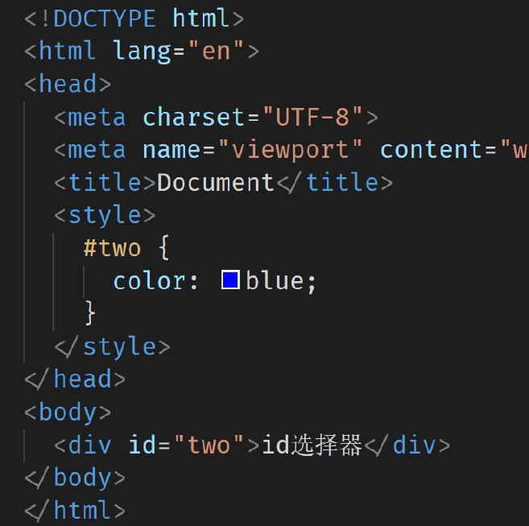

# CSS

## ---------------------------------- 思源黑体，免费商用字体，你值得拥有.jpg------------------------------------------


## 1.概述

​	CSS 是一门编程语言，用于控制网页表现。

​	CSS也有一个专业的名字：**Cascading Style Sheet**（层叠样式表）。

​	一般写在 style 标签中，style 标签一般写在 head 标签里， tittle 标签下面。

如下面的代码， `style` 标签中定义的就是css代码。该代码描述了将 div 标签的内容的字体颜色设置为 红色。

```html
<!DOCTYPE html>
<html lang="en">
<head>
    <meta charset="UTF-8">
    <title>Title</title>
    <style>
        div {
            color: red;
        }
    </style>
</head>
<body>
    <div>Hello CSS~</div>
</body>
</html>
```

在浏览器中的效果如下：


**常见属性**(每个键值写完后，最后需要写分号) ：

|   css常见属性    |   作用   |
| :--------------: | :------: |
|      color       | 文字颜色 |
|    font-size     | 字体大小 |
| background-color | 背景颜色 |
|      width       |   宽度   |
|      height      |   高度   |


## 2.css 导入方式

css 导入方式其实就是 css 代码和 html 代码的结合方式。CSS 导入 HTML有三种方式：

* 内联样式：在标签内部使用**style**属性，属性值是css属性键值对

  ```html
  <div style="color: red">Hello CSS~</div>
  ```

  > 给方式只能作用在这一个标签上，如果其他的标签也想使用同样的样式，那就需要在其他标签上写上相同的样式。复用性太差。

* 内嵌样式：定义< style>标签，在标签内部定义css样式

  ```html
  <style type="text/css">
  	div {
  		color: red;
      }
  </style>
  ```

  > 这种方式可以做到在该页面中复用。

* 外部样式：定义link标签，引入外部的css文件

  编写一个css文件。名为：demo.css，内容如下：

  ```css
  div {
  	color: red;
  }
  ```

  在html中引入 css 文件。

  ```html
  <link rel="stylesheet" href="demo.css">
  ```

  > 这种方式可以在多个页面进行复用。其他的页面想使用同样的样式，只需要使用 `link` 标签引入该css文件。

**总结**：

| 引入方式 | 书写位置                                 | 作用范围 | 使用场景   |
| -------- | ---------------------------------------- | -------- | ---------- |
| 内嵌式   | CSS写在style标签中                       | 当前页面 | 小案例     |
| 外联式   | CSS写在单独的css文件中，通过link标签引入 | 多个页面 | 项目中     |
| 行内式   | CSS写在标签的style属性中                 | 当前标签 | 配合js使用 |


**代码演示：**

项目目录结构如下：


编写页面 `02-导入方式.html`，内容如下：

```html
<!DOCTYPE html>
<html lang="en">
<head>
    <meta charset="UTF-8">
    <title>Title</title>
    <style>
        span {
            color: red;
        }
    </style>
    <link href="../css/demo.css" rel="stylesheet">
</head>
<body>
    <div style="color: red">hello css</div>

    <span>hello css</span>

    <p>hello css</p>
</body>
</html>
```

## 3.css 基本选择器

css 选择器就是选取需设置样式的元素（标签），比如如下css代码：

```css
div {
	color:red;
}
```

如上代码中的 `div` 就是 css 中的选择器。

### 1.标签选择器

* 作用：通过标签名，找到页面中所有这类标签，设置样式
* 

- 格式：


```css
标签名 {color: red;}
```

- 例子：


```css
div {color:red;}  /*该代码表示将页面中所有的div标签的内容的颜色设置为红色*/
```

- 注意：

1.标签选择器选择的是一类标签，而不是单独某一个

2.标签选择器无论嵌套关系有多深，都能找到对应的标签


### 2.id选择器

* 
* 作用通过id属性名，找到页面中带有这个id属性值的标签，设置样式

- 格式：


```css
#id属性值 {color: red;}
```

-  例子：

html代码如下：

```html
<div id="name">hello css2</div>
```

css代码如下：

```css
#name {color: red;}/*该代码表示将页面中所有的id属性值是 name 的标签的内容的颜色设置为红色*/
```

### 3.类选择器

* 作用：通过类名，找到页面中所有带有这个类名的标签，设置样式
* 注意：
  * 所有标签上都有class属性，class属性的属性值称为类名（类似于名字）
  * 类名可以由数字、字母、下划线、中划线组成，但不能以数字或者中划线开头
  * 一个标签可以同时有多个类名，类名之间以空格隔开
  * 类名可以重复，一个类选择器可以同时选中多个标签

* 

- 格式：


```css
.class属性值 {color: red;}
```

- 例子：

  html代码如下：


```html
<div class="cls">hello css3</div>
```

​	css代码如下：

```css
.cls {color: red;} /*该代码表示将页面中所有的class属性值是 cls 的标签的内容的颜色设置为红色*/
```

**代码演示：**

```html
<!DOCTYPE html>
<html lang="en">
<head>
    <meta charset="UTF-8">
    <title>Title</title>
    <style>
        div{
            color: red;
        }

        #name {
            color: blue;
        }

        .cls {
            color: pink;
        }
    </style>

</head>
<body>
    <div>div1</div>
    <div id="name">div2</div>
    <div class="cls">div3</div>
    <span class="cls">span</span>
</body>
</html>
```

### 4.通配符选择器

- 结构 ：

  ```css
  * { css属性名: 属性值 ; }
  ```

- 作用：找到页面中所有的标签，设置样式

- 

- 注意：

  - 开发中使用极少，只会在极特殊的情况下才会用到
  - 可能使用时会用于去除标签默认的margin和padding
  - 


### 5.小结：

- 选择器作用：选中页面中对应的标签（找她），方便后续设置样式（改她）
- 标签选择器：标签名 { css属性名：属性值； }
- 类选择器：.类名 { css属性名：属性值； }
- id选择器：#id属性值 { css属性名：属性值； }
- 通配符选择器：* { css属性名：属性值； }


#### 1..class类名与id属性值的区别

- class类名相当于姓名，可以重复，一个标签可以同时有多个class类名
- id属性值相当于身份证号码，不可重复，一个标签只能有一个id属性值


#### 2..类选择器与id选择器的区别

- 类选择器以 . 开头
- id选择器以 # 开头


#### 3.实际开发的情况

-  类选择器用的最多
-  id一般配合js使用，除非特殊情况，否则不要使用id设置样式
   实际开发中会遇到冗余代码的抽取 （可以将一些公共的代码抽取到一个公共的类中去）


#### 4.组合选择器

```html
<!DOCTYPE html>
<html lang="en">
<head>
    <meta charset="UTF-8">
    <title>Title</title>
    <style>
        div, span {
            background: coral;
        }

        div {
            background: cornflowerblue;
        }
    </style>
</head>
<body>
    <div id="div1">div1</div>
    <div>div3</div>
    <div id="div2">div2</div>
    <span>span</span>
</body>
</html>

```

## 4.层次选择器

1. 后代选择器
2. 子选择器
3. 相邻兄弟选择器 (了解)
4. 通用兄弟选择器 (了解)

```html
<!DOCTYPE html>
<html lang="en">
<head>
    <meta charset="UTF-8">
    <title>Title</title>
    <style>
        /*后代选择器*/
        body p {
            background: chocolate;
        }

        /*子选择器*/
        body > p {
            background: chocolate;
        }

        /*相邻兄弟选择器*/
        /*.p1 + p {*/
            /*background: chocolate;*/
        /*}*/

        /*通用兄弟选择器*/
        /*.p1 ~ p {*/
            /*background: chocolate;*/
        /*}*/
    </style>
</head>
<body>
    <p>p0</p>
    <p class="p1">p1</p>
    <p>p2</p>
    <p>p3</p>
    <ul>
        <li>
            <p>p4</p>
        </li>
        <li>
            <p>p5</p>
        </li>
        <li>
            <p>p6</p>
        </li>
    </ul>
    <p>p7</p>
    <p>p8</p>
</body>
</html>
```

## 5.伪类选择器

同一个标签，根据其不同的种状态，有不同的样式，这就叫做“伪类”，伪类用冒号来表示。  

```html
<!DOCTYPE html>
<html lang="en">
<head>
    <meta charset="UTF-8">
    <title>Title</title>
    <style>
        h1:hover {
            background: cornflowerblue;
        }
        ul li:first-child {
            background: cornflowerblue;
        }
    </style>
</head>
<body>
    <h1>h1</h1>
    <ul>
        <li>li-1</li>
        <li>li-2</li>
        <li>li-3</li>
    </ul>
</body>
</html>
```

## 6.属性选择器

```html
<!DOCTYPE html>
<html lang="en">
<head>
    <meta charset="UTF-8">
    <title>Title</title>
    <style>
        input[name="userName"] {
            background: cornflowerblue;
        }
    </style>
</head>
<body>
    用户名：<input type="text" name="userName" value="张三"><br><br>
    密码：<input type="password" name="password">
</body>
</html>
```

## 7.字体样式

​	**用CSS来写，如果有多个字体样式属性时，最好写在同一行**

### 1.样式

- 字体大小：font-size   ；取值：数字+px  ；  chrome默认16px，单位未设置则无效


- 字体粗细：font-weight

  - 取值

    - 关键字：

      | 正常 | normal |
      | ---- | ------ |
      | 加粗 | bold   |

    - 纯数字：100-900的整百数

      | 正常 | 400  |
      | ---- | ---- |
      | 加粗 | 900  |

  - 部分字体未提供九种粗细，实际开发中正常和加粗两种取值使用最多

  

- 字体样式：font-style

  - 取值

    | 正常(default) | normal     |
    | ------------- | ---------- |
    | 倾斜          | italic     |
    | 无衬线字体    | sans-serif |
    | 衬线字体      | serif      |
    | 等宽字体      | monospace  |

  - 

  - 

  - 

    

- 字体类型：font-family

  - 常见取值：具体字体1，具体字体2，具体字体3，......,字体系列
    - 具体字体："Microsoft YaHei",微软雅黑、黑体、宋体、楷体等......
    - 字体系列：sans-serif、serif、monospace等......
  - 渲染规则：
    - 从左往右按照顺序查找，如果电脑中未安装该字体，则显示下一个字体
    - 如果都不支持，此时会根据操作系统，显示最后字体系列的默认字体
  - 注意点
    1. 如果字体名称中存在多个单词，推荐使用引号包裹
    2. 最后一项字体系列不需要引号包裹
    3. 网页开发时，尽量使用系统常见自带字体，保证不同用户浏览网页都可以正确显示
  - 


- 字体类型：font属性连写

```html
<!DOCTYPE html>
<html lang="en">
<head>
    <meta charset="UTF-8">
    <title>Title</title>
    <style>
        p {
            font-family: "Times New Roman", 隶书;
            font-size: 20px;
            font-weight: bold;
            color: yellowgreen;
        }
    </style>
</head>
<body>
<p>好想被优香的大腿夹紧脑袋啊🥵🥵🥵优香的腿，肉肉的夹紧我的脑袋时猛吸一大口，就可以被优香充满了🥵🥵🥵如果此时优香有兴致的话也许会俯下身来亲吻我的额头呢，这样我就可以用额头细细感受她那温软的嘴唇🤤🤤🤤或者说我直接转头把脸埋在她的怀里，100KG的优香一定会有软fufu的小肚子吧🤤🤤🤤面对这样的突然袭击优香说不定会红着脸骂我两句呢？🥰🥰🥰啊～好想看优香那小脸泛红的样子啊，就像秋日里的苹果一般，娇嫩欲滴，让人忍不住上去咬上一口</p>
</body>
</html>

```

### 2.总结

- 字体大小： font-size
  - 数字+px
- 字体粗细：font-weight
  - 正常：normal 或 400
  - 加粗：bold 或 700
- 字体样式：font-style
  - 正常：normal
  - 倾斜：italic
- 字体系列：font-family
  - 具体字体1,具体字体2,具体字体3,具体字体4,...,字体系列
- 字体连写：font
  - font : style weight size family;


## 8.文本样式

### 1.文本缩进

#### 1.属性名：`text-indent`

#### 2.取值：

- 数字+px
- 数字+em (推荐，1em = 当前标签的font-size的大小 )

#### 3.效果：


### 2.文本水平对齐方式

#### 1.属性名：`text-align`

#### 2.取值

| 属性值 |   效果   |
| :----: | :------: |
|  left  |  左对齐  |
| center | 居中对齐 |
| right  |  右对齐  |

#### 3.作用域

1. 文本
2. span标签、a标签
3. input标签、img标签


### 3.文本修饰

#### 1.属性名：`text-decoration`

#### 2.取值范围

|    属性值    |       效果       |
| :----------: | :--------------: |
|   unerline   |  下划线 (常用)   |
| line-through |  删除线(不常用)  |
|   overline   | 上划线(几乎不用) |
|     none     |  无装饰线(常用)  |

#### 3.效果


#### 4.注意

​	开发中会使用到 `text-decoration:none` 清除a标签默认的下划线。


### 4.总结

|       样式       |     属性名      |      常见属性值       |
| :--------------: | :-------------: | :-------------------: |
|     文本缩进     |   text-indent   |   数字+px / 数字+em   |
| 文本水平对齐方式 |   text-align    | left / center / right |
|     文本修饰     | text-decoration |   underline / none    |

#### 例：

```html
<!DOCTYPE html>
<html lang="en">
<head>
    <meta charset="UTF-8">
    <title>Title</title>
    <style>
        p {
            text-align: justify;
            text-indent: 2em;
            text-decoration: line-through;
        }
    </style>
</head>
<body>
<p>好想被优香的大腿夹紧脑袋啊🥵🥵🥵优香的腿，肉肉的夹紧我的脑袋时猛吸一大口，就可以被优香充满了🥵🥵🥵如果此时优香有兴致的话也许会俯下身来亲吻我的额头呢，这样我就可以用额头细细感受她那温软的嘴唇🤤🤤🤤或者说我直接转头把脸埋在她的怀里，100KG的优香一定会有软fufu的小肚子吧🤤🤤🤤面对这样的突然袭击优香说不定会红着脸骂我两句呢？🥰🥰🥰啊～好想看优香那小脸泛红的样子啊，就像秋日里的苹果一般，娇嫩欲滴，让人忍不住上去咬上一口</p>
</body>
</html>

```


## 9.超链接样式

```html
<!DOCTYPE html>
<html lang="en">
<head>
    <meta charset="UTF-8">
    <title>Title</title>
    <style>
        a {
            text-decoration: none;
            color: black;
        }
    </style>
</head>
<body>
    <a href="www.baidu.com" >百度一下，你就知道</a>
</body>
</html>

```


## 10.无序列表样式

```html
<!DOCTYPE html>
<html lang="en">
<head>
    <meta charset="UTF-8">
    <title>Title</title>
    <style>
        ul li {
            list-style: none;
        }
    </style>
</head>
<body>
    <ul>
        <li>牛奶</li>
        <li>咖啡</li>
        <li>铁观音</li>
    </ul>
<p>------------------</p>
</body>
</html>

```

## 11.display属性

```html
<!DOCTYPE html>
<html lang="en">
<head>
    <meta charset="UTF-8">
    <title>Title</title>
    <style>
        div {
            display: inline;
        }

        div {
            border: 3px cornflowerblue dashed;
        }

        span {
            width: 100px;
            height: 100px;
            display: block;
        }
    </style>
</head>
<body>
    <div>div1</div>
    <div>div2</div>
    <hr>
    <span>span1</span>
    <span>span2</span>
</body>
</html>
```

## 12.浮动属性

```html
<!DOCTYPE html>
<html lang="en">
<head>
    <meta charset="UTF-8">
    <title>Title</title>
    <style>
        #div1, #div2 {
            float: right;
        }

        div {
            border: 3px cornflowerblue dashed;
            display: inline-block;
        }

        span {
            width: 100px;
            height: 100px;
            display: block;
        }
    </style>
</head>
<body>
    <div id="div1">div1</div>
    <div>div3</div>
    <div id="div2">div2</div>
</body>
</html>
```

## 13.盒子模型


```html
<!DOCTYPE html>
<html lang="en">
<head>
    <meta charset="UTF-8">
    <title>Title</title>
    <style>
        div {
            display: inline-block;
        }

        div {
            border: 3px cornflowerblue dashed;
            padding: 100px 50px;
            margin: 50px;
        }
    </style>
</head>
<body>
    <div>div1</div>
    <div>div2</div>
</body>
</html>
```

### *标签水平居中的方法：margin : 0 auto

如果需要让div、p、h（大盒子）水平居中？

- 可以通过margin : 0 auto ; 实现


## 14.行高

### 1.作用

​	控制一行的上下行间距


### 2.属性名：`line-height`


### 3.取值

- 数字+px
- 倍数(当前标签font-size的倍数)


### 4.应用

1. 让单行文本垂直居中可以设置 line-height : 文字父元素高度
2. 网页精准布局时，会设置 line-height : 1 可以取消上下间距


#### 5.行高与font连写的注意点：

- 如果同时设置了行高和font连写，注意覆盖问题
- font : style weight size/line-height family ;


#### 6.图例：


## 15.阴影属性

### 1.CSS 语法

```
box-shadow: h-shadow v-shadow blur spread color inset;
```

**注释：**box-shadow 向框添加一个或多个阴影。该属性是由逗号分隔的阴影列表，每个阴影由 2-4 个长度值、可选的颜色值以及可选的 inset 关键词来规定。省略长度的值是 0。

### 2.属性值

| 值         | 描述                                     |
| :--------- | :--------------------------------------- |
| *h-shadow* | 必需。水平阴影的位置。允许负值。         |
| *v-shadow* | 必需。垂直阴影的位置。允许负值。         |
| *blur*     | 可选。模糊距离。                         |
| *spread*   | 可选。阴影的尺寸。                       |
| *color*    | 可选。阴影的颜色。请参阅 CSS 颜色值。    |
| inset      | 可选。将外部阴影 (outset) 改为内部阴影。 |

### 3.技术细节

| 默认值：          | none                                             |
| ----------------- | ------------------------------------------------ |
| 继承性：          | no                                               |
| 版本：            | CSS3                                             |
| JavaScript 语法： | *object*.style.boxShadow="10px 10px 5px #888888" |

### 4.实例：扔到桌子上面的图片

```html
<!DOCTYPE html>
<html>
<head>
<style> 
body
{
margin:30px;
background-color:#E9E9E9;
}

div.polaroid
{
width:294px;
padding:10px 10px 20px 10px;
border:1px solid #BFBFBF;
background-color:white;
/* Add box-shadow */
box-shadow:2px 2px 3px #aaaaaa;
}

div.rotate_left
{
float:left;
-ms-transform:rotate(7deg); /* IE 9 */
-moz-transform:rotate(7deg); /* Firefox */
-webkit-transform:rotate(7deg); /* Safari and Chrome */
-o-transform:rotate(7deg); /* Opera */
transform:rotate(7deg);
}

div.rotate_right
{
float:left;
-ms-transform:rotate(-8deg); /* IE 9 */
-moz-transform:rotate(-8deg); /* Firefox */
-webkit-transform:rotate(-8deg); /* Safari and Chrome */
-o-transform:rotate(-8deg); /* Opera */
transform:rotate(-8deg);
}
</style>
</head>
<body>

<div class="polaroid rotate_left">

<p class="caption">上海鲜花港的郁金香，花名：Ballade Dream。</p>
</div>

<div class="polaroid rotate_right">

<p class="caption">2010年上海世博会，中国馆。</p>
</div>


</body>
</html>
```


## 16.动画属性

### 1.CSS 语法

```
transition: property duration timing-function delay;
```

### 2.属性值

| 值                                                           | 描述                                |
| :----------------------------------------------------------- | :---------------------------------- |
| [transition-property](https://www.w3school.com.cn/cssref/pr_transition-property.asp) | 规定设置过渡效果的 CSS 属性的名称。 |
| [transition-duration](https://www.w3school.com.cn/cssref/pr_transition-duration.asp) | 规定完成过渡效果需要多少秒或毫秒。  |
| [transition-timing-function](https://www.w3school.com.cn/cssref/pr_transition-timing-function.asp) | 规定速度效果的速度曲线。            |
| [transition-delay](https://www.w3school.com.cn/cssref/pr_transition-delay.asp) | 定义过渡效果何时开始。              |

### 3.技术细节

| 默认值：          | all 0 ease 0                         |
| ----------------- | ------------------------------------ |
| 继承性：          | no                                   |
| 版本：            | CSS3                                 |
| JavaScript 语法： | *object*.style.transition="width 2s" |

### 4.实例

把鼠标指针放到 div 元素上，其宽度会从 100px 逐渐变为 300px：

```css
div {
  width: 100px;
  transition: width 2s;
}
```


## *扩展 颜色常见取值

### 1.属性名：

- 如：文字颜色：color
- 如：背景颜色：background-color


### 2.属性值

| 颜色的表示方式 | 表示含义                                 | 属性值                                                       |
| -------------- | ---------------------------------------- | ------------------------------------------------------------ |
| 关键词         | 预定义的颜色名                           | red、green、blue、yellow......                               |
| rgb表示法      | 红绿蓝三原色。每项取值范围：0~255        | rgb(0,0,0)、rgb(255,255,255)......                           |
| rgba表示法     | 红绿蓝三原色+ a表示透明度，取值范围是0~1 | rgba(255,255,255,0.5)......                                  |
| 十六进制表示法 | #楷体，将数字转换成十六进制表示          | #000000、#ff0000,简写#000、#f00(前提是每两位数都相同且三组都是如此的情况下) |


[FISH (iwhalecloud.com)](https://fish.iwhalecloud.com/fish-show/)


# Google Chrome调试工具

## 1.Chrome调试工作操作

### 	1.打开方式：

① 右击 → 检查 ② 看哪里


### 	2.选择元素

 两种常见方法


###  	3.控制样式

 ① 修改属性值 ② 添加属性 ③ 控制样式生效


### 	4. 特殊情况

 ① 出现删除线 ② 出现小三角形


## 2.小结


session与cookies的问题