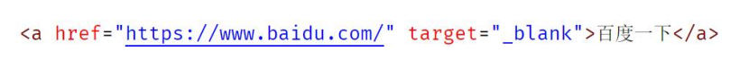
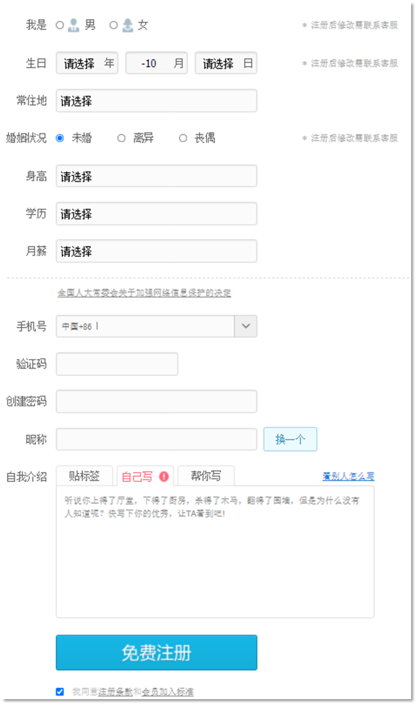

# HTML 学习

## 1.认识网页

​	目标：认识 **网页组成** 和 **五大浏览器** ，明确 **Web标准的构成** ，使用 **HTML骨架** 搭建出一个网页。

### 1.组成

- 文字
- 图片
- 音频
- 视频
- 超链接


### 2.原理

​	前端的代码通过浏览器的转化(解析和渲染)成用户看到的网页。


### 3.五大浏览器

#### 1.浏览器的作用

​	网页显示、运行的平台，前端开发必备工具之一。


#### 2.常见五大浏览器：

- IE浏览器
- Firefox浏览器
- Google Chrome浏览器
- Safari浏览器
- Opera浏览器 (欧朋)
- edge浏览器(新生儿)


#### 3.浏览器市场份额


​	

#### 4.渲染引擎

​	浏览器中专门对代码进行解析渲染的部分

​	不同公司出品的浏览器，内在渲染引擎也有所不同：

| 浏览器       | 内核    | 备注                                      |
| ------------ | ------- | ----------------------------------------- |
| IE           | Trident | IE、猎豹浏览器、360极速浏览器、百度浏览器 |
| FireFox      | Gecko   | 火狐浏览器内核                            |
| Safari       | Webkit  | 苹果浏览器内核                            |
| Chrome/Opera | Blink   | Blink其实是Webkit的分支                   |

*注意：

- 渲染引擎不同，导致解析相同代码时的速度、性能、效果也不同的
- 谷歌浏览器的渲染引擎速度快、性能高、效果好，所以更吸引用户的喜爱（推荐)


### 4.Web标准

#### 1.出现的原因

​	不同浏览器的渲染引擎不同，对于相同代码解析的效果存在差异，二Web标准会让不同的浏览器按照相同的标准显示结果，让展示的效果统一。


#### 2.Web标准的构成

| 构成 | 语言       | 说明                                           |
| ---- | ---------- | ---------------------------------------------- |
| 结构 | HTML       | 页面元素和内容                                 |
| 表现 | CSS        | 网页元素的外观和位置等页面样式(如颜色、大小等) |
| 行为 | JavaScript | 网页模型的定义与页面交互                       |


即：骨架(HTML) + 衣服外观(CSS) + 行为动作( JavaScipt)


## 2.HTML 入门

### 1.HTML概念

​	HTML（Hyper Text Markup Language）中文译为：**超文本标记语言** 

​	专门用于网页开发的语言，主要通过HTML标签对网页中的文本、图片、音频、视频等内容进行描述


案例：文字变粗案例 

​	体验构建一个网页，需要在网页中显示一个加粗的文字

```html
<!DOCTYPE html>
<html lang="en">
<head>
    <meta charset="UTF-8">
    <meta name="viewport" content="width=device-width, initial-scale=1.0">
    <title>Document</title>
</head>
<body>
    <h1>只是一个大标题</h1>
    <p>山清水秀，风景格外美丽耀眼，使我久久不能移动一步，哦，天哪！<b>原来是我把手机拉在了车上！！！</b></p>
</body>
</html>
```


### 2.构建基本网页的步骤

1. 在代码文件夹中点击鼠标右击 → 新建文本文档 → 命名为：文字变粗案例.txt 
2.  双击这个文件，输入代码等内容 → 记得保存！
3.  在文件上点击鼠标右键 → 重命名 → 修改文件后缀为为.html
4.  双击文字变粗案例.html ，浏览器会自动打开文件并显示之前输入的内容


### 3.HTML页面固定结构

包括：

- 整体 < html>< /html>
- 头部 < head>< /head>
- 标题 < title>< /title>
- 主体 < body>< /body>


### 4.开发工具

​	这里使用Visual Studio Code


#### 使用原因：

1. 文本编辑器如记事本，开发效率太低
2. 其他一些开发工具如Webstorm、Sublime、Dreamweaver、Hbuilder，但是体积不小
3. VS Code的速度快、体积小、插件多


#### 	VS Code 安装：略


#### 	VS Code 快捷键：

- ctrl+s 保存
- ! + tab 快速生成结构标签 (英文符号) 必须要求文件后缀为.html
- ctrl + c 快速复制一整行
- ctrl + X 快速剪切(删除)一整行
- ctrl + v 快速粘贴一整行
- ctrl + / 快速行注释


## 3.语法规范

### 1.HTML的注释

#### 1.作用

- 为代码添加的具有解释性、描述性的信息，主要用来帮助开发人员理解代码 
- 浏览器执行代码时会忽略所有的注释

#### 2.快捷键

`ctrl + / `


### 2.HTML标签的构成

#### 1.HTML标签的结构


说明：

- 标签由<、>、/、英文单词或字母组成。并且把标签中<>包括起来的英文单词或字母称为标签名 

- 常见标签由两部分组成，我们称之为：双标签。前部分叫开始标签，后部分叫结束标签，两部分之间包裹内容 

- 少数标签由一部分组成，我们称之为：单标签。自成一体，无法包裹内容


### 3.HTML标签的关系

- 父子关系(嵌套关系)

  ```html
  <head>
  	<tittle></tittle>
  </head>
  ```

  


- 兄弟关系(并列关系)

  ```html
  <head></head>
  <body></body>
  ```


## 4.标签内容

### 1.基础标签

| 标签                | 描述                               |
| ------------------- | ---------------------------------- |
| < h1> ~ < h6>       | 定义标题，h1最大，h6最小           |
| < font>             | 定义文本的字体、字体尺寸、字体颜色 |
| < p>                | 定义段落,段落间存在间隙且独占一行  |
| < br>               | 定义折行，强制换行                 |
| < hr>               | 定义水平线，页面中显示一条水平线   |
| < b>    /    strong | 定义粗体文本                       |
| < i>    /     ins   | 定义斜体文本                       |
| < u>    /    em     | 定义文本下划线                     |
| < s>    /     del   | 删除线                             |
| < center>           | 定义居中，需要结合 align 使用      |


​	转义字符：

| HTML 原代码 | 显示结果 | 描述                   |
| ----------- | -------- | ---------------------- |
| &lt ;       | <        | 小于号或显示标记       |
| &gt ；      | >        | 大于号或显示标记       |
| &amp ;      | &        | 可用于显示其它特殊字符 |
| &quot ;     | "        | 引号                   |
| &reg ;      | ®        | 已注册                 |
| &copy ;     | ©        | 版权                   |
| &trade ;    | ™        | 商标                   |
| &nbsp ;     |          | 不断行的空白           |

### 2.图片、音频、视频标签，超链接标签，列表、表格、布局、表单标签

#### 1.图片标签img：  

```html

```


*注意：

1. 标签的属性在开始标签内
2. 标签上可以存在多个属性
3. 属性之间空格隔开
4. 标签名与属性之间必须空格隔开
5. 属性之间没有顺序之分


|  属性  |                 说明                 |
| :----: | :----------------------------------: |
|  src   |        指定需要展示图片的路径        |
|  alt   | 替换文本，当图片加载失败时才显示文字 |
| tittle |   提示文本，当鼠标悬停时才显示文字   |
| width  |              图片的宽度              |
| height |              图片的高度              |


#### *路径

- 绝对路径：通常从盘符开始，到目标位置的完整路径
- 相对路径：从当前文件为起始地址出发找到目标文件的过程，分为同级目录、下级目录和上级目录


#### ***尺寸单位：**

height属性和width属性有两种设置方式：

* 像素：单位是px
* 百分比。占父标签的百分比。例如宽度设置为 50%，意思就是占它的父标签宽度的一般（50%）


####   2.音频标签例：       

```html
<audio src=" " controls ></audio>
```


常见属性：

|  属性名  |            功能            |
| :------: | :------------------------: |
|   src    |         音频的路径         |
| controls |       显示播放的控件       |
| autoplay | 自动播放(部分浏览器不支持) |
|   loop   |          循环播放          |


***注意**：音频标签目前支持三种格式：MP3、Wav、Ogg


####   3.视频标签例：    

```html
<video src="./c.mp4" controls width="300" height="400" ></video>
```


常见属性：

|  属性名  |            功能            |
| :------: | :------------------------: |
|   src    |         音频的路径         |
| controls |       显示播放的控件       |
| autoplay | 自动播放(部分浏览器不支持) |
|   loop   |          循环播放          |

***注意**：视频标签目前支持三种格式：MP4、WebM、Ogg


#### 4.链接标签：

| 标签  | 描述                             |
| ----- | -------------------------------- |
| < a > | 定义超链接，用于链接到另一个资源 |

< a > 标签属性：

* href：指定访问资源的URL ，包括**外部连接**和**内部链接**
* 显示特点： 
  *  a标签默认文字有下划线 
  *  a标签从未点击过，默认文字显示蓝色 
  *  a标签点击过之后，文字显示为紫色（清除浏览器历史记录可恢复蓝色)
* target：指定打开资源的方式
  * _self：默认值，在当前页面打开
  * _blank：在空白页面打开
  * 
* 空链接
  * `< a href = "#" > 空链接 < /a >
  * 点击之后回到网页顶部 
  * 开发中不确定该链接最终跳转位置，用空链接占个位置


#### 5.列表标签

- **有序列表**

  阿拉伯数字按序号排列

  ```html
      <ol>
          <li>咖啡</li>
          <li>茶</li>
          <li>牛奶</li>
          <li>小黑子</li>
          <li>巴福</li>
          <li>牛比</li>
      </ol>
  ```

  

- **无序列表**

  使用 点 进行标记

  ```html
  <ul>
          <li>咖啡</li>
          <li>茶</li>
          <li>牛奶</li>
          <li>小黑子</li>
          <li>巴福</li>
          <li>牛比</li>
      </ul>
  ```

  

  **标签说明：**

  | 标签   | 描述         |
  | ------ | ------------ |
  | < ol > | 定义有序列表 |
  | < ul > | 定义无序列表 |
  | < li > | 定义列表项   |

有序列表中的 `type` 属性用来指定标记的标号的类型（数字、字母、罗马数字等）

无序列表中的 `type` 属性用来指定标记的形状

代码：

```html
<!DOCTYPE html>
<head>
    <title>Title</title>
</head>
<body>
    <ol type="A">
        <li>咖啡</li>
        <li>茶</li>
        <li>牛奶</li>
    </ol>
    
    <ul type="circle">
        <li>咖啡</li>
        <li>茶</li>
        <li>牛奶</li>
    </ul>
</body>
</html>
```


#### 6.表格标签


* table ：定义表格

  * border：规定表格边框的宽度

  * width ：规定表格的宽度

  * cellspacing：规定单元格之间的空白

* tr ：定义行

  * align：定义表格行的内容对齐方式

* td ：定义单元格

  * rowspan:规定单元格可横跨的行数

  * colspan:规定单元格可横跨的列数

* th：定义表头单元格

**代码**：

```html
<!DOCTYPE html>
<head>
    <title>Title</title>
</head>
<body>

<table border="1" cellspacing="0" width="500">
    <tr>
        <th>序号</th>
        <th>品牌logo</th>
        <th>品牌名称</th>
        <th>企业名称</th>
    </tr>
    <tr align="center">
        <td>010</td>
        <td></td>
        <td>三只松鼠</td>
        <td>三只松鼠</td>
    </tr>

    <tr align="center">
        <td>009</td>
        <td></td>
        <td>优衣库</td>
        <td>优衣库</td>
    </tr>

    <tr align="center">
        <td>008</td>
        <td></td>
        <td>小米</td>
        <td>小米科技有限公司</td>
    </tr>
</table>
</body>
</html>
```


#### 7.布局标签

| 标签     | 描述                                                      |
| -------- | --------------------------------------------------------- |
| < div >  | 定义HTML文档中的一个区域部分，经常与CSS一起使用，布局网页 |
| < span > | 用于组合行内元素                                          |

这两个标签，一般都是和css结合到一块使用来实现页面的布局。

`div`标签 在浏览器上会有换行的效果，而 `span` 标签在浏览器上没有换行效果。

代码：

```html
<!DOCTYPE html>
<head>
    <title>Title</title>
</head>
<body>
    <div>我是div</div>
    <div>我是div</div>
    <span>我是span</span>
    <span>我是span</span>
</body>
</html>
```


#### 8.表单标签

表单标签效果大家其实都不陌生，像登陆页面、注册页面等都是表单。


像这样的表单就是用来采集用户输入的数据，然后将数据发送到服务端，服务端会对数据库进行操作，比如注册就是将数据保存到数据库中，而登陆就是根据用户名和密码进行数据库的查询操作。

##### 8.1 表单标签概述

- 表单：在网页中主要负责数据采集功能，使用 < form > 标签定义表单

- 表单项(元素)：不同类型的 input 元素、下拉列表、文本域等

| 标签        | 描述                                 |
| ----------- | ------------------------------------ |
| < form>     | 定义表单                             |
| < input>    | 定义表单项，通过type属性控制输入形式 |
| < label>    | 为表单项定义标注                     |
| < select>   | 定义下拉列表                         |
| < option>   | 定义下拉列表的列表项                 |
| < textarea> | 定义文本域                           |


`form` 是表单标签，它在页面上没有任何展示的效果。需要借助于表单项标签来展示不同的效果。如下图就是不同的表单项标签展示出来的效果。



##### 8.2  form标签属性

* **action：规定当提交表单时向何处发送表单数据，该属性值就是URL**

  以后会将数据提交到服务端，该属性需要书写服务端的URL。而今天我们可以书写 `#` ，表示提交到当前页面来看效果。

* **method ：规定用于发送表单数据的方式**

  method取值有如下两种：

  * get：默认值。如果不设置method属性则默认就是该值
    * 请求参数会拼接在URL后边
    * url的长度有限制 4KB
  * post：
    * 浏览器会将数据放到http请求消息体中
    * 请求参数无限制的

##### 8.3  代码演示

由于表单标签在页面上没有任何展示的效果，所以在演示的过程是会先使用 `input` 这个表单项标签展示输入框效果。

代码如下：

```html
<!DOCTYPE html>
<head>
    <title>Title</title>
</head>
<body>
    <form>
        <input type="text">
        <input type="submit">
    </form>
</body>
</html>
```

浏览器展示效果如下：

 

从效果可以看到页面有一个输入框，用户可以在数据框中输入自己想输入的内容，点击提交按钮以后会将数据发送到服务端，当然现在肯定不能实现。现在我们可以将 `form` 标签的 `action` 属性值设置为 `#` ，将其将数据提交到当前页面。还需要注意一点，要想提交数据，`input` 输入框必须设置 `name` 属性。代码如下：

```html
<!DOCTYPE html>
<head>
    <title>Title</title>
</head>
<body>
    <form action="#" method="get">
        username: <input type="text" name="username"><br>
        password: <input type="password" name="password"><br>
        <input type="submit"><br>
    </form>
</body>
</html>
```

浏览器展示效果如下：

 

在输入框完成输入，点击提交按钮，就能看到如下效果

 

我们可以看到在浏览器的地址栏的URL后拼接了我们提交的数据。`username` 就是输入框 `name` 属性值，而 `xiaoming` 就是我们在输入框输入的内容。

接下来我们来聊 `method` 属性，默认是 `method = 'get'`，所以该取值就会将数据拼接到URL的后面。那我们将 `method` 属性值设置为 `post`，浏览器的效果如下：

 

从上图可以看出数据并没有拼接到 URL 后，那怎么看提交的数据呢？我们可以使用浏览器的开发者工具来查看

重新提交数据后，可以看到提交的数据，如下图


#### 9  表单项标签

表单项标签有很多，不同的表单项标签有不同的展示效果。表单项标签可以分为以下三个：

* \<input>：表单项，通过type属性控制输入形式

  `input` 标签有个 `type` 属性。 `type` 属性的取值不同，展示的效果也不一样

  | type取值 | 描述                                           |
  | -------- | ---------------------------------------------- |
  | text     | 默认值。定义单行的输入字段。                   |
  | password | 定义密码字段。输入的密码不可见。               |
  | radio    | 定义单选按钮                                   |
  | checkbox | 定义复选框                                     |
  | file     | 定义文件上传按钮                               |
  | hidden   | 定义隐藏的输入字段                             |
  | submit   | 定义提交按钮，提交按钮会把表单数据发送到服务器 |
  | reset    | 定义重置按钮，重置按钮会清楚表单中的所有数据   |
  | button   | 定义可点击按钮                                 |

  

* \<select>：定义下拉列表，\<option> 定义列表项 

  如下图就是下拉列表的效果：

   

* \<textarea>：文本域

  如下图就是文本域效果。它可以输入多行文本，而 `input` 数据框只能输入一行文本。

   


*注意：

* 以上标签项的内容要想提交，必须得定义 `name` 属性。
* 每一个标签都有id属性，id属性值是唯一的标识。
* 单选框、复选框、下拉列表需要使用 `value` 属性指定提交的值。

**代码演示：**

```html
<!DOCTYPE html>
<head>
    <title>Title</title>
</head>
<body>
    <form action="#" method="post">
        <input type="hidden" name="id" value="123">

        <label for="username">用户名：</label>
        <input type="text" name="username" id="username"><br>

        <label for="password">密码：</label>
        <input type="password" name="password" id="password"><br>

        性别：
        <input type="radio" name="gender" value="1" id="male"> <label for="male">男</label>
        <input type="radio" name="gender" value="2" id="female"> <label for="female">女</label>
        <br>

        爱好：
        <input type="checkbox" name="hobby" value="1"> 旅游
        <input type="checkbox" name="hobby" value="2"> 电影
        <input type="checkbox" name="hobby" value="3"> 游戏
        <br>

        头像：
        <input type="file"><br>

        城市:
        <select name="city">
            <option>北京</option>
            <option value="shanghai">上海</option>
            <option>广州</option>
        </select>
        <br>

        个人描述：
        <textarea cols="20" rows="5" name="desc"></textarea>
        <br>
        <br>
        <input type="submit" value="免费注册">
        <input type="reset" value="重置">
        <input type="button" value="一个按钮">
    </form>
</body>
</html>
```

在浏览器的效果如下：


## * 一点补充

### 1.什么是W3C标准？

​    W3C标准不是一个标准，而是一系列标准的集合，包含三部分的标准：**结构标准、表现标准和动作标准**。与结构标准对应的代表语言是**xHTML**，与表现标准对应的代表语言是**CSS**，与动作标准对应的代表语言是**JavaScript**。

​     当我们将一个成品的网页设计制作成一个静态页面的时候，就要符合前面两种标准，结构标准和表现标准，那么制作出来的页面就是标准页面，用他们相对应的语言来描述这种制作标准页面的技术我们就称之为“**xHTML+CSS”**！


### 2.BS与CS的联系与区别

#### 2.1 什么是CS?

​      C/S 是 Client/Server 的缩写。服务器通常采用高性能的 PC、工作站或小型机，并采用大型数据库系统，如 Oracle、Sybase、InFORMix 或 SQLServer。客户端需要安装专用的客户端软件；

#### 2.2 什么是BS?

​      B/Ｓ是 Brower/Server 的缩写，客户机上只要安装一个浏览器（Browser），如 NetscapeNavigator 或 InternetExplorer，服务器安装 Oracle、Sybase、InFORMix 或 SQLServer 等数据库。在这种结构下，用户界面完全通过 WWW浏览器实现，一部分事务逻辑在前端实现，但是主要事务逻辑在服务器端实现。浏览器通过ＷebServer 同数据库进行数据交互；

#### 2.3 C/S 与 B/S 区别

##### 2.3１ 硬件环境不同

​    C/S 一般建立在专用的网络上,小范围里的网络环境,局域网之间再通过专门服务器提供连接和数据交换服务；
​    B/S 建立在广域网之上的,不必是专门的网络硬件环境,例与电话上网,租用设备.信息自己管理.有比 C/S 更强的适应范围,一般只要有操作系统和浏览器就行；

##### 2.3２ 对安全要求不同

​    C/S 一般面向相对固定的用户群,对信息安全的控制能力很强.一般高度机密的信息系统采用 C/S 结构适宜.可以通过 B/S 发布部分可公开信息；
  B/S 建立在广域网之上,对安全的控制能力相对弱,可能面向不可知的用户；

##### 2.3３ 对程序架构不同

​    C/S 程序可以更加注重流程,可以对权限多层次校验,对系统运行速度可以较少考虑；
​    B/S 对安全以及访问速度的多重的考虑,建立在需要更加优化的基础之上比 C/S 有更高的要求 B/S 结构的程序架构是发展的趋势,从 MS 的.Net系列的 BizTalk2000Exchange2000 等,全面支持网络的构件搭建的系统.SUN和 IBM 推的 JavaBean 构件技术等,使 B/S 更加成熟；


## 5.案例

```html
<!DOCTYPE html>
<html lang="en">
<head>
    <meta charset="UTF-8">
    <meta name="viewport" content="width=device-width, initial-scale=1.0">
    <title>Document</title>
</head>
<body>
    <h1>腾讯科技高级web前端开发岗位</h1>
    <hr color="pink">
    <h2>职位表述</h2>
    <p>负责重点项目的前端技术方案和架构的研发和维护工作</p>
    <h2>岗位要求</h2>
    <p>5年以上前端开发经验，<b>精通html5/css3/javascript等</b> web开发技术;</p>
    <p>熟悉bootstrap, vue, angularjs, reactjs等框架，熟练掌握一种以上;</p>
    <p>代码风格严谨，能高保真还原设计稿，能兼容各种浏览器;</p>
    <p>对web前端的性能优化以及web常见漏洞有一定的理解和相关实践;</p>
    <p>具备良好的分析解决问题的能力，能独立承担任务，有开发进度把控能力;</p>
    <p>责任心强，西路清晰，抗压能力强，具备良好的对外沟通和团队协作能力。</p>
    <h2>工作地址</h2>
    <p>上海市-徐汇区-腾云大厦</p>
    

</body>
</html> 
```


