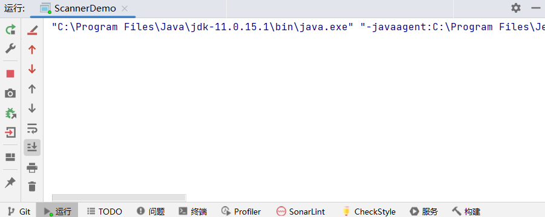

# Java基础语法

## 1.名词介绍

### 1.1.注释

​	注释是对代码的解释和说明文字，可以提高程序的可读性，因此在程序中添加必要的注释文字十分重要。Java中的注释分为三种：

- 单行注释。单行注释的格式是使用//，从//开始至本行结尾的文字将作为注释文字。
- 多行注释。多行注释的格式是使用`/* 和 */`将一段较长的注释括起来。（注意：多行注释不能嵌套使用。）
- 文档注释。文档注释以`/**`开始，以`*/`结束。


### 1.2.关键字

​	关键字是指被java语言赋予了特殊含义的单词。

​	关键字的**特点**：

-   关键字的字母全部小写。
-   常用的代码编辑器对关键字都有高亮显示，比如现在我们能看到的public、class、static等。


### 1.3.常量

常量：在程序运行过程中，值不可以发生改变的量。

Java中的常量分类：

-   字符串常量  用双引号括起来的多个字符（可以包含0个、一个或多个），例如"a"、"abc"、"中国"等
-   整数常量 整数，例如：-10、0、88等
-   小数常量 小数，例如：-5.5、1.0、88.88等
-   字符常量 用单引号括起来的一个字符，例如：'a'、'5'、'B'、'中'等
-   布尔常量 布尔值，表示真假，只有两个值true和false
-   空常量 一个特殊的值，空值，值为null

除空常量外，其他常量均可使用输出语句直接输出。


### 1.4.变量简述

​	变量的定义格式：

​		数据类型 变量名 = 数据值；


一般类名起名为大驼峰

一般变量名起名为小驼峰


### 1.5.包

其实就是文件夹

​	jar包就是文件夹压缩后的包

​	java.lang包不需要导入，其他的需要


### 1.6.字面量

​	可以给变量赋值的值。


### 1.7lib库

lib库

## 2.数据类型


### 2.1.计算机存储单元

  计算机是可以用来存储数据的，但是无论是内存还是硬盘，计算机存储设备的最小信息单元叫“位（bit）”，我们又称之为“比特位”，通常用小写的字母”b”表示。而计算机中最基本的存储单元叫“字节（byte）”

​	通常用大写字母”B”表示，字节是由连续的8个比特位组成。

​	比特位存储二进制数0或1，通常有符号数最高位位符号位，0位正1为负，存储在计算机内存中的数通常为补码

​	除了字节外还有一些常用的存储单位，其换算单位如下：

- 1B（字节byte） = 8bit
- 1KB = 1024B
- 1MB = 1024KB
- 1GB = 1024MB
- 1TB = 1024GB
- 1PB=1024TB


### 2.2.基本数据类型

| 数据类型 | 关键字           | 内存占用 | 取值范围                                                     |
| -------- | ---------------- | -------- | ------------------------------------------------------------ |
| 整数类型 | byte             | 1        | -128 ~ 127                                                   |
|          | short            | 2        | -32768 ~ 32767                                               |
|          | int  (default)   | 4        | -(2的31次方) 到 2的31次方 - 1                                |
|          | long             | 8        | -(2的63次方) 到 2的63次方 - 1   数字的末尾加上`L`            |
| 浮点类型 | float            | 4        | 负数：-3.402823E+38到-1.401298E-45  正数：1.301298E-45到3.402823E+38 |
|          | double (default) | 8        | 负数：-1.797693E+308到-4.9000000E-324  正数：4.9000000E-324到 1.797693E+308 |
| 字符类型 | char             | 2        | 0 ~ 65535                                                    |
| 布尔类型 | boolean          | 1        | true (=1)  , false (=0)                                      |

#### 2.2.1.说明：

-   E+18表示是乘以10的18次方，同样，E-25表示乘以10的负25次方。
-   在Java中整数默认是int类型，浮点数默认是double类型。


#### 2.2.2.作业：打印每个类型的默认值

```java
//Test.java

public class Test {
    static byte a;                           //创建静态static全局变量
    static short b;
    static int c;
    static long d;
    static float e;
    static double f;
    static char g;
    static boolean h;
    public static void main(String[] args){
        System.out.println("变量默认值如下\n"+
                "byte: "+ a + "\n" +
                "short: "+ b + "\n" +
                "int: "+ c + "\n" +
                "long: "+ d + "\n" +
                "float: "+ e + "\n" +
                "double: "+ f + "\n" +
                "char: "+ g + "\n" +
                "boolean: "+ h + "\n");
    }
}
```

```bash
//运行结果：
"C:\Program Files\Java\jdk-11.0.15.1\bin\java.exe" "-javaagent:C:\Program Files\JetBrains\IntelliJ IDEA 2022.2.5\lib\idea_rt.jar=11095:C:\Program Files\JetBrains\IntelliJ IDEA 2022.2.5\bin" -Dfile.encoding=UTF-8 -classpath D:\Program\Gitee\06_Java\JavaTest\out\production\JavaTest Test
变量默认值如下
byte: 0
short: 0
int: 0
long: 0
float: 0.0
double: 0.0
char:  
boolean: false


进程已结束,退出代码0

```


### 2.3.变量详细说明

​	变量：在程序运行过程中，其值可以发生改变的量。

​	从本质上讲，变量是内存中的一小块区域，其值可以在一定范围内变化。

#### 2.3.1.变量的定义格式：

-   数据类型：为空间中存储的数据加入类型限制。java是强类型语言，js是弱类型
-   变量名：自己要为空间起的名字
-   数据值： 内存中要存储的数值


1. **声明变量并赋值(一定要赋值)**

```java
int age = 18;
System.out.println(age);

age = 16;
System.out.println(age);
```

2. 先声明，后赋值（使用前赋值即可）

```java
int age;
age = 18;
System.out.println(age);
```


3. 同一行定义多个同一种数据类型的变量，中间使用逗号隔开(不建议)

```java
int a = 10, b = 20; // 定义int类型的变量a和b，中间使用逗号隔开
System.out.println(a);
System.out.println(b);

int c,d; 			// 声明int类型的变量c和d，中间使用逗号隔开
c = 30;d = 40;
System.out.println(c);
System.out.println(d);
```


### 2.4.变量的注意事项

- 在同一对花括号中，变量名不能重复。
- 变量在使用之前，必须初始化（赋值）。
- 定义long类型的变量时，需要在整数的后面加L（大小写均可，建议大写）。因为整数默认是int类型，整数太大可能超出int范围。
- 定义float类型的变量时，需要在小数的后面加F（大小写均可，建议大写）。因为浮点数的默认类型是double， double的取值范围是大于float的，类型不兼容。


### 2.5.案例 - 键盘录入

我们可以通过 Scanner 类来获取用户的输入。使用步骤如下：

1、导包。Scanner 类在java.util包下，所以需要将该类导入。导包的语句需要定义在类的上面。

```java
import java.util.Scanner; 
```

2、创建Scanner对象。

```java
Scanner sc = new Scanner(System.in);
// 创建Scanner对象，sc表示变量名，其他均不可变
```

3、接收数据

```java
int i = sc.nextInt();   // 表示将键盘录入的值作为int数返回。
```


示例：

```java
import java.util.Scanner;
public class ScannerDemo { 
	public static void main(String[] args) {   
		Scanner sc = new Scanner(System.in);      //创建对象
		int a = sc.nextInt();    				 //接收数据
		System.out.println(a); 					//输出数据
	}
}
```


运行：




## 3.类型转换

​	在Java中，一些数据类型之间是可以相互转换的。


### 3.1.隐式转换

​	把一个表示数据范围小的数值或者变量赋值给另一个表示数据范围大的变量。这种转换方式是自动的，直接书写即可。例如：

```java
double num = 10; 			 // 将int类型的10直接赋值给double类型
System.out.println(num);	 // 输出10.0
```


​	说明：

1. 整数默认是int类型，byte、short和char类型数据参与运算均会自动转换为int类型。

   ```java
   byte b1 = 10;
   byte b2 = 20;
   byte b3 = b1 + b2; 
   // 第三行代码会报错，b1和b2会自动转换为int类型，计算结果为int，int赋值给byte需要强制类型转换。
   
   // 修改为:
   int num = b1 + b2;
   
   // 或者：
   byte b3 = (byte) (b1 + b2);
   ```

   

2. boolean类型不能与其他基本数据类型相互转换。


### 3.2.强制转换

​	把一个表示数据范围大的数值或者变量赋值给另一个表示数据范围小的变量。

​	强制类型转换格式：目标数据类型 变量名 = (目标数据类型)值或者变量;

​	例如：

```java
double num1 = 5.5;
int num2 = (int) num1; 			// 将double类型的num1强制转换为int类型
System.out.println(num2);	    // 输出5（小数位直接舍弃）
```


## 4.运算符

### 4.1.算术运算符

| 符号 | 作用 |
| ---- | ---- |
| +    | 加   |
| -    | 减   |
| *    | 乘   |
| /    | 除   |
| %    | 取余 |

注意：

1. /和%的区别：两个数据做除法，/取结果的商，%取结果的余数。

2. 整数操作只能得到整数，要想得到小数，必须有浮点数参与运算。


### 4.2.字符的`+`操作

​	char类型参与算术运算，使用的是计算机底层对应的十进制数值。需要我们记住三个字符对应的ASCII数值：

'a' -- 97   a-z是连续的，所以'b'对应的数值是98，'c'是99，依次递加

'A' -- 65  A-Z是连续的，所以'B'对应的数值是66，'C'是67，依次递加

'0' -- 48   0-9是连续的，所以'1'对应的数值是49，'2'是50，依次递加


```java
// 可以通过使用字符与整数做算术运算，得出字符对应的数值是多少
char ch1 = 'a';
System.out.println(ch1 + 1); 	// 输出98，97 + 1 = 98

char ch2 = 'A';
System.out.println(ch2 + 1); 	// 输出66，65 + 1 = 66

char ch3 = '0';
System.out.println(ch3 + 1);	// 输出49，48 + 1 = 49
```


​	算术表达式中包含不同的基本数据类型的值的时候，整个算术表达式的类型会自动进行提升。

提升规则：

​	byte类型，short类型和char类型将被提升到int类型，不管是否有其他类型参与运算。

​	整个表达式的类型自动提升到与表达式中最高等级的操作数相同的类型

​    等级顺序：byte,short,char --> int --> long --> float --> double

例如： 

```java
byte b1 = 10;
byte b2 = 20;
// byte b3 = b1 + b2; // 该行报错，因为byte类型参与算术运算会自动提示为int，int赋值给byte可能损失精度

int i3 = b1 + b2; 			// 应该使用int接收
byte b3 = (byte) (b1 + b2); // 或者将结果强制转换为byte类型

//-------------------------------

int num1 = 10;
double num2 = 20.0;
double num3 = num1 + num2; // 使用double接收，因为num1会自动提升为double类型
```


### 4.3.字符串的`"+"`操作

1.当“+”操作中出现字符串时，这个”+”是字符串连接符，而不是算术运算。

```java
System.out.println("QY"+ 666);     // 输出：QY666
```


2.在”+”操作中，如果出现了字符串，就是连接运算符，否则就是算术运算。当连续进行“+”操作时，**从左到右逐个执行**。

```java
System.out.println(1 + 99 + "年xxx");            // 输出：100年xxx
System.out.println(1 + 2 + "QY" + 3 + 4);   // 输出：3QY34
// 可以使用小括号改变运算的优先级 
System.out.println(1 + 2 + "QY" + (3 + 4)); // 输出：3QY7
```


### 4.4.数值拆分

需求： 键盘录入一个三位数，将其拆分成个位，十位，百位，打印在控制台

分析：

- 变量定义为`int`整数型，不会显示小数位，那么除法运算不会显示小数位
- 个位数的取法：可以将这个三位数对`10`取余数即可得到
- 十位数的取法，可以将这个三位数先除以`10`,再对`10`取余数即可得到
- 百位数的取法，可以直接将这个三位数除以`100`即可得到


```java
import java.util.Scanner;
public class Test {
   public static void main(String[] args) {
       // 1：使用Scanner键盘录入一个三位数
       Scanner sc = new Scanner(System.in);
       System.out.println("请输入一个三位数");
       int num = sc.nextInt();
       // 2：个位的计算：数值 % 10
       int ge = num % 10;    
       // 3：十位的计算：数值 / 10 % 10
       int shi = num / 10 % 10;   
       // 4：百位的计算：数值 / 100
       int bai = num / 100;
       // 5：将个位, 十位, 百位拼接上正确的字符串, 打印即可
       System.out.println("整数"+num+"个位为:" + ge);
       System.out.println("整数"+num+"十位为:" + shi);
       System.out.println("整数"+num+"百位为:" + bai);
   }
}
```


### 4.5.自增自减运算符

| 符号 | 作用 |
| ---- | ---- |
| ++   | 自增 |
| --   | 自减 |

#### 注意事项：

-   ++和-- 既可以放在变量的后边，也可以放在变量的前边。
-   单独使用的时候， ++和-- 无论是放在变量的前边还是后边，结果是一样的。
-   参与操作的时候，如果放在变量的后边，先拿变量参与操作，后拿变量做++或者--。
-   参与操作的时候，如果放在变量的前边，先拿变量做++或者--，后拿变量参与操作。
-   最常见的用法：单独使用。


案例：

##### 4.5.1.运算规则

```java
int i = 10;
i++; // 单独使用
System.out.println("i:" + i); // i:11
int j = 10;
++j; // 单独使用
System.out.println("j:" + j); // j:11
int x = 10;
int y = x++; // 赋值运算，++在后边，所以是使用x原来的值赋值给y，x本身自增1
System.out.println("x:" + x + ", y:" + y); // x:11，y:10
int m = 10;
int n = ++m; // 赋值运算，++在前边，所以是使用m自增后的值赋值给n，m本身自增1
System.out.println("m:" + m + ", m:" + m); // m:11，m:11
```

##### 4.5.2.练习

```java
int x = 10;
int y = x++ + x++ + x++;
System.out.println(y); // y的值是多少？
/*
解析，三个表达式都是++在后，所以每次使用的都是自增前的值，但程序自左至右执行，所以第一次自增时，使用的是10进行计算，但第二次自增时，x的值已经自增到11了，所以第二次使用的是11，然后再次自增。。。
所以整个式子应该是：int y = 10 + 11 + 12;
输出结果为33。
*/
注意：通过此练习深刻理解自增和自减的规律，但实际开发中强烈建议不要写这样的代码！小心挨打！
 x不能同时前++和后++
```


### 4.6.赋值运算符

赋值运算符的作用是将一个表达式的值赋给左边，左边必须是可修改的，不能是常量。

| 符号 | 作用                         | 说明                  |
| ---- | ---------------------------- | --------------------- |
| =    | 等号右边的数值赋值给等号左边 | a=20  将20赋值给变量a |
| +=   | 加后赋值                     | a+=b  也可写作a=a+b   |
| -=   | 减后赋值                     | a-=b  也可写作a=a-b   |
| *=   | 乘后赋值                     | a*=b  也可写作`a=a*b` |
| /=   | 除后赋值                     | a/=b  也可写作a=a/b   |
| %=   | 取余后赋值                   | a%=b  也可以写作a=a%b |


#### 注意：

​	扩展的赋值运算符隐含了强制**类型转换。**

```java
short s = 10;
s = s + 10; // 此行代码报出，因为运算中s提升为int类型，运算结果int赋值给short可能损失精度
s += 10; // 此行代码没有问题，隐含了强制类型转换，相当于 s = (short) (s + 10);
```


### 4.7.关系运算符

| 符号 | 说明                                                     |
| ---- | -------------------------------------------------------- |
| =    | a=b，判断a和b的值是否相等，成立则为true，不成立则为false |
| ≠    | a≠b，判断a和b的值是否不相等，成立为true，不成立为false   |
| >    | a>b，判断a是否大于b                                      |
| ≥    | a≥b，判断a是否大于等于b                                  |
| <    | a<b，判断a是否小于b                                      |
| ≤    | a≤b，判断a是否小于等于b                                  |


#### 注意事项：

- 关系运算符的结果都是boolean类型，要么是true，要么是false。
- 千万不要把“==”误写成“=”，"=="是判断是否相等的关系，"="是赋值。

```java
int a = 10;
int b = 20;
System.out.println(a == b); // false
System.out.println(a != b); // true
System.out.println(a > b); // false
System.out.println(a >= b); // false
System.out.println(a < b); // true
System.out.println(a <= b); // true
// 关系运算的结果肯定是boolean类型，所以也可以将运算结果赋值给boolean类型的变量
boolean flag = a > b;
System.out.println(flag); // 输出false
```


### 4.8.逻辑运算符

​	逻辑运算符把各个运算的关系表达式连接起来组成一个复杂的逻辑表达式，以判断程序中的表达式是否成立，判断的结果是 true 或 false。

| 符号 | 作用      | 说明                                           |
| ---- | --------- | ---------------------------------------------- |
| &    | 逻辑 与   | a&b，a和b都是true，结果为true，否则为false     |
| \|   | 逻辑 或   | a\|b，a和b都是false，结果为false，否则就算true |
| ^    | 逻辑 异或 | a^b，a和b结果不同为true，相同为false           |
| !    | 逻辑 非   | !a，结果与a的结果正好相反                      |

```java
//定义变量
int i = 10;
int j = 20;
int k = 30;

//& “与”，并且的关系，只要表达式中有一个值为false，结果即为false
System.out.println((i > j) & (i > k)); //false & false,输出false
System.out.println((i < j) & (i > k)); //true & false,输出false
System.out.println((i > j) & (i < k)); //false & true,输出false
System.out.println((i < j) & (i < k)); //true & true,输出true
System.out.println("--------");

//| “或”，或者的关系，只要表达式中有一个值为true，结果即为true
System.out.println((i > j) | (i > k)); //false | false,输出false
System.out.println((i < j) | (i > k)); //true | false,输出true
System.out.println((i > j) | (i < k)); //false | true,输出true
System.out.println((i < j) | (i < k)); //true | true,输出true
System.out.println("--------");

//^ “异或”，相同为false，不同为true
System.out.println((i > j) ^ (i > k)); //false ^ false,输出false
System.out.println((i < j) ^ (i > k)); //true ^ false,输出true
System.out.println((i > j) ^ (i < k)); //false ^ true,输出true
System.out.println((i < j) ^ (i < k)); //true ^ true,输出false
System.out.println("--------");

//! “非”，取反
System.out.println((i > j)); //false
System.out.println(!(i > j)); //!false，,输出true
```


### 4.9.短路逻辑运算符

​	在逻辑与运算中，只要有一个表达式的值为false，那么结果就可以判定为false了，没有必要将所有表达式的值都计算出来，短路与操作就有这样的效果，可以提高效率。同理在逻辑或运算中，一旦发现值为true，右边的表达式将不再参与运算。

- 逻辑与&，无论左边真假，右边都要执行。
- 短路与&&，如果左边为真，右边执行；如果左边为假，右边不执行。
- 逻辑或|，无论左边真假，右边都要执行。
- 短路或||，如果左边为假，右边执行；如果左边为真，右边不执行。

| 符号 | 作用   | 说明                         |
| ---- | ------ | ---------------------------- |
| &&   | 短路与 | 作用和&相同，但是有短路效果  |
| \|\| | 短路或 | 作用和\|相同，但是有短路效果 |


```java
int x = 3;
int y = 4;
System.out.println((x++ > 4) & (y++ > 5)); // 两个表达都会运算
System.out.println(x); // 4
System.out.println(y); // 5

System.out.println((x++ > 4) && (y++ > 5)); // 左边已经可以确定结果为false，右边不参与运算
System.out.println(x); // 4
System.out.println(y); // 4
```


### 4.10.三元（目）运算符

​	三元运算符语法格式：

`关系表达式 ? 表达式1 : 表达式2;`

​	解释：问号前面的位置是判断的条件，判断结果为boolean型，为true时调用表达式1，为false时调用表达式2。其逻辑为：如果条件表达式成立或者满足则执行表达式1，否则执行第二个。

```java
int a = 10;
int b = 20;
int c = a > b ? a : b; // 判断 a>b 是否为真，如果为真取a的值，如果为假，取b的值
```

#### 案例

需求：

  一座寺庙里住着三个和尚，已知他们的身高分别为150cm、210cm、165cm，请用程序实现获取这三个和尚的最高身高。

```java
public class TestDemo {
    public static void main(String[] args) {
        int shaveling1=150,shavelng2=210,shaveling3=165;	//定义三个和尚的身高
        int tempHeight1 = shaveling1 > shavelng2 ? shaveling1 : shavelng2;		//判定前两个和尚身高并取得最高的值存入tempHeight1中
        int maxHeight = tempHeight1 > shaveling3 ? tempHeight1 : tempHeight1;	//判定tempHeight1中的最高的和尚与和尚3的身高进行对比取得最大值
        System.out.println("The highest in these three shaveling is :" + maxHeight);	//输出最大的身高

    }
}
```


## 5.流程控制语句

### 5.1 顺序结构

​	顺序结构按照代码的先后顺寻依次执行


### 5.2 分支结构

####  5.2.1 if语句

- ```java
  if(关系表达式)
  {
  	语句体;
  }
  ```

- ```java
  if(关系表达式)
  {
  	语句体
  }
  else
  {
  	语句体
  }
  ```

- ```java
  if(关系表达式)
  {
  	语句体
  }
  else if(关系表达式)
  {
  	语句体
  }
  ```

案例：

​	需求：小明快要期末考试了，小明爸爸对他说，会根据他不同的考试成绩，送他不同的礼物，假如你可以控制小明的得分，请用程序实现小明到底该获得什么样的礼物，并在控制台输出。

​	分析：

- 考试成绩的不同，获得的奖励不同
- 根据孩子对成绩的说明前，可以先制定一个奖励方案
- 一般成绩可以划分成几个区间
  - [90,100] 优秀
  - [80,90) 良好
  - [60,80) 一般(及格)
  - (0,60) 不及格
- 一般奖励可以划分为
  - 优秀：正版万代高达模型*2(自选)
  - 良好：一顿胡吃海喝
  - 一般(及格)：一本优秀的《Java从入门到精通》
  - 不及格：一顿数落+送几套对应的数学试卷
- 如果不是一般情况，则根据试卷难度进行考核，并对奖励所在的成绩区间进行重新划分（这里不考虑）

```java
import java.util.Scanner;
public class TestDemo {
    public static void main(String[] args) {
        System.out.println("小明的成绩为多少分：");
        Scanner score = new Scanner(System.in);
        int sc = score.nextInt();
        if(sc >= 90 & sc <= 100)
        {
            System.out.println("成绩可以的嘛！那就奖励小明：两个自选的正版的万代高达模型吧");
        }
        else if(sc>=80 & sc<90)
        {
            System.out.println("成绩还行，勉勉强强带小明去胡吃海喝一顿吧");
        }
        else if(sc>=60 & sc < 80)
        {
            System.out.println("下次加把油吧，这次就奖励你一本我珍藏已久的《java从入门到精通》吧！");
        }
        else if(sc < 60 & sc >=0){
            System.out.println("还有什么想说的嘛？****(儒雅随和)，奖励你这门科目的额外试卷作为作业，每天都写都检查！");
        }
        else if(sc < 0 | sc > 100) {
            System.out.println("崽种！你知不知道你在玩火？等着！(立马解开裤腰带)......");
        }
    }
}
```


#### 5.2.2 switch语句

格式：

```java
switch (表达式) {
   case 1:
       语句体1;
       break;
   case 2:
       语句体2;
       break;
   ...
   default:
       语句体n+1;
       break;
}
```

执行流程：

- 首先计算出表达式的值 
- 其次，和case依次比较，一旦有对应的值，就会执行相应的语句，在执行的过程中，遇到break就会结 束。 
- 最后，如果所有的case都和表达式的值不匹配，就会执行default语句体部分，然后程序结束掉。 

##### 案例：一周的每天做什么查询

| 时间       | 事件     |
| ---------- | -------- |
| 周一       | 跑步     |
| 周二       | 游泳     |
| 周三       | 慢走     |
| 周四       | 动感单车 |
| 周五       | 拳击     |
| 周六和周日 | 睡觉     |

```java
import java.util.Scanner;
public class TestDemo {
    public static void main(String[] args) {
        System.out.println("一周想做什么查询器，输入周几（只要数字就ok）：");
       Scanner input = new Scanner(System.in);
       int selector = input.nextInt();
       switch (selector)
       {
           case 1:
               System.out.println("跑步");
               break;
           case 2:
               System.out.println("游泳");
               break;
           case 3:
               System.out.println("慢走");
               break;
           case 4:
               System.out.println("动感单车");
               break;
           case 5:
               System.out.println("拳击");
               break;
           case 6:
           case 7:
               System.out.println("睡觉");
               break;
           default:
               System.out.println("重新选择情况");
               break;
       }

        }

}
```


### 5.3.循环结构

#### 5.3.1 for循环

​	循环语句可以在满足循环条件的情况下，反复执行某一段代码，这段被重复执行的代码被称为循环体语句，当反复 执行这个循环体时，需要在合适的时候把循环判断条件修改为false，从而结束循环，否则循环将一直执行下去，形成死循环。 


格式：

```java
for (初始化语句;条件判断语句;条件控制语句) {
   循环体语句;
}
```


**格式解释：**

- 初始化语句： 用于表示循环开启时的起始状态，简单说就是循环开始的时候什么样
- 条件判断语句：用于表示循环反复执行的条件，简单说就是判断循环是否能一直执行下去
- 循环体语句： 用于表示循环反复执行的内容，简单说就是循环反复执行的事情
- 条件控制语句：用于表示循环执行中每次变化的内容，简单说就是控制循环是否能执行下去

**执行流程：**

①执行初始化语句

②执行条件判断语句，看其结果是true还是false

​     如果是false，循环结束

​     如果是true，继续执行

③执行循环体语句

④执行条件控制语句

⑤回到②继续


##### 案例：

​	1.控制台里输出1 ~ 5，再输出5 ~ 1 ，再输出 1 ~ 5 的和 ， 之后输出1 ~ 100间的所有偶数以及 1 ~ 100 所有的偶数和，并且写出偶数和计算的过程，再输出水仙花数(100 ~ 999间)，再每行输出两个水仙花数

```java
import java.util.*;
public class TestDemo {
    public static void main(String[] args) {
        System.out.println("控制台输出1~5：");
        int num1 = 1, i = 0,j = 0 , sum = 0;
        int gw=0,sw=0,bw=0;
        for (i = 0; i < 5; i++) {
            System.out.println(num1++);
        }
        System.out.println("-----分割线------");
        for (; i > 0; i--) {
            System.out.println(--num1);
        }
        System.out.println("题二：");
        for (; i < 5; i++) {
            System.out.println(sum + "+" + num1 + "=" + (sum += num1++));
        }
        System.out.println("题三：" + "(此时的num1=" + num1 + ";i=" + i + " )");
        for (i = 2; i <= 100; i += 2)     //初始化i=2
        {
            System.out.println(i);
        }
        System.out.println("-----分割线------");

        for (i = 2, sum = 0; i <= 100; ) {
            System.out.println(sum + "+" + i + "=" + (sum += i += 2));
        }

        System.out.println("-----分割线------");

        for (i = 100; i < 1000; i++)
        {
            gw = i % 10;
            sw = i / 10 % 10;
            bw = i / 100;
            if(i == Math.pow(gw,3)+Math.pow(sw,3)+Math.pow(bw,3) )
            {
                System.out.println(i);
            }
        }
        for (i = 100; i < 1000; i++)
        {
            gw = i % 10;
            sw = i / 10 % 10;
            bw = i / 100;
            if(i == Math.pow(gw,3)+Math.pow(sw,3)+Math.pow(bw,3) )
            {
                System.out.println(i);
            }
        }
        System.out.println("-----分割线------");
        for (i = 100; i < 1000; i++)
        {
            gw = i % 10;
            sw = i / 10 % 10;
            bw = i / 100;
            if(i == Math.pow(gw,3)+Math.pow(sw,3)+Math.pow(bw,3) )
            {
                System.out.print(i+" ");
                j++;
                if(j==2){
                    System.out.println(" ");
                }
            }
        }


    }
}
```


2 . 9x9乘法表

```java
public class TestDemo{
	public static void main(String[] args){
	    int i,j;
        for(j = 1; j <10 ; j++){
        for (i = 1; i <= j; i++) {
        System.out.print(i + "x" + j + "=" + i*j + " ");
        }
        System.out.println();
        }
	}
}
```

 

3 、  1~100内的所有素数

```java
//法一:100内的所有数都进行遍历
public class TestDemo{
	public static void main(String[] args){
	int i,j;                      //素数
        for(j=100;j>0;j--){           //1 ~ 100 每个数都尝试一遍
            for(i=2;i<=j;i++){        //从2开始 对j进行相除
                if( j % i == 0 ){     //如果出现非自身外的因数，则跳出i自增的循环
                    break;
                 }
             }
             if(j==i)                   //如果j的因数是除了1之外的自身，则这个数就是素数
             {
                System.out.println(j);     //输出这个素数
             }
           }
		}
	}
```


4 、 求a和b的最大公约数

```java
import java.util.*;
public class ScannerDemo {
    public static void main(String[] args){  //创建对象
    //求 a 和 b 的最大公约数
        int a = 0 ,b = 0 ,c = 0 ,d = 0, e = 0 ;
        System.out.println("请输入数字a：");
        Scanner num_01 = new Scanner(System.in);
        a = num_01.nextInt();					//输入第一个数
        System.out.println("请输入数字b：");
        Scanner num_02 = new Scanner(System.in);
        b = num_02.nextInt();					//输入第二个数
        d = Math.max(a,b);						//得到两个数里最大的数
        e = Math.min(a,b);						//得到两个数里最小的数
        if(a == b){
            System.out.println("最大公约数为:"+a);
        }
        else {
            for (int i = 0; i <= 5; i++) {
               c  = ( d % e);
               d = e;
               e = c;
               if(e == 0){
                   break;
               }
            }
            System.out.println("最大公约数为："+ d );
        }
        System.out.println();

    }
}
```


#### 5.3.2.while循环

格式：

```java
while (条件判断语句) {
   循环体语句;
    条件控制语句;
}
```

​	while循环执行流程：

​	①执行初始化语句

​	②执行条件判断语句，看其结果是true还是false

​      	 如果是false，循环结束

​     	  如果是true，继续执行

​	③执行循环体语句

​	④执行条件控制语句

​	⑤回到②继续

```java
public class TestDemo {
    public static void main(String[] args) {
        //需求：在控制台输出5次"HelloWorld"
       //for循环实现
       for(int i=1; i<=5; i++) {
          System.out.println("HelloWorld");
       }
       System.out.println("--------");
       //while循环实现
       int j = 1;
       while(j<=5) {
          System.out.println("HelloWorld");
          j++;
       }
    }
}
```

案例：

​	需求：世界最高山峰是珠穆朗玛峰(8844.43米=8844430毫米)，假如我有一张足够大的纸，它的厚度是0.1毫米。请问，我折叠多少次，可以折成珠穆朗玛峰的高度?

```java
public class Zhezhi{
    public static void main(String[] args){
        double height = 0.1 ;
        int i=0;
        while(height < 8844430){
            height *= 2 ;
            i++;
        }
        System.out.println(i);
    }
}
```


#### 5.3.3 do while循环

语法：

```java
do {
   循环体语句;
   条件控制语句;
}while(条件判断语句);
```

执行流程：

① 执行初始化语句

② 执行循环体语句

③ 执行条件控制语句

④ 执行条件判断语句，看其结果是true还是false

- 如果是false，循环结束
- 如果是true，继续执行

⑤ 回到②继续

```java
public class DoWhileDemo {
    public static void main(String[] args) {
        //需求：在控制台输出5次"HelloWorld"
       //for循环实现
       for(int i=1; i<=5; i++) {
          System.out.println("HelloWorld");
       }
       System.out.println("--------");
       //do...while循环实现
       int j = 1;
       do {
          System.out.println("HelloWorld");
          j++;
       }while(j<=5);
    }
}
```


### 5.4三种循环的区别

1. for循环和while循环先判断条件是否成立，然后决定是否执行循环体（先判断后执行）

- do...while循环先执行一次循环体，然后判断条件是否成立，是否继续执行循环体（先执行后判断）

2. for循环和while的区别

- 条件控制语句所控制的自增变量，因为归属for循环的语法结构中，在for循环结束后，就不能再次被访问到了
- 条件控制语句所控制的自增变量，对于while循环来说不归属其语法结构中，在while循环结束后，该变量还可以继续使用

3. 死循环（无限循环）的三种格式

   - for(;;){}

   - while(true){}

   - do {} while(true);


#### 问题: 死循环有应用场景吗?

​         例如: 键盘录入一个1-100之间的整数
​         顾虑: 键盘录入是用户操作的, 用户就可能会出现一些误操作的现象

```java
public static void main(String[] args) {
    /*
       for(;;){
          System.out.println("我停不下来了~");
       }
       */

    /*
       while(true){
          System.out.println("我停不下来了~");
       }
       */

    do{
        System.out.println("我停不下来了~");
    }while(true);

    System.out.println("看看我能被执行吗?~");  // 无法访问的语句
}
}
```


### 5.5 跳转控制语句

​	跳转控制语句`break`

- 跳出循环，结束循环

​	跳转控制语句`continue`

- 跳过本次循环，继续下次循环

注意： `continue`只能在循环中进行使用！

```java
public class Demo1Continue {
   /*
       continue : 跳过某次循环体内容的执行
       注意：使用是基于条件控制, 在循环内部使用.
       需求: 模拟电梯上行的过程 1-24层, 4层不停.
   */
   public static void main(String[] args){
       for(int i = 1; i <= 24; i++){
          if(i == 4){
             continue;
          }
          System.out.println(i + "层到了~");
       }
   }
}
```

```java
public class Demo2Break {
   /*
       break : 终止循环体内容的执行
       注意：使用是基于条件控制的
             break语句只能在循环和switch中进行使用.     
       需求: 模拟20岁工作到80岁, 60岁退休.
   */
   public static void main(String[] args){
       for(int i = 20; i <= 80; i++){
          if(i == 60){
             break;      // 结束整个循环
          }
          System.out.println(i + "岁正在上班");
       }
   }  
}
```


### 5.6 Random

​	Random类似Scanner，也是Java提供好的API，内部提供了产生随机数的功能

​	API后续讲解，可以简单理解为Java已经写好的代码使用步骤：

1. 导包 : 

   ```java
   import java.util.Random;
   ```

​     导包的动作必须出现在类定义的上面


2. 创建对象 : 

   ```java
   Random r = new Random();
   ```

​     上面这个格式里面，r 是变量名，可以变，其他的都不允许变


3. 获取随机数 :

   ```java
    int number = r.nextInt(10);  //获取数据的范围：[0,10) 包括0,不包括10
   ```

​     上面这个格式里面，number是变量名，可以变，数字10可以变。其他的都不允许变


#### 需求：

程序自动生成一个1-100之间的数字，使用程序实现猜出这个数字是多少？

当猜错的时候根据不同情况给出相应的提示

A. 如果猜的数字比真实数字大，提示你猜的数据大了

B. 如果猜的数字比真实数字小，提示你猜的数据小了

C. 如果猜的数字与真实数字相等，提示恭喜你猜中了

```java
import java.util.*;

public class RandomDEMO{
    public static void main(String[] args){
        Random sj = new Random();
        Scanner sc = new Scanner(System.in);
        System.out.println("猜 1~100 内的一个数，看看是是不是这个数 ");
        int num = sj.nextInt(101) ;
        while(true){
            int scan = sc.nextInt();
            if(scan > num){
                System.out.println("你猜的数据大了，再猜：");
            }
            else if(scan < num){
                System.out.println("你猜的数据小了，再猜：");
            }
            else if(scan == num){
                System.out.println("恭喜你你猜中了！ ");
                break;
            }
        }
    }
}
```


## 6. 数组

### 6.1 定义格式：

第一种格式

`数据类型[]  数组名`

```
int[] arr;  
double[] arr; 
char[] arr;
```

第二种格式

`数据类型  数组名[]`

```
int arr[];
double arr[];
char arr[];
```


### 6.2 动态初始化

数组动态初始化就是只给定数组的长度，由系统给出默认初始化值

数据类型[] 数组名 = new 数据类型[数组长度];

```java
int[] arr = new int[5];
```

**等号左边：**

- int:数组的数据类型
- []:代表这是一个数组
- arr:代表数组的名称

**等号右边：**

- new:为数组开辟内存空间
- int:数组的数据类型
- []:代表这是一个数组
- 5:代表数组的长度

```java
package com.xinqi.array;
public class Demo2Array {
    /*
        数组的动态初始化:
                        在初始化的时候, 需要手动指定数组的长度, 系统会为数组容器分配初始值.
        动态初始化格式:
                        数据类型[] 数组名 = new 数据类型[数组的长度];
        注意:
                        打印数组变量的时候, 会打印出数组的内存地址
        [I@10f87f48 :
                        @ : 分隔符
                        [ : 当前的空间是一个数组类型
                        I : 当前数组容器中所存储的数据类型
                        10f87f48 : 十六进制内存地址
 
                                0 1 2 3 4 5 6 7 8 9 a b c d e f
     */
    public static void main(String[] args) {
        // 数据类型[] 数组名 = new 数据类型[数组的长度];
        // 通过new关键字创建了一个int类型的数组容器, 该容器可以存储5个int类型的整数, 该容器被arr数组变量所记录
        int[] arr = new int[5];
        // [I@10f87f48
        System.out.println(arr);
        byte[] bArr = new byte[3];
        // [B@b4c966a
        System.out.println(bArr);
    }
}
```


### 6.3 数组元素访问

**数组索引**

每一个存储到数组的元素，都会自动的拥有一个编号，从0开始。

这个自动编号称为数组索引(index)，可以通过数组的索引访问到数组中的元素。 (类似于指针)

**访问数组元素格式** 

数组名 [索引];

```java
package com.xinqi.array;
public class Demo3ArrayIndex {
    /*
        数组动态初始化:
                初始化的时候, 手动指定数组长度, 系统会为数组容器分配初始值.
        数组的元素访问格式:
                数组名[索引]
                索引: 数组中数据的编号方式, 编号从0开始
                作用: 访问数组容器中的空间位置
        注意:
                数组在创建完毕后, 即使没有赋值, 也可以取出, 但取出的元素都是默认初始化值.
     */
    public static void main(String[] args) {
        int[] arr = new int[3];         // 0 1 2
        System.out.println(arr);        // 数组的内存地址  [I@10f87f48
        // 数组名[索引]  访问数组容器中的空间位置
        System.out.println(arr[0]);     // 0  系统自动分配的默认初始化值
        System.out.println(arr[1]);
        System.out.println(arr[2]);
        System.out.println("--------------");
        // 数组名[索引]
        arr[0] = 11;
        arr[1] = 22;
        arr[2] = 33;
        System.out.println(arr[0]);
        System.out.println(arr[1]);
        System.out.println(arr[2]);
    }
}
```


### 6.4 内存分配

**内存概述**

内存是计算机中的重要原件，临时存储区域，作用是运行程序。

我们编写的程序是存放在硬盘中的，在硬盘中的程序是不会运行的。

必须放进内存中才能运行，运行完毕后会清空内存。 

Java虚拟机要运行程序，必须要对内存进行空间的分配和管理。 

**java中的内存分配**

目前我们只需要记住两个内存，分别是：栈内存和堆内存


**Java内存分配-一个数组内存图**


**两个数组内存图**


**多个数组指向相同内存图**


### 6.5静态初始化

在创建数组时，直接将元素确定 

**完整版格式**

数据类型[] 数组名 = new 数据类型[]{元素1,元素2,...}; 

**简化版格式**

数据类型[] 数组名 = {元素1,元素2,...};

```java
package com.xinqi.array2;

public class Demo1Array {
    public static void main(String[] args) {
        // 数据类型[] 数组名 = new 数据类型[]{数据1,数据2,数据3...};
        int[] arr = new int[]{11,22,33};
        System.out.println(arr[0]);
        System.out.println(arr[1]);
        System.out.println(arr[2]);
        // 数据类型[] 数组名 = {数据1,数据2,数据3...};
        int[] arr2 = {44,55,66};
        System.out.println(arr2);
        System.out.println(arr2[0]);
        System.out.println(arr2[1]);
        System.out.println(arr2[2]);
    }
}
```


### 6.6常见问题

#### 6.6.1.索引越界异常

```java
public class ArrayDemo {
    public static void main(String[] args) {
        int[] arr = new int[3];
        System.out.println(arr[3]);
    }
}
```

数组长度为3，索引范围是0~2，但是我们却访问了一个3的索引。

​	程序运行后，将会抛出ArrayIndexOutOfBoundsException 数组越界异常。在开发中，数组的越界异常是不能出现的，一旦出现了，就必须要修改我们编写的代码。 

​	解决方案：

将错误的索引修改为正确的索引范围即可！


#### 6.6.2 空指针异常

```java
public class ArrayDemo {
    public static void main(String[] args) {
        int[] arr = new int[3];
        //把null赋值给数组
        arr = null;
        System.out.println(arr[0]);
    }
}
```

​	arr = null 这行代码，意味着变量arr将不会在保存数组的内存地址，也就不允许再操作数组了，因此运行的时候会抛出 NullPointerException 空指针异常。在开发中，数组的越界异常是不能出现的，一旦出现了，就必须要修改我们编写的代码。

​	解决方案

给数组一个真正的堆内存空间引用即可！


### 6.7 数组遍历

数组遍历：就是将数组中的每个元素分别获取出来，就是遍历。遍历也是数组操作中的基石。

```java
public class ArrayTest01 {
   public static void main(String[] args) {
       int[] arr = { 1, 2, 3, 4, 5 };
       System.out.println(arr[0]);
       System.out.println(arr[1]);
       System.out.println(arr[2]);
       System.out.println(arr[3]);
       System.out.println(arr[4]);
   }
}
```

以上代码是可以将数组中每个元素全部遍历出来，但是如果数组元素非常多，这种写法肯定不行，因此我们需要改造成循环的写法。数组的索引是 0 到 lenght-1 ，可以作为循环的条件出现。 

```java
public class ArrayTest01 {
    public static void main(String[] args) {
        //定义数组
        int[] arr = {11, 22, 33, 44, 55};
        //使用通用的遍历格式
        for(int x=0; x<arr.length; x++) {
            System.out.println(arr[x]);
        }
    }
}
```


### 6.8二维数组

二维数组也是一种容器，不同于一维数组，该容器存储的都是一维数组容器。 

```
相当于制表，将一维数组作为行，数组的第一个`[]`表示第几列

默认从0开始排列。

arr[0] = arr1;
arr[1] = arr2;
arr[2] = arr3;

```

**动态初始化格式：**

数据类型[][] 变量名 = new 数据类型 [m] [n] ;

m表示这个二维数组，可以存放多少个一维数组

n表示每一个一维数组，可以存放多少个元素


 **静态初始化格式：**

完整格式 : 数据类型 [ ] [ ] 变量名 = new 数据类型 [ ] [ ]{ {元素1, 元素2...} , {元素1, 元素2...} 

简化格式 : 数据类型 [ ] [ ] 变量名 = { {元素1, 元素2...} , {元素1, 元素2...} ...};


