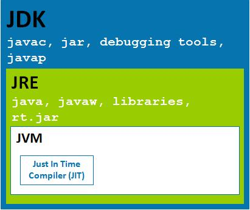
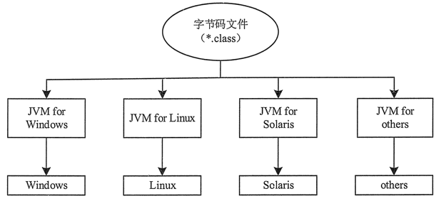
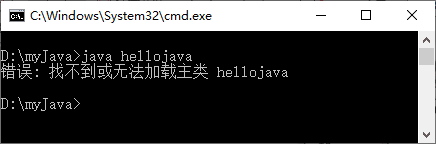
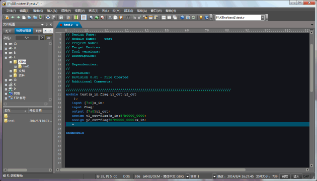
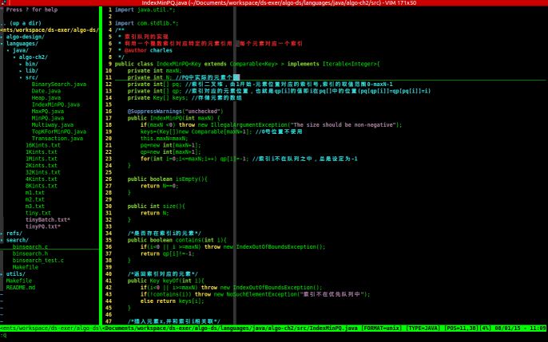

# Java概述

## 1.背景介绍

### 1.相关介绍

​	计算机语言：人与计算机之间进行信息交流沟通的一种特殊语言

​	Java语言是美国Sun公司（Stanford University Network）在1995年推出的计算机语言

​	Java之父：詹姆斯·高斯林（James Gosling）

​	2009年，Sun公司被[甲骨文公司 ](https://www.oracle.com) 收购


### 	2.java语言的三个版本：

- JavaSE: Java 语言的（标准版），用于桌面应用的开发，是其他两个版本的基础
- JavaME: Java 语言的（小型版），用于嵌入式消费类电子设备

- JavaEE: Java 语言的（企业版），用于 Web 方向的网站开发


### 	3.Java语言的特点

#### 1. 面向对象

Java 是一种面向对象的语言，它对对象中的类、对象、继承、封装、多态、接口、包等均有很好的支持。为了简单起见，Java 只支持类之间的单继承，但是可以使用接口来实现多继承。使用 Java 语言开发程序，需要采用面向对象的思想设计程序和编写代码。

#### 2. 平台无关性

平台无关性的具体表现在于，Java 是“一次编写，到处运行（Write Once，Run any Where）”的语言，因此采用 Java 语言编写的程序具有很好的可移植性，而保证这一点的正是 Java 的虚拟机机制。在引入虚拟机之后，Java 语言在不同的平台上运行不需要重新编译。

Java 语言使用 Java 虚拟机机制屏蔽了具体平台的相关信息，使得 Java 语言编译的程序只需生成虚拟机上的目标代码，就可以在多种平台上不加修改地运行。

#### 3. 简单性

Java 语言的语法与 C 语言和 C++ 语言很相近，使得很多程序员学起来很容易。对 Java 来说，它舍弃了很多 C++ 中难以理解的特性，如操作符的重载和多继承等，而且 Java 语言不使用指针，加入了垃圾回收机制，解决了程序员需要管理内存的问题，使编程变得更加简单。

#### 4. 解释执行

Java 程序在 Java 平台运行时会被编译成字节码文件，然后可以在有 Java 环境的操作系统上运行。在运行文件时，Java 的解释器对这些字节码进行解释执行，执行过程中需要加入的类在连接阶段被载入到运行环境中。

#### 5. 多线程

Java 语言是多线程的，这也是 Java 语言的一大特性，它必须由 Thread 类和它的子类来创建。Java 支持多个线程同时执行，并提供多线程之间的同步机制。任何一个线程都有自己的 run() 方法，要执行的方法就写在 run() 方法体内。

#### 6. 分布式

Java 语言支持 Internet 应用的开发，在 Java 的基本应用编程接口中就有一个网络应用编程接口，它提供了网络应用编程的类库，包括 URL、URLConnection、Socket 等。Java 的 RIM 机制也是开发分布式应用的重要手段。

#### 7. 健壮性

Java 的强类型机制、异常处理、垃圾回收机制等都是 Java 健壮性的重要保证。对指针的丢弃是 Java 的一大进步。另外，Java 的异常机制也是健壮性的一大体现。

#### 8. 高性能

Java 的高性能主要是相对其他高级脚本语言来说的，随着 JIT（Just in Time）的发展，Java 的运行速度也越来越高。

#### 9. 安全性

Java 通常被用在网络环境中，为此，Java 提供了一个安全机制以防止恶意代码的攻击。除了 Java 语言具有许多的安全特性以外，Java 还对通过网络下载的类增加一个安全防范机制，分配不同的名字空间以防替代本地的同名类，并包含安全管理机制。

Java 语言的众多特性使其在众多的编程语言中占有较大的市场份额，Java 语言对对象的支持和强大的 API 使得编程工作变得更加容易和快捷，大大降低了程序的开发成本。Java 的“一次编写，到处执行”正是它吸引众多商家和编程人员的一大优势。


## 2.JRE、JDK、JVM

### 1.解释

- JVM（Java Virtual Machine），Java虚拟机
- JRE（Java Runtime Environment），Java运行环境，包含了JVM和Java的核心类库（Java API）
- JDK（Java Development Kit）称为Java开发工具，包含了JRE和开发工具


### 2.Java实现跨平台的原理


​	在 Java 语言白皮书上面有这样一段话：Java 是一种简单的，面向对象的，适用于网络应用的，平台无关的，解释的，健壮的，安全的，结构自然的，可移植的，高性能的，多线程的，动态的语言。

​	就单从平台无关这一点上面来说，就已经超越 C/C++ 一大截了。就比如说我们在 Windows 下面写出来的一段 Java 程序，换成 Linux，macOS 系统里面，一样可以正常运行并且输出相同的结果，但是这一点，换成 C/C++ 却很难办到。那么跨平台的特性，就是 JVM 决定的了。

#### 	1.**JVM 的专业解释如下**：

​	Java 虚拟机（Java Virtual Machine，简称 JVM）是一种用于计算设备的规范，它是一个虚构出来的计算机，是通过在实际的计算机上仿真模拟各种计算机功能来实现的。Java 虚拟机包括一套字节码指令集、一组寄存器、一个栈、一个垃圾回收堆和一个存储方法域。JVM 屏蔽了与具体操作系统平台相关的信息，使 Java 程序只需生成在 Java 虚拟机上运行的目标代码（字节码），就可以在多种平台上不加修改地运行。JVM 在执行字节码时，实际上最终还是把字节码解释成具体平台上的机器指令执行。

​	JVM，也就是 Java 虚拟机，就是一个平台，包含于 JRE 的下面。当你需要执行某个 Java 程序时，由 JVM 帮你进行编译和执行。我们编写的 Java 源码，编译后会生成一种 .class 文件，称为字节码文件。Java 虚拟机就是负责将字节码文件翻译成特定平台下的机器码然后运行。

而且 JVM 分为很多个系统版本的，你编写好的 Java 程序，无论到哪个平台上，Windows 也好，Linux 也好，macOS 也好，只需要找到 JVM，便可以成功编译和执行。也就是说，只要在不同平台上安装对应的 JVM，就可以运行字节码文件，运行我们编写的 Java 程序。所以这也就是 Java 跨平台性良好，平台无关特性的来历。

​	而这个过程中，我们编写的 Java 程序没有做任何改变，仅仅是通过 JVM 这一”中间层“，就能在不同平台上运行，真正实现了”一次编译，到处运行“的目的。

JVM 是一个“桥梁”，是一个“中间件”，是实现跨平台的关键，Java 代码首先被编译成字节码文件，再由 JVM 将字节码文件翻译成机器语言，从而达到运行 Java 程序的目的。

​	*注意：编译的结果不是生成机器码，而是生成字节码(`.class`)，字节码不能直接运行，必须通过 JVM 翻译成机器码才能运行。不同平台下编译生成的字节码是一样的，但是由 JVM 翻译成的机器码却不一样。

​	所以，运行 Java 程序必须有 JVM 的支持，因为编译的结果不是机器码，必须要经过 JVM 的再次翻译才能执行。即使你将 Java 程序打包成可执行文件（例如 .exe），仍然需要JVM的支持。

​	*注意：跨平台的是 Java 程序，不是 JVM。JVM 是用 C/C++ 开发的，是编译后的机器码，不能跨平台，不同平台下需要安装不同版本的 JVM(类似于Docker的工作原理，但JVM仅仅是对`.class`的字节码进行解释的一个更小的功能更为单一的虚拟机)。


#### 	2.关于JVM的执行效率

​	Java 推出的前几年，人们有不同的看法，解释字节码肯定比全速运行机器码慢很多，牺牲性能换来跨平台的优势是否值得？

​	然而，JVM 有一个选项，可以将使用最频繁的字节码翻译成机器码并保存，这一过程被称为即时编译。这种方式确实很有效，致使微软的 .NET 平台也使用了虚拟机。

​	现在的即时编译器已经相当出色，甚至成了传统编译器的竞争对手，某些情况下甚至超过了传统编译器，原因是 JVM 可以监控运行时信息。例如，即时编译器可以监控使用频率高的代码并进行优化，可以消除函数调用（即“**内嵌**”）。

​	但是，Java 毕竟有一些 C/C++ 没有的额外的开销，关键应用程序速度较慢。比如 Java 采用了与平台无关的绘图方式，GUI 程序（客户端程序）执行要慢；虚拟机启动也需要时间。


#### 	3.客户端市场的折戟

​	Java 的 GUI 库称不上出色，界面不算友好，大部分用户不太习惯；Java 的客户端资源消耗也比较大，大数据量的应用和功能复杂的应用性能堪忧。

​	更加不能接受的是，**微软因自身利益和 SUN 分家后，Windows 便不再预装 JVM 了**，用户安装你的程序之前，必须要安装 JVM 并正确设置。

​	虽然你可以将 JVM 集成在你的程序中，自动安装并设置，不让用户干预，但是你希望附带一个比你的程序还要大好多的 JVM 吗？一个软件这样做或许可以接受，成千上万个软件都这样做，那用户要安装多少个 JVM？磁盘空间要浪费多少？

​	所以，直接投放市场的面向普通用户的客户端程序，用 Java 开发的很少，大部分 Java 开发的客户端是给企业内部员工使用，员工领到电脑时，技术部已经给配置好了。如果你希望从事客户端开发，建议学习 C/C++ 和 .NET，它们在 Window 客户端开发方面有较大的优势。

​	种种原因，注定了 Java 客户端不利于推向市场，让普通用户接受。不过话又说回来，客户端开发也不是 Java 的初衷，**Java 最初是面向嵌入式的，却随着互联网的兴起而快速成长，在 Web 开发上大显身手。**


#### 	4.JDK、JRE、JVM三者的区别

​	任何语言或者软件的运行都需要环境。就像人要生活在空气中，鱼要活在水中，喜阴植物就不能放在阳光下暴晒一样，任何对象个体的存在都离不开其所需要的环境，编程语言亦是一样的。

​	Java 语言的开发运行，也离不开 Java 语言的运行环境 JRE。没有 JRE 的支持，Java 语言便无法运行。当然，如果还想编译 Java 程序，搞搞小开发的话，JRE 是明显不够了，这时候就需要 JDK。

​	其实啊，JDK 就是 JRE 加上一些常用工具组成的。JDK 不仅能运行已经被编译好了的 Java 程序，还能支持我们编译 Java 程序（JDK=JRE+各种工具）。

三者的关系和区别：

- JDK（Java Development Kid，Java 开发开源工具包），是针对 Java 开发人员的产品，是整个 Java 的核心，包括了 Java 运行环境 JRE、Java 工具和 Java 基础类库。
- JRE（Java Runtime Environment，Java 运行环境）是运行 JAVA 程序所必须的环境的集合，包含 JVM 标准实现及 Java 核心类库(lib)。
- JVM（Java Virtual Machine，Java 虚拟机）是整个 Java 实现跨平台的最核心的部分，能够运行以 Java 语言写作的软件程序。




​	由图中可以看出以下几点：

- JDK=JRE+多种Java开发工具
- JRE=JVM+各种类库
- 这三者的关系是一层层的嵌套关系。JDK>JRE>JVM


#### 	5.总结

- 学习并使用Java进行Web开发
- JVM需自行安装，因此不建议Java进行 C/S 开发
- Java的初衷是面向嵌入式的


## 3.下载和安装

[Java JDK 11][https://www.oracle.com/java/technologies/downloads/]

需要配置环境变量

注意：安装路径不要包含中文或者空格等特殊字符（使用纯英文目录）。

JDK 安装目录下具有多个子目录和一些网页文件，其中重要目录和文件的说明如下。


- `bin`：提供 JDK 工具程序，包括 javac、java、javadoc、appletviewer 等可执行程序。
- `include`：存放用于本地访问的文件。
- `jre`：存放 Java 运行环境文件。
- `lib`：存放 Java 的类库文件，工具程序实际上使用的是 Java 类库。JDK 中的工具程序，大多也由 Java 编写而成。


环境变量—系统变量—添加与Java有关的变量

> 新建系统变量 ： JAVA_HOME	变量值为JDK的安装目录
>
> 
>
> 在系统变量Path中，最左边添加变量值：`.;％JAVA__HOME%\bin;` 
>
> *注意：其中字符串“`.;％JAVA_HOME%\bin;`”中的两个分号是不可缺少的，它们用于分隔多个环境变量。第一个分号前是一个英文状态半角下的句号，表示命令行下的当前目录；第二个分号前则是 JDK 的 bin 目录。


## 4.Java程序开发运行流程

​	开发Java程序，需要**三个步骤**：

1. **编写**：是指在 Java 开发环境中进行程序代码的输入，最终形成后缀名为 .java 的 Java 源文件。
2. **编译**：是指使用 Java 编译器对源文件进行错误排査的过程，编译后将生成后缀名为 .class 的字节码文件，不像C语言那样生成可执行文件。
3. **运行**：是指使用 Java 解释器将字节码文件翻译成机器代码，执行并显示结果。


​	字节码文件(`.class`)是一种和任何具体机器环境及操作系统环境无关的中间代码。它是一种二进制文件，是 Java 源文件由 Java 编译器编译后生成的目标代码文件。编程人员和计算机都无法直接读懂字节码文件，它必须由专用的 Java 解释器来解释执行，因此 Java 是一种在编译基础上进行解释运行的语言。

​	Java 解释器负责将字节码文件翻译成具体硬件环境和操作系统平台下的机器代码，以便执行。因此 Java 程序不能直接运行在现有的操作系统平台上，它必须运行在被称为 Java 虚拟机的软件平台之上。

​	Java 虚拟机（JVM）是运行 Java 程序的软件环境，**Java 解释器是 Java 虚拟机的一部分**。在运行 Java 程序时，首先会启动 JVM，然后由它来负责解释执行 Java 的字节码程序，并且 Java 字节码程序只能运行于 JVM 之上。这样利用 JVM 就可以把 Java 字节码程序和具体的硬件平台以及操作系统环境分隔开来，只要在不同的计算机上安装了针对特定平台的 JVM，Java 程序就可以运行，而不用考虑当前具体的硬件平台及操作系统环境，也不用考虑字节码文件是在何种平台上生成的。

​	JVM 把这种不同软、硬件平台的具体差别隐藏起来，从而实现了真正的二进制代码级的跨平台移植。JVM 是 Java 平台架构的基础，Java 的跨平台特性正是通过在 JVM 中运行 Java 程序实现的。




​	Java 语言这种“一次编写，到处运行”的方式，有效地解决了目前大多数高级程序设计语言需要针对不同系统来编译产生不同机器代码的问题，即硬件环境和操作平台的异构问题，大大降低了程序开发、维护和管理的开销。

​	提示：Java 程序通过 JVM 可以实现跨平台特性，但 JVM 是不跨平台的。也就是说，不同操作系统之上的 JVM 是不同的，Windows 平台之上的 JVM 不能用在 Linux 平台，反之亦然。

​	JVM 类似于 Docker ，平台不同，对应的版本不同，但运行的结果基本上是一致的，实现了多平台的运行，具备了强大的移植性。


### 1.HelloWorld案例

​	HelloWorld案例是指在计算机屏幕上输出“HelloWorld”这行文字。

​	各种计算机语言都习惯使用该案例作为第一个演示案例。

```java
public class HelloWorld {          					//定义类文件
  public static void main(String[] args) {   		//程序入口
    System.out.println("HelloWorld");				//输出字符串
    }
}
```


源代码中的重要组成元素的简单介绍：

- 关键字 public 表示访问说明符，表明该类是一个公共类，可以控制其他对象对类成员的访问。
- 关键字 class 用于声明一个类，其后所跟的字符串是类的名称。
- 关键字 static 表示该方法是一个静态方法，允许调用 main() 方法，无须创建类的实例。
- 关键字 void 表示 main() 方法没有返回值。
- main() 方法是所有程序的入口，最先开始执行。
- “/*”“*/”之间的内容和以“//”开始的内容为 Java 程序的注释。


### 2.HelloWorld案例的编译和运行

​	编译：javac 文件名.java

​	范例：javac HelloWorld.java

​	无如语法等错误后会在同级目录下生成一个 `同名的.class` 文件 


​	执行：java 类名

​	范例：java HelloWorld


### 3.编译常见错误解决方法

在使用 javac 编译器编译源代码文件时，可能会出现下面几个常见问题。

(1) Error:cannot read:HelloJava.java javac。
工具程序找不到指定的 java 文件，需要检查文件是否存储在当前目录中，或文件名是否错误。


(2) HelloJava.java:4:class HelloJava is public,should be declared in a file named MyApplication.java。
源文件中类的名称和源文件名称不符，需要确定源文件名称和类名称是否相同。


(3) HelloJava.java:6:cannot find symbol。
源程序文件中某些代码部分输入错了，最常产生的原因可能是没有注意到字母的大小写。


(4) Javac 不是内部或外部命令、可执行程序或批量文件。
path 设置有误或没有在 path 系统变量中加入 JDK 的 bin 目录。

如果没有出现上述所列问题，即成功编译了该 Java 文件。在解释执行 .dass 文件时，可能会出现下面几个常见问题。

​	(1) Exception in thread “main” java.lang.NoClassDe£FoundError。
Java 工具程序找不到所指定的 .class 类，需要确定指定的类是否存储在当前目录中，名称是否正确。

​	(2) Exception in thread “main” java.lang.NoSuchMetliodError:main。
没有指定 Java 程序的入口。Java 工具程序指定的类必须有一个程序入口，也就是必须包括 main(String args[]) 这个方法。


[java “错误：编码GBK 的不可映射字符”](https://blog.csdn.net/Ginny97/article/details/117220201)


## 5.BUG

### 	1.**HelloWorld案例常见问题**

1、非法字符问题。Java中的符号都是英文格式的。

2、大小写问题。Java语言对大小写敏感（区分大小写）。

3、在系统中显示文件的扩展名，避免出现HelloWorld.java.txt文件。

4、编译命令后的java文件名需要带文件后缀.java

5、运行命令后的class文件名（类名）不带文件后缀


### 2.Java编程规范(命名规则)

编程规范是对编程的一种约定，主要作用是增强代码的可读性和可维护性，便于代码重用。

首先要求程序中的各个要素都遵守命名规则，然后在编码中严格按照编码格式编写代码。

- 包的名称由一个小写字母序列组成。
- 类的名称由大写字母开头，其他字母都由小写的单词组成。
- 类的实例的名称由一个小写字母开头，后面的单词由大写字母开头，或者用驼峰式，一般根据不同的规定做变动。
- 常量的名称都大写，并且指出完整含义。
- 参数的名称无其他具体规定。
- 数组的命名使用“类型[] 数组名”的形式。


另外，编码格式规定如下。

- 程序最开始编写导入包和类语句，即 import 语句。import 语句可以有多行，编写完 import 语句后空一行。
- 定义 public 类，顶格书写。类的主体左括号“{”不换行书写，右括号“}”顶格书写。
- 定义 public 类中的变量，缩进书写。
- 定义方法用缩进书写，方法的左括号“{”不换行书写，右括号“}”和方法首行第一个字符对齐。方法体要再次缩进书写，最后一个变量定义和第一个方法定义之间、方法和方法之间最好空一行。


提示：在单一的语句后有“;”，在一对括号“{}“之外无“;”。方法调用名和紧跟在其后的左括号“(”无空格，该左括号和其后的标识符之间无空格。多个参数之间的逗号和前一个参数紧靠，与后一个参数空一格。

### 3.大小写问题

​	之前我们已经提到，Java 是区分大小写的语言。但由于大部分读者都是 Windows 操作系统的忠实拥护者，因此对大小问题往往都不够重视（Linux 平台是区分大小写的）。

​	例如，有的读者编写的 Java 程序的类是 HelloJava，但当他运行 Java 程序时，运行的则是 java hellojava 这种形式，这种错误的形式没有严格按 Java 程序中编写的来写，可能引起系统提示如图 1 所示的错误。





实际上，Java 程序中的关键字全部是小写的，无需大写任何字母。

### 4.路径里包含空格的问题

这是一个更容易引起错误的问题。由于 Windows 系统的很多路径都包含了空格，典型的例如 Program Files 文件夹，而且这个文件夹是 JDK 的默认安装路径。

如果 CLASSPATH 环境变量里包含的路径中存在空格，则可能引发错误。因此，推荐大家安装 JDK 以及 Java 相关程序、工具时，不要安装在包含空格的路径下，否则可能引发错误。

### 5.main 方法的问题

​	如果需要用 java 命令直接运行一个 Java 类，这个 Java 类必须包含 main 方法，这个 main 方法必须使用 public 和 static 来修饰，必须使用 void 声明该方法的返回值，而且该方法的参数类型只能是一个字符串数组，而不能是其他形式的参数。对于这个 main 方法而言，前面的 public 和 static 修饰符的位置可以互换，但其他部分则是固定的。

​	定义 main 方法时，不要写成 Main 方法，如果不小心把方法名的首字母写成了大写，编译时不会出现任何问题，但运行该程序时将给出如图 2 的错误提示：


​	这个错误提示找不到 main 方法，因为 Java 虚拟机只会选择从 main 方法开始执行。对于 Main 方法，Java 虚拟机会把该方法当成一个普通方法，而不是程序的入口。

​	main 方法里可以放置程序员需要执行的可执行性语句，例如 System.out.println("HelloJava!")，这行语句是 Java 里的输出语句，用于向控制台输岀“Hello Java!”这个字符串内容，输出结束后还输出一个换行符。

​	在 Java 程序里执行输岀有两种简单的方式：System.out.print(需要输出的内容) 和System.out.println (需要输出的内容)，其中前者在输出结束后不会换行，而后者在输出结束后会换行。后面会有关于这两个方法更详细的解释，此处读者只能把这两个方法先记下来。


## 6.常见的编辑器

​	Java 源代码本质上其实就是普通的文本文件，所以理论上来说任何可以编辑文本文件的编辑器都可以作为我们的 Java 代码编辑工具。比如：Windows 记事本，Mac OS X 下的文本编辑，Linux 下的 vi、emacs、gedit、DOS 下的 edit 等。但是这些简单工具没有语法的高亮提示、自动完成等功能，这些功能的缺失会大大降低代码的编写效率。

​	所以学习开发时一般我们不会选用这些简单文本编辑工具。我们一般会选用一些功能比较强大的类似记事本的工具，比如： Notepad++、Sublime Text、editplus、ultraedit、vim 等。下面我们分别具体介绍一下它们的优缺点，方便大家找到适合自己开发工具。

#### 1.Notepad++

[Notepad++](https://notepad-plus-plus.org/) 是 Windows 操作系统下的一套文本编辑器，有完整的中文化接口及支持多国语言编写的功能（UTF8 技术）。

Notepad++ 优点：

- 功能比 Windows 中的 Notepad（记事本）强大，除了可以用来制作一般的纯文字说明文件，也十分适合编写计算机程序代码。
- 不仅有语法高亮度显示，也有语法折叠功能，并且支持宏以及扩充基本功能的外挂模组。
- 是免费软件，可以免费使用，自带中文，支持所有主流的计算机程序语言。


Notepad++ 缺点：

- 比起专用的 IDE 缺少语法检查，颜色选取，代码的 outline，注释的解析，TODO，调试工具集成，部署工具集成等等好多功能。
- 打开大文件比较慢


#### 2.EditPlus

[EditPlus](https://www.editplus.com/) 是一款由韩国 Sangil Kim （ES-Computing）出品的小巧但是功能强大的可处理文本、HTML 和程序语言的 Windows 编辑器，甚至可以通过设置用户工具将其作为 C，Java，Php 等等语言的一个简单的 IDE。

EditPlus 优点：

- EditPlus 界面简洁美观，且启动速度快。
- 对中文支持比较好。
- 支持多种日期、时间输入；支持语法高亮；支持代码折叠；支持代码自动完成。
- 配置功能强大，且比较容易，扩展也比较强。
- 适合编辑网页。


EditPlus 缺点：

- 不支持代码提示功能。
- 不免费，收费单位美元，注册费用高
- 功能较简单。
- 版本更新比较慢。


#### 3.UltraEdit

[UltraEdit](https://www.ultraedit.com/) 是一套功能强大的文本编辑器，可以编辑文本、十六进制、ASCII 码，完全可以取代记事本，它是一款需要花费 49.95 美元的共享软件。

UltraEdit 优点：

- 提供了友好界面的编程编辑器，支持语法高亮，代码折叠和宏。
- 内置了对于 HTML、[PHP](http://c.biancheng.net/php/) 和 [JavaScript](http://c.biancheng.net/js/) 等语法的支持，可同时编辑多个文件，而且即使开启很大的文件速度也不会慢。


UltraEdit 缺点：

- 启动速度较慢。
- 默认的设置中不支持 Pascal 语言。
- 对中文支持不是很好。




#### 4.Sublime Text

[Sublime Text](http://www.sublimetext.com/) 是由程序员 Jon Skinner 于 2008 年 1 月份所开发出来，它最初被设计为一个具有丰富扩展功能的 Vim。

它是一款收费软件，但是可以无限期试用，它是一个跨平台的编辑器，同时支持 Windows、Linux、Mac OS X 等操作系统。

Sublime Text 优点：

- 主流前端开发编辑器
- 体积较小，运行速度快
- 文本功能强大
- 支持编译功能且可在控制台看到输出


#### 5.Vim

Vim 是从 Vi 发展出来的一个文本编辑器。代码补全、编译及错误跳转等方便编程的功能特别丰富，在程序员中被广泛使用。是 Unix 系统用户最喜欢的文本编辑器。

Vim 优点：

- 支持多种操作系统
- 打开大文件速度较快，在大文件中查找的速度也非常快。
- 免费，开源
- 有搜索高亮功能
- 支持多中编辑语言
- 功能强大


Vim 缺点：

- 比较难学
- 虽然有菜单，但 Windows 用户第一次上手会很难
- 界面不太好看
- 键盘命令多，必须长期使用才能熟练。





### 集成开发工具介绍

Java 初学者为了能更好的掌握 Java 代码的编写，我们一般会选用一款高级记事本类的工具作为开发工具， 而实际项目开发时，更多的还是选用集成 IDE 做为开发工具，比如当下最流行的两款工具：Eclipse、IDEA。

所谓集成 IDE 就是把代码的编写、调试、编译、执行都集成到一个工具中了，不用单独在为每个环节使用工具。

#### 1.Eclipse IDE

[Eclipse](https://www.eclipse.org/downloads/) 是一个开放源码的项目，是著名的跨平台的自由集成开发环境（IDE），最初主要用来 Java 语言开发，后来通过安装不同的插件 Eclipse 可以支持不同的计算机语言，比如 [C++](http://c.biancheng.net/cplus/) 和 [Python](http://c.biancheng.net/python/) 等开发工具。

Eclipse 优点：

- 能提供关于代码完成、重构和语法检查这些急需的帮助。
- 能提供 JDT 的一系列工具，包括各种插件工具来帮助开发各种 Java 应用。
- 允许开发人员使用不同的语言支持，如它也可以提供 C/C++ 和 PHP 的 IDE。这使得它成为了 Java 开发的一个一站式资源。
- Eclipse 是免费的，这点很重要，所以大多公司里依然是使用 Eclipse 这款 IDE，而且它良好的性能，也在市场占着不小的比重。


Eclipse 缺点：

- 版本间不兼容，特别是插件，在一个版本下可以很好工作，在另一个版本下就完全无法工作，就算两个版本的版本号只有微小的差异。
- 与 JDK 捆绑过于紧密。当 JDK 新的版本出来后，Eclipse 一般要滞后很长一段时间才有一个新版本支持新的 JDK，然后等各个插件能在新版本的 Eclipse 下使用又要过很长时间。


#### 2.MyEclipse

[MyEclipse](https://www.genuitec.com/products/myeclipse/) 是同 Eclipse 一个公司的，在功能上增加了不少，相对于 Eclipse 来说，MyEclipse 更像将 Eclipse 中好多插件都集成起来了，当然，性能上面也有更好的考虑，不过这款 IDE 是收费的。

因 MyEclipse 属于收费软件，所以大公司很少使用。


#### 3.Intellij IDEA

[Intellij IDEA](https://www.jetbrains.com/idea/) 简称 IDEA，具有美观，高效等众多特点。IDEA 是 JetBrains 公司的产品，这家公司总部位于捷克共和国的首都布拉格，开发人员以严谨著称的东欧程序员为主。它的旗舰版本还支持 HTML，CSS，PHP，[MySQL](http://c.biancheng.net/mysql/)，Python 等。免费版只支持 Java 等少数语言。

据传它有“最智慧的 Java ide”之称。它能帮助开发人员拿出最具有创造性的解决方案。它的“Smart Code Completion”和“On-the-fly Code Analysis”功能等可以提高开发人员的工作效率，并且还提供了对 web 和移动开发高级支持。

IDEA 缺点：

- 编辑超大文件不靠谱，易卡顿或直接卡死。
- 相对于一些专用工具，显得不够专业：比如批量修改项目中的文件编码效果就很差劲。
- 消耗大量硬件资源，IntelliJ IDEA 要求内存大，并且还要用的流畅还需要固态硬盘辅助。比如在做微服务类的项目的时候，一般需要同时启动多个项目，内存一会就上来的，8G 内存完全不够用的。


#### 4.NetBeans

[NetBeans](https://netbeans.org/) 是业界第一款支持创新型 Java 开发的开放源码 IDE。开发人员可以利用业界强大的开发工具来构建桌面、Web 或移动应用。同时，通过 NetBeans 和开放的 API 的模块化结构，第三方能够非常轻松地扩展或集成 NetBeans 平台。 

NetBeans IDE 目前支持 PHP、Ruby、JavaScript、Ajax、Groovy、Grails 和 C/C ++ 等开发语言。

NetBeans 是甲骨文公司生产的 IDE，在其中也内置了许多功能，相对于 idea 和 Eclipse 市场还是较少的。

NetBeans 提供了功能全面的阵列。如转换器，编辑器和代码分析器，这些工具可以帮助你使用最新的 Java 技术实现应用程序。工具范围相当广泛，而且 IDE 背后的团队也在不断地改进。此外你还可以得到静态分析工具的帮助——编写出无 bug 的代码。


​	

​	在使用这些开发工具之前，我们最好能熟知这些软件的优点和缺点，以便根据实际情况选择应用。编程工具只是工具，为了方便人们工作而开发的，各有特点，因此，选工具主要的依据自己将要从事的领域是什么，而不是盲目的认为那种工具好，那种工具不好。看完这篇文章后希望大家都能找到自己合适的 Java 开发工具。


## 7.C/C++与Java语言三者之间的区别


| C 语言 | 19 世纪 70 年代初问世，1978 年美国电话电报公司（AT&T）贝尔实验室正式发布C语言。 |
| ------ | ------------------------------------------------------------ |
| C++    | 在 C 基础上，1983 年贝尔实验室推出了 C++。                   |
| Java   | 由 Sun 公司于 1995 年 5 月推出。                             |

​	

### 	1. Java 和 C/C++ 的 10 条不同之处

- C  面向过程的语言 Procedure-Oriented，单位是函数，而 C++ 与 Java 均为面向对象的语言OOP（Object-Oriented Programming）
- C++ 支持指针，而 Java 没有指针的概念。
- C++ 支持多继承，而 Java 不支持多重继承，但允许一个类实现多个接口。
- Java 是完全面向对象的语言，并且还取消了 C/C++ 中的结构和联合，使编译程序更加简洁
- Java 自动进行无用内存回收操作，不再需要程序员进行手动删除，而 C++ 中必须由程序释放内存资源，这就增加了程序员的负担。
- Java 不支持操作符重载，操作符重载则被认为是 C++ 的突出特征。
- Java 允许预处理，但不支持预处理器功能，所以为了实现预处理，它提供了引入语句（import），但它与 C++ 预处理器的功能类似。
- Java 不支持缺省参数函数，而 C++ 支持 。
- C 和 C++ 不支持字符串变量，在 C 和 C++ 程序中使用“Null”终止符代表字符串的结束。在 Java 中字符串是用类对象（String 和 StringBuffer）来实现的
- goto 语句是 C 和 C++ 的“遗物”，Java 不提供 goto 语句，虽然 Java 指定 goto 作为关键字，但不支持它的使用，这使程序更简洁易读。
- Java 不支持 C++ 中的自动强制类型转换，如果需要，必须由程序显式进行强制类型转换。


### 2.面向过程语言与面向对象语言的优缺点

**面向过程**：

> *优点：符合人类思维，各代码块儿分工明确，能将需要实现的功能拆分的清晰明了
>
> 
>
> *缺点：可复用性差，数据安全性差，难以开发大型复杂的软件*
>
> *不易复用：数据处理数据的过程互相独立，一旦数据结构，类型改变，之前的代码就都不起作用了，后续工作量大*
>
> *不易拓展及维护：函数功能太固定，增删都不简容易*


**面向对象：**

> 优点：
> ①易扩展：由于面向对象编程封装、继承、多态的三大特性，使得设计出来的系统高内聚、低耦合，整个系统灵活、易扩展，而且成本较低。
> ②易复用：可在不同的模块，应用下多次调用。
> ③效率高：在软件开发时，根据需要将现实世界的事物抽象成类，类的属性表示事物的特有性质、类的方法表示事物的行为。一个类对象表示一个事物的实例。这种方式更贴近人类的日常思维，能够提高程序的开发效率和质量。
>
> 缺点：
> ①需要一定的软件支持环境。
> ②不太适宜大型的MIS开发，若缺乏整体系统设计划分，易造成系统结构不合理、各部分关系 失调等问题。
> ③只能在现有业务基础上进行分类整理，不能从科学管理角度进行理顺和优化


## 8.主流的 Java Web框架

**框架**（Framework）是一个提供了可重用的公共结构半成品，它为构建新的应用程序提供了极大的便利。

​	“框架”这个词最早出现在建筑领域，指在建造房屋前期构建的建筑骨架


​	对于应用程序来说，“框架”就是应用程序的骨架，开发者可以在这个骨架上搭建符合自己需求的应用系统；框架凝结着前人的经验和智慧，使用这些框架就等于站在了巨人的肩膀上。

> ​	Rickard Oberg（WebWork 的开发者和 JBoss 的创始人之一）说过：“框架的强大之处不是源自它能让你做什么，而是它不能让你做什么。”Rickard 强调框架另一个层面的含义：框架能使混乱的内容变得结构化。如果没有框架，一千个人将写出一千种 Servlet+JavaBean+JSP 的代码，而框架保证了程序结构风格的统一。

​	从企业的角度来说，框架也降低了人员培训和软件维护的成本。框架在结构统一和创造力之间维持着一个合适的平衡。

### 	主流 Java Web 开发框架

#### 	1. Spring 框架

Spring 框架是一个轻量级的框架，渗透了 Java EE 技术的方方面面。Spring 框架是由于软件开发的复杂性而创建的，是一个开源框架。

Spring 框架的用途不仅限于服务器端的开发，从简单性、可测试性和松耦合性角度而言，绝大部分 Java 应用都可以从 Spring 框架中受益。

对 Spring 框架的几点说明：

- 目的：解决企业应用开发的复杂性。
- 目标：Java EE 技术更容易使用，并促进良好编程习惯的养成。
- 功能：使用基本的 JavaBean 代替 EJB，并提供更多的企业应用功能。
- 范围：任何 Java 应用。


	Spring 框架是一个轻量级控制反转（IoC）和面向切面（AOP-Aspect Oriented Programming）的容器框架，它主要作为依赖注入容器和 AOP 实现存在，还提供了声明式事务、对 DAO 层的支持等简化开发的功能。

​	Spring 框架可以很方便地与 Spring MVC、Struts 2、MyBatis、Hibernate 等框架集成，其中大名鼎鼎的 SSM 集成框架指的就是基于 Spring MVC + Spring + MyBatis 的技术框架，使用这个集成框架能使应用程序更加健壮、稳固、轻巧和优雅，这也是当前流行的 Java Web 技术框架。

​	Spring 框架官网：https://spring.io/


#### 	2. Spring MVC 框架

​	Spring MVC 框架属于 SpringFrameWork 的后续产品，已经融合在 Spring Web Flow 中，是结构清晰的 MVC Model2 的实现。

​	Spring 框架提供了构建 Web 应用程序的全功能 MVC 模块，并且拥有高度的可配置性，支持多种视图技术。它还可以进行定制化开发，使用相当灵活。

​	此外，Spring 框架整合 Spring MVC 框架是无缝集成，这是一个高性能的架构模式，已越来越广泛地应用于互联网应用的开发中。当使用 Spring 框架进行 Web 开发时，可以选择 Spring MVC 框架或集成其他 MVC 的开发框架，如 Struts 1（现在一般不用）、Struts 2（一般老项目使用）等。


#### 	3. MyBatis 框架

​	MyBatis 框架是一个优秀的数据持久层框架，可在实体类和 SQL 语句之间建立映射关系，是一种半自动化的 ORM 实现。

​	Mybatis 的封装性要低于 Hibernate 框架，且性能优异、简单易学，因此应用较为广泛。

​	MyBatis 框架本是 Apache 的一个开源项目 iBatis，2010 年，这个项目由 Apache software foundation 迁移到 Google code，并且改名为“MyBatis”；2013 年 11 月它迁移到 Github。

​	“iBatis”一词来源于“internet”和“abatis”的组合，它是一个基于 Java 的持久层框架，其框架包括 SQL Maps 和 Data Access Objects（DAOs）。

​	MyBatis 3中文文档：https://mybatis.org/mybatis-3/zh/


#### 	4. Hibernate 框架

​	Hibernate 框架不仅是一个优秀的持久化框架，也是一个开放源代码的对象关系映射框架。它对 JDBC 进行了轻量级的对象封装，将 POJO 与数据库表建立映射关系，形成一个全自动的 ORM 框架。

Hibernate 框架可以自动生成 SQL 语句，且自动执行，使 Java 程序员可以随心所欲地使用对象编程思维来操纵数据库。

Hibernate 框架还可以应用在任何使用 JDBC 的场合：

- 可以在 Java 的客户端程序使用；
- 也可以在 Servlet/JSP 的 Web 应用中使用；
- 最具革命意义的是，Hibernate 框架可以在应用 EJB 的 Jave EE 架构中取代 CMP，以完成数据持久化的重任。


Hibernate 框架已经成为当前主流的数据库持久化框架，并被广泛应用。

Hibernate 框架官网：http://hibernate.org/


#### 	5. Struts 2 框架

​	Struts 2 框架以 WebWork 的优秀设计思想为核心，吸收 Struts 框架的部分优点，提供了一个更加简洁的基于 MVC 设计模式实现的 Web 应用程序框架，它本质上相当于一个 Servlet。

​	在 MVC 设计模式中，Struts 2 框架作为控制器（Controller）来建立模型与视图的数据交互。

​	Struts 2 框架是 Struts 的下一代产品，是在 Struts 1 和 WebWork 技术的基础上进行合并的创新。它采用拦截器的机制来处理用户的请求，可使业务逻辑控制器与 Servlet API 完全脱离开，所以也可以理解是 WebWork 的更新产品。

​	Struts 2 框架充分利用了其他 MVC 框架的经验和教训，使整个框架更加清晰和灵活。

​	Struts 框架官网：https://struts.apache.org/


### DAO接口

#### 1.基本概念

​       DAO（Data Access Object，数据存取对象）是为数据库或其他持久化机制提供了抽象接口的对象，在不暴露底层持久化方案实现细节的前提下提供了各种数据访问操作。解决了两个问题：访问数据、对象封装数据。


   DAO模式的优势在于两次隔离：

①隔离了数据访问代码和业务逻辑代码，降低了耦合性，提高了可复用性；

②隔离了不同数据库实现。底层数据库变化，只需增加新的DAO接口实现类即可，原有实现不用修改，符合“开-闭”原则。降低了代码的耦合性，提高了代码扩展性和系统的可移植性。（开-闭原则：对扩展开放，对修改关闭）

#### 2.组成部分

- DAO接口：对数据库的所有操作定义成抽象方法，可以提供多种实现
- DAO实现类：针对不同数据库给出DAO接口定义方法的具体实现
- 实体类：用于存放和传输对象数据
- 数据库连接和关闭工具类：避免了数据库连接和关闭代码的重复使用，方便修改java 传递接口 java dao接口


