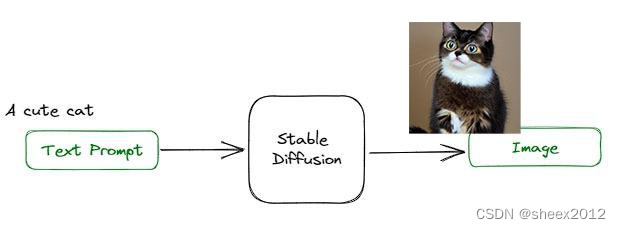
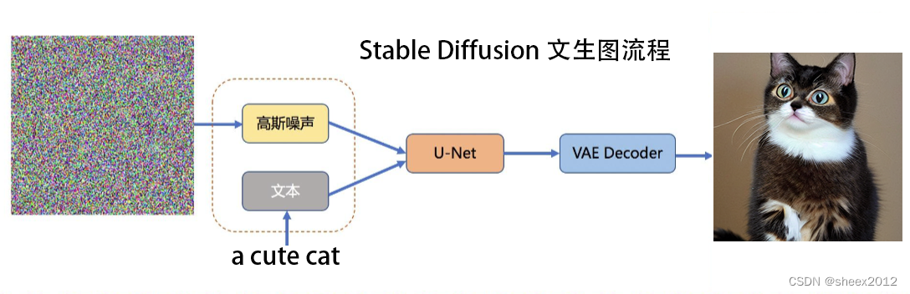

# 1. Stable Diffusion 简介

​		AIGC技术下的一种技术，包括开源的**Stable Diffusion** 和 **Midjourney**，均为文本生成图像的深度学习模型，**Midjourney**的优点是可以通过互联网社区直接使用，但限制很多，而**SD**（Stable Diffusion简介）的好处在于可以本地部署，且是个完全开源的项目，

## 1.1 SD的优点及工作原理：

### 1.1.1 SD的优点

1. 可拓展性强；
2. 出图效率高；
3. 数据安全保障

### 1.1.2 SD工作原理

​		**从使用角度来看**，通过给定文本提示词（text prompt），经过SD模型的处理后会生成一张与提示词匹配的图片，原理如图所示：

​		

​		**从算法角度来看**：模型算法基于一个扩散过程，逐步从噪声（图像当中不需要的，冗余的像素点）中恢复出图象信息。步骤如下：

1. 训练阶段，训练模型能够学习如何逐步将噪声转换为真实的图像数据；
2. 生成阶段，从随机噪声出发，通过反向扩散过程（说白了就是聚集像素点），生成出于训练数据相似分布的图像

​		SD 主要由**变分自编码器(VAE)**，**U-Net**，**文本编码器** 三部分组成，高斯噪声被迭代地应用于压缩的潜在表征。每个去噪步骤都由一个包含残差神经网络（ResNet）的U-Net架构完成，通过从前向扩散往反方向去噪而获得潜在表征。最后，VAE解码器通过将表征转换回像素空间来生成输出图像。原理如下图：

# 2. Stable Diffusion相关安装

## 2.1 安装版本的选择 - Stable Diffusion v2

​		如标题所示，优先选择安装最新的版本，避免相关的问题。

### 2.1.1* 安装前的环境配置（重点项目）

​		基于深度学习的模型训练，避免不了硬件方面使用 Nvidia 的 GPU ， 且在软件方面使用 CUDA 工具包（如：典型的OCR图像识别，必备的工具）、Python解释器和编译器、深度学习框架（常用 TensorFlow、Pytorch这两种框架）、Git、Conda 这些软件。下表为即将使用的开发环境配置表：

| 名称 |       参数        |
| :--: | :---------------: |
| CPU  |     i5-13400F     |
| 内存 | DDR5-6000MHZ 32GB |
| 显卡 |                   |

